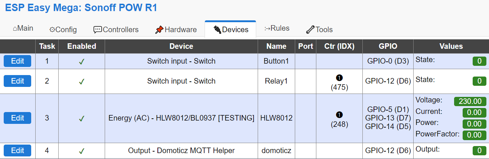
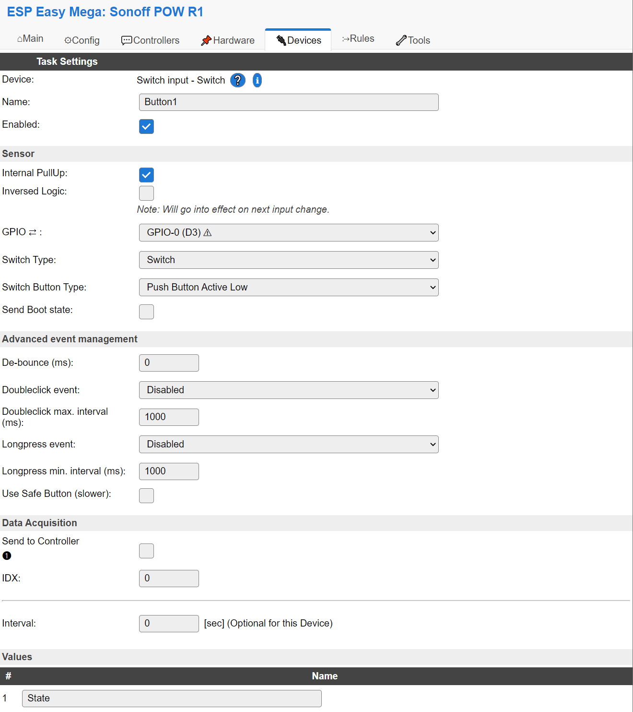
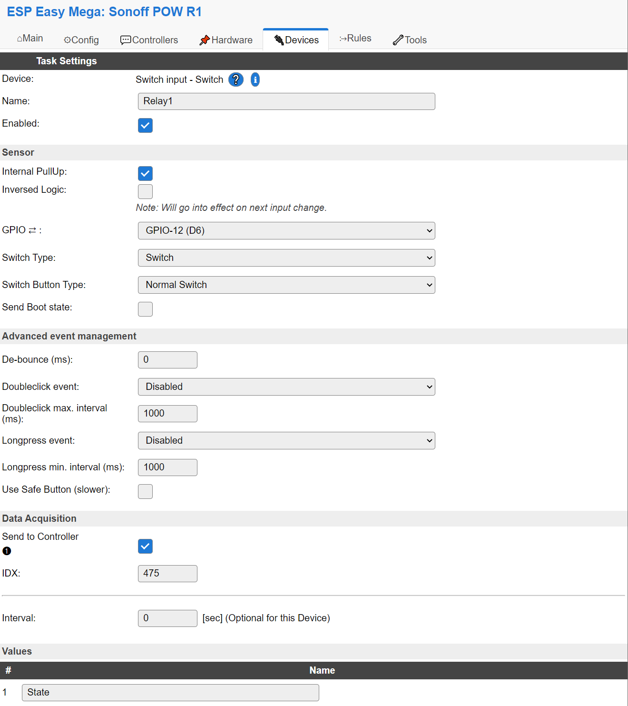
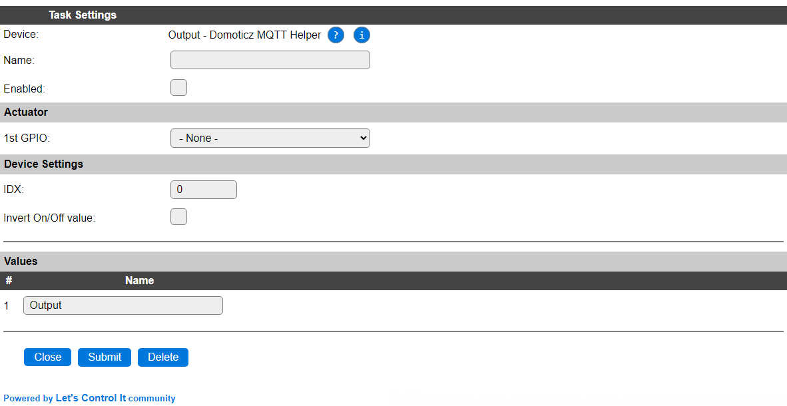

.. include:: ../Plugin/_plugin_substitutions_p02x.repl
.. _P029_page:

|P029_typename|
==================================================

|P029_shortinfo|

Plugin details
--------------

Type: |P029_type|

Name: |P029_name|

Status: |P029_status|

GitHub: |P029_github|_

Maintainer: |P029_maintainer|

Used libraries: |P029_usedlibraries|

Supported hardware
------------------

|P029_usedby|

.. Commands available
.. ^^^^^^^^^^^^^^^^^^

.. .. include:: P029_commands.repl

.. Events
.. ~~~~~~

.. .. include:: P029_events.repl

Description
-----------

Using the Domoticz MQTT protocol, it is not possible to configure direct commands to control output.
Instead, a json message is send by Domoticz on the Domoticz/Out channel.

We need to configure the IDX value within ESP Easy and link this to a given output pin.
This plugin is a special 'helper' device to link IDX to GPIO.

Only the IDX and the corresponding GPIO pin needs to be set.

Use Case - Link Button & Relay
------------------------------

A very typical use case is to sync the state of a relay with both Domoticz and a button.

In this example we have a typical unit like a Sonoff, or just about any device with a switch and a relay.
The screenshots are taken from a setup running on a Sonoff POW R1.

Used GPIO pins
^^^^^^^^^^^^^^

* GPIO 0: Push button
* GPIO 12: Relay

Domoticz related settings
^^^^^^^^^^^^^^^^^^^^^^^^^

* In Domoticz we have a switch configured using IDX 475.
* The first controller is set to be the Domoticz MQTT controller.

Relevant Tasks
^^^^^^^^^^^^^^

Task 1 - Button1
""""""""""""""""

Relevant Settings:

* Plugin: Switch input - Switch
* Task Name: Button1
* GPIO: 0
* Switch Type: Switch
* Switch Button Type: Push Button Active Low
* Variable Name: State
* No linked controller

Task 2 - Relay1
"""""""""""""""

Relevant Settings:

* Plugin: Switch input - Switch
* Task Name: Relay1
* GPIO: 12
* Switch Type: Switch
* Switch Button Type: Normal Switch
* Variable Name: State
* Linked to Domoticz MQTT controller using IDX 475

Task 4 - Domoticz MQTT Helper
"""""""""""""""""""""""""""""

Relevant Settings:

* Plugin: Output - Domoticz MQTT Helper
* 1st GPIO: 12 (the relay)
* IDX: 475

Rules
^^^^^

.. code-block:: none

   on Button1#State do
     if [Relay1#State]=0
       gpio,12,1
     else
       gpio,12,0
     endif
   endon

Event Flow Button Press
^^^^^^^^^^^^^^^^^^^^^^^

Button Press
""""""""""""

When the push button is touched, it does change the state of task 1.
This will send an event containing the state change of ``Button1#State``, which is handled in the rules.

The rules will then issue a command to toggle GPIO 12 (the relay), based on the current ``State`` of the ``Relay1`` task.

Thus on every button press, the relay will toggle.

Since the Switch task connected to the same GPIO is sending its state to Domoticz using IDX 475, the state of the connected switch in Domoticz will change too.

Switch State Change Domoticz
""""""""""""""""""""""""""""

When a switch state is changed from within Domoticz, a message will be published to the MQTT broker.

This message is received by the Domoticz MQTT controller and updates all tasks linked to the matching IDX value (regardless whether it is set to "send" to the Domoticz MQTT controller).

We have 2 tasks set to act on IDX 475:

* Task 2: Relay1
* Task 4: Domoticz Helper

For Task 2, the ``State`` variable will be synced to the (new) Domoticz state.

For Task 4, the Domoticz Helper will create a command to set the configured GPIO, based on the value in Domoticz.
e.g. ``gpio,12,0``

Both actions will generate an event ``Relay1#State`` containing the same new state.

.. note::
   The rules only act on the events matching ``Button1#State``, so events sent by the ``Relay1`` task are ignored in the rules.

  

Change log
----------

.. versionchanged:: 2.0
  ...

  |added|
  Major overhaul for 2.0 release.

.. versionadded:: 1.0
  ...

  |added|
  Initial release version.

