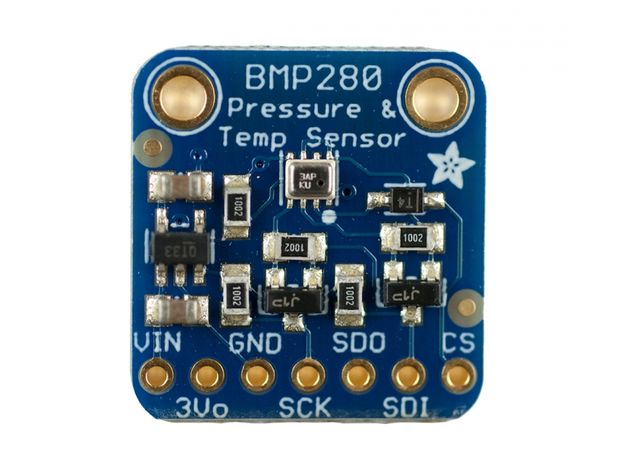

.. include:: ../Plugin/_plugin_substitutions_p03x.repl
.. _P030_BMP280_page:

BMP280
======

|P030_typename|
|P030_status|

Introduction
------------

Specifications:
 * Temperature (-40C to +85C)
 * Barometric pressure (300-1100 hPa)

.. warning:: The BMP280 is easily mistaken for its big brother the BM**E**280. The :ref:`P028_page` can also be used
             to control the BMP280.

Wiring
------

.. code-block:: html

 ESP               BMP280
 GPIO (4)   <-->   SDI (SDA)
 GPIO (5)   <-->   SCK (SCL)

 Power
 3.3V       <-->   VIN
 GND        <-->   GND

.. note:: If you have change the I2C settings in the hardware setup you need to connect to those instead of GPIO 4 and 5.

.. note:: Only use 3.3V BMP280 boards. The ESP pins are not 5V tolerant. Depending on the make of the BMP280 board,
          pull-up resistors on SDA and SDC may be absent. 4k7 types are fine. When more I2C devices are being used, only one set
          of pull-up resistors is required or even allowed. It may be necessary to add a ceramic 100nF capacitor across the power
          lines, close to the BMP280 board.

Setup
-----

.. image:: P030_Setup_BMP280_1.png

Task settings
~~~~~~~~~~~~~

* **Device**: Name of plugin
* **Name**: Name of the task (example name **BMP**)
* **Enable**: Should the task be enabled or not

Sensor
^^^^^^

* **i2C address**: You can use two BMP280 at the same time, choose address here. If you only use one, stay with the default address.
* **Altitude**: Set the level above sea for your unit. This is done in order to get a correct pressure value.

Data acquisition
^^^^^^^^^^^^^^^^

* **Send to controller** 1..3: Check which controller (if any) you want to publish to. All or no controller can be used.
* **Interval**: How often should the task publish its value (5..15 seconds is normal).

Indicators (recommended settings)
^^^^^^^^^^^^^^^^^^^^^^^^^^^^^^^^^

.. csv-table::
  :header: "Indicator", "Value Name", "Interval", "Decimals", "Extra information"
  :widths: 8, 5, 5, 5, 40

  "Temperature", "Celsius", "10", "1", ""
  "Pressure", "hPa", "10", "0", ""

Rules examples
--------------

.. code-block:: html

    on BMP#hPa do
     if BMP#hPa>999
       Publish,%sysname%/pressure,Is normal
     endif
    endon

.. Commands available
.. ~~~~~~~~~~~~~~~~~~

.. .. include:: P030_commands.repl

Where to buy
------------

.. csv-table::
 :header: "Store", "Link"
 :widths: 5, 40

 "AliExpress","`Link 1 ($) <http://s.click.aliexpress.com/e/qMVQ66k>`_"
 "Banggood","`Link 2 ($) <https://www.banggood.com/search/bmp280.html?sbc=1&p=V3270422659778201806&custlinkid=99988>`_"
 "eBay","`Link 3 ($) <http://rover.ebay.com/rover/1/711-53200-19255-0/1?ff3=4&pub=5575404073&toolid=10001&campid=5338336929&customid=&mpre=https%3A%2F%2Fwww.ebay.com%2Fsch%2Fi.html%3F_from%3DR40%26_trksid%3Dm570.l1313%26_nkw%3Dbmp280%26_sacat%3D0>`_"

|affiliate|

.. More pictures
.. -------------

.. .. image:: P030_BMP280_2.jpg
