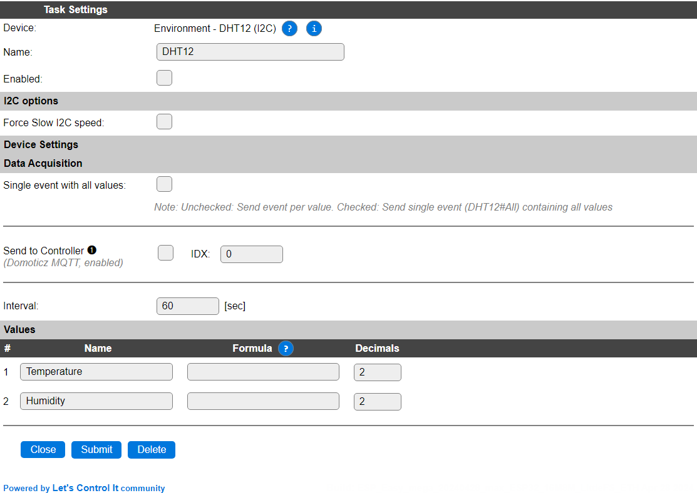

.. include:: ../Plugin/_plugin_substitutions_p03x.repl
.. _P034_page:

|P034_typename|
==================================================

|P034_shortinfo|

Plugin details
--------------

Type: |P034_type|

Name: |P034_name|

Status: |P034_status|

GitHub: |P034_github|_

Maintainer: |P034_maintainer|

Used libraries: |P034_usedlibraries|

.. Supported hardware
.. ------------------

.. .. |P034_usedby|

Introduction
------------

Specifications:
 * Temperature (-20 to +60C) 
 * Humidity (20-95 % rel. humidity)

Settings
--------

* **Name**: Required by ESPEasy, must be unique among the list of available devices/tasks.

* **Enabled**: The device can be disabled or enabled. When not enabled the device should not use any resources.

I2C options
^^^^^^^^^^^

The available settings here depend on the build used. At least the **Force Slow I2C speed** option is available, but selections for the I2C Multiplexer can also be shown. For details see the :ref:`Hardware_page`

Device Settings
^^^^^^^^^^^^^^^

This device has no further configuration settings.

Data Acquisition
^^^^^^^^^^^^^^^^

This group of settings, **Single event with all values**, **Send to Controller** and **Interval** settings are standard available configuration items. Send to Controller is only visible when one or more Controllers are configured.

* **Interval** By default, Interval will be set to 60 sec. It is the frequency used to read sensor values and send these to any Controllers configured for this device.

Values
^^^^^^

The names for the values are initially set to a default name, but can be changed if desired. Also, a formula can be entered to re-calculate the value before display/sending to a controller, and the number of decimals can be changed, for Temperature, usually 1 decimal is enough to be displayed (value will be rounded).

Where to buy
------------

.. csv-table::
  :header: "Store", "Link"
  :widths: 5, 40

  "AliExpress","`Link 1 ($) <http://s.click.aliexpress.com/e/cg1fhDDI>`_"

|affiliate|

.. Commands available
.. ^^^^^^^^^^^^^^^^^^

.. .. include:: P034_commands.repl

.. Events
.. ~~~~~~

.. .. include:: P034_events.repl

Change log
----------

.. versionchanged:: 2.0
  ...

  |added|
  Major overhaul for 2.0 release.

.. versionadded:: 1.0
  ...

  |added|
  Initial release version.

