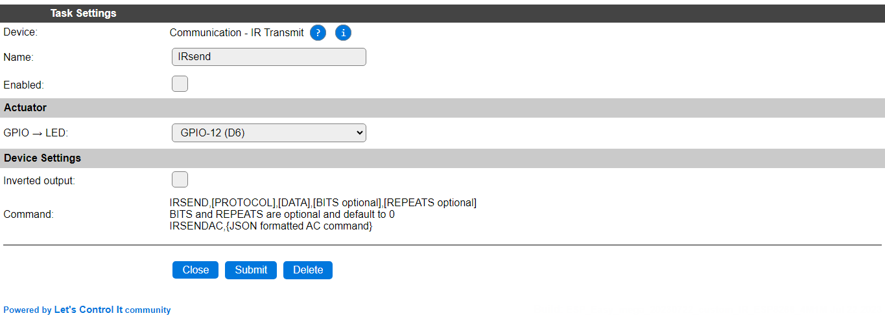

.. include:: ../Plugin/_plugin_substitutions_p03x.repl
.. _P035_page:

|P035_typename|
==================================================

|P035_shortinfo|

Plugin details
--------------

Type: |P035_type|

Name: |P035_name|

Status: |P035_status|

GitHub: |P035_github|_

Maintainer: |P035_maintainer|

Used libraries: |P035_usedlibraries|

Introduction
------------
This plugin can be used to send out IR signals, usually at 38 kHz, to IR-controlled devices like ventilators, TVs, airconditioners etc.

.. Supported hardware
.. ------------------

.. .. |P035_usedby|

Wiring
------

The IR led can be connected directly to an ESP GPIO pin. The default is that the Anode of the LED is connected to the GPIO pin, and the Cathode to GND, but using the **Inverted output** configuration setting allows to connect the Anode to VCC, and the Cathode to the GPIO pin.

Device Configuration
--------------------

* **Name**: Required by ESPEasy, must be unique among the list of available devices/tasks.

* **Enabled**: The device can be disabled or enabled. When not enabled the device should not use any resources.

Actuator
^^^^^^^^

* **GPIO -> LED**: Select the GPIO pin the LED is connected to.

Device Settings
^^^^^^^^^^^^^^^

* **Inverted output**: With this setting enabled, the signal will be sent out inverted (On and Off swapped), so the LED can be connected to VCC and the GPIO pin, instead of between the GPIO pin and GND. This allows for a somewhat larger current through the LED.

Commands available
^^^^^^^^^^^^^^^^^^

.. include:: P035_commands.repl

Change log
----------

.. versionchanged:: 2.0
  ...

  |added|
  2023-07-21 Inverted output option introduced.

  |added|
  Major overhaul for 2.0 release.

.. versionadded:: 1.0
  ...

  |added|
  Initial release version.

