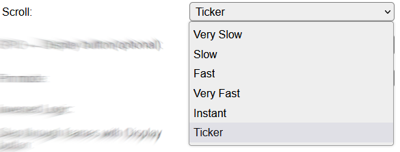
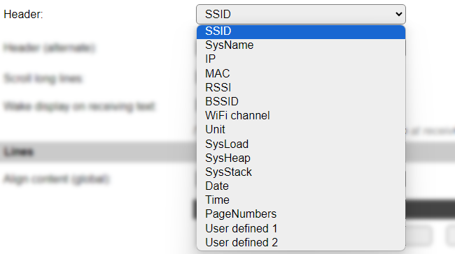

.. include:: ../Plugin/_plugin_substitutions_p03x.repl
.. _P036_page:

|P036_typename|
==================================================

|P036_shortinfo|

Plugin details
--------------

Type: |P036_type|

Name: |P036_name|

Status: |P036_status|

GitHub: |P036_github|_

Maintainer: |P036_maintainer|

Used libraries: |P036_usedlibraries|

Description
-----------

The Framed OLED plugin does allow a bit more fancy look and feel compared to P023 OLED.

The plugin allows to show several "pages or frames" of information.
The number of pages depends on the number of set lines of text and the font size.

Configuration
-------------

* **Name**: A unique name should be entered here.

* **Enabled**: The device can be disabled or enabled. When not enabled the device should not use any resources.

I2C Options 
^^^^^^^^^^^^

The available settings here depend on the build used. At least the **Force Slow I2C speed** option is available, but selections for the I2C Multiplexer can also be shown. For details see the :ref:`Hardware_page`

Device Settings
^^^^^^^^^^^^^^^

* **Controller**: Select the controller chip that is used for the display. There are 2 options available, ``SSD1306`` and ``SH1106``.

* **Display Size**: Select the pixel resolution of the display.

* **Rotation**: Select if the display is mounted normally or upside-down (rotated 180 degrees).

* **Lines per Frame**: The maximum number of 'Lines per frame' depends on the display size (height). Select from 1..4. This determines the number of frames, so there can be 12 frames of 2 line, 6 frames of 2 lines, 4 frames of 3 lines, or 4 frames of 3 lines.

* **Reduce no. of lines to fit font**: (default: off) can be used to reduce the lines per frame to fit the set font for the lines. If not checked the maximum used font size is limited.

* **Scroll**: Switching between pages can be "instant", "scrolling" or a "ticker" band. Please note that scrolling will need more resources of the ESP, which can have an effect on other active tasks of the node.

For the ``Ticker`` there are some restrictions:

* Depending on the build used (NORMAL and CUSTOM) this option is available
* only one line is displaying the ticker string
* all line contents are parsed and combined to this ticker string, the parsing happens only at each ticker start (using the setting ``Interval``)
* the optional split token ``<|>`` is replaced by three spaces
* the gaps between the ticker items must be set by the ``line content`` (trailing spaces)
* the starting alignment (left, center, right) depends on the setting ``Align content (global)``
* the font is taken from the setting ``Modify font`` of the first line, the ``Alignment`` settings of the lines are ignored (always right aligned)
* the ticker speed depends on the length of the ticker string and the task ``Interval`` setting
* the footer is automatically hidden

.. spacer

* **GPIO <- Display button**: Setting up a ``Display Button``, allows to configure a Display Timeout and wake the display on demand, either by a button, or by using some presence detection.

* **Pin mode**: Select how the button pin is to be configured, either regular input, using an external pull-up resistor, or using the ESP internal pull-up resistor. When using wiring > 30 cm. an external pull-up resistor of ~10k is advised to be used.

* **Inversed Logic**: Should be checked when using a button that connects the input to ground when pressed. Default a high signal is used to wake the display, as that is the standard output for most IR detection sensors.

* **Step through pages with Display button**: When enabled the button can also be used to step through the pages (frames), when having multiple pages, to display the content on demand. If this option is unchecked, then, when available, the next page will be displayed after Interval seconds have passed. Pressing the button restarts the Display Timeout timer. When holding the button pressed, the next page will be shown after a 1 second delay.

* **Display Timeout**: The numbers of seconds after which the display is turned off. When set to 0 no timeout is active.

* **Contrast**: Select the desired contrast. To prolong the working life of the display, it is advised to use a low/medium contrast level, and turn off the display automatically after some time.

* **Disable all scrolling while WiFi is disconnected**: When checked switching between the pages is always "instant" and long lines are not scrolling as long as no Wifi connection is established. The Wifi connection attempts use a lot of resources and the scrolling may be disturbed by that.

* **Generate Events**: Depending on the build used (NORMAL and CUSTOM), an option to generate events can be set, that will generate an event if the display is turned on or off, the contrast setting is changed, a new frame is shown, the number of lines per frame is changed or a line is updated using the ``oledframedcmd,<line>,<text>`` command.

Content
^^^^^^^

* **Hide header**: When checked the Header that is normally shown will be suppressed. This will aloow more content on the display, or the content to be displayed in a larger font.

* **Hide indicator**: When checked will not show the page indicator at the bottom of the screen, again to fit more content on the screen or use a larger font. On the 128x32 display this option is always enabled, as that display is rather small.

* **Header** / **Header (alternate)**: The plugin allows for a header line, which may show some user selectable information. When using a different setting for **Header (alternate)**, the header will be updated halfway of the Interval time. The **User defined 1/2** options are not available in all builds. If they are available, their content can be set using the ``oledframedcmd,userDef1,'<user Defined Header1>'`` and ``oledframedcmd,userDef2,'<user Defined Header2>'`` commands (by default they are empty), see the command reference below for details.

* **Scroll long lines**: When checked, lines that won't fit on the display will be scrolled to be completely shown.

* **Wake display on receiving text**: (default: on) Allows to not wake up the display when a text is sent from a remote source or rules, when Display Timeout is set, by unchecking this option.

Lines
^^^^^

* **Align content (global)**: this setting will be used to align all lines that use the **Use global** setting, but there are also individual align and font settings for each line.

* **Line 1..12**: All user defined texts may contain references to system variables or task values which will be interpreted when displayed on screen.

For example: ``[bme#Temperature#D2.1] {D}C [bme#H]%``

The user defined texts may also contain a split token ``<|>`` to display the line splitted, the left part left-aligned and the other part right-aligned on the display. This will override the Alignment setting.

* **Modify Font**: For each line, the font to be used can be selected, from the options shown here.

* **Alignment**: For each line, the alignment to be used can be selected, or the global setting can be used.

* **Interval** By default, Interval will be set to 0. It needs to be set to a non-zero value, to switch between the frames using that interval (seconds).

General
-------

Commands available
^^^^^^^^^^^^^^^^^^

.. include:: P036_commands.repl

Events
~~~~~~

.. include:: P036_events.repl

Change log
----------

.. versionchanged:: 2.0
  ...

  |added|
  Major overhaul for 2.0 release.

.. versionadded:: 1.0
  ...

  |added|
  Initial release version.

