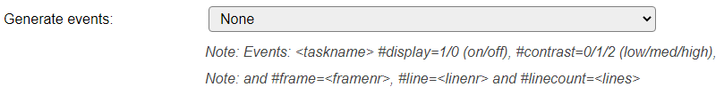

.. include:: ../Plugin/_plugin_substitutions_p03x.repl
.. _P036_page:

|P036_typename|
==================================================

|P036_shortinfo|

Plugin details
--------------

Type: |P036_type|

Name: |P036_name|

Status: |P036_status|

GitHub: |P036_github|_

Maintainer: |P036_maintainer|

Used libraries: |P036_usedlibraries|

Description
-----------

The Framed OLED plugin does allow a bit more fancy look and feel compared to P023 OLED.

The plugin allows to show several "pages" of information.
The number of pages depends on the number of set lines of text and the font size.

Switching between pages can be "instant" or "scrolling".
Please note that scrolling may need more resources of the ESP, which can have an effect on other active tasks of the node.

Setting up a Display Button, allows to configure a Display Timeout and wake the display on demand. Inversed Logic should be checked when using a button that connects the input to ground when pressed.

When enabling "Step through pages with Display button", the button can also be used to step through the pages, when having multiple pages, to display the content on demand. If this option is unchecked, then, when available, the next page will be displayed after Interval seconds have passed. Pressing the button restarts the Display Timeout timer. When holding the button pressed, the next page will be shown after a 1 second delay.

The Display Timeout setting sets the numbers of seconds after which the display is turned off. When set to 0 no timeout is active.

The plugin allows for a header line, which may show some user selectable information. And an optional footer line that can show a page indicator, when using a 128x64 display.

Checkbox 'Wake display on receiving text' (default: on) allows to not wake up the display when a text is sent from a remote source, and Display Timeout is set.

'Align content (global)' can be used to align all lines, but there are also individual align and font settings for each line. 

All user defined texts may contain references to system variables or task values which will be interpreted when displayed on screen.

For example: ``[bme#T#D2.1] {D}C [bme#H]%``

The user defined texts may also contain a split token '<|>' to display the line splitted, one part on the left the other one on the right side of the display.

Depending on the build used (NORMAL and CUSTOM), an option to generate events can be set, that will generate an event if the display is turned on or off, the contrast setting is changed, a new frame is shown, the number of lines per frame is changed or a line is updated using the ``oledframedcmd,<line>,<text>`` command.

The device setting:

Available options:

.. image:: P036_GenerateEventsOptions.png

Supported hardware
------------------

|P036_usedby|

Commands available
^^^^^^^^^^^^^^^^^^

.. include:: P036_commands.repl

.. Events
.. ~~~~~~

.. .. include:: P036_events.repl

Change log
----------

.. versionchanged:: 2.0
  ...

  |added|
  Major overhaul for 2.0 release.

.. versionadded:: 1.0
  ...

  |added|
  Initial release version.

