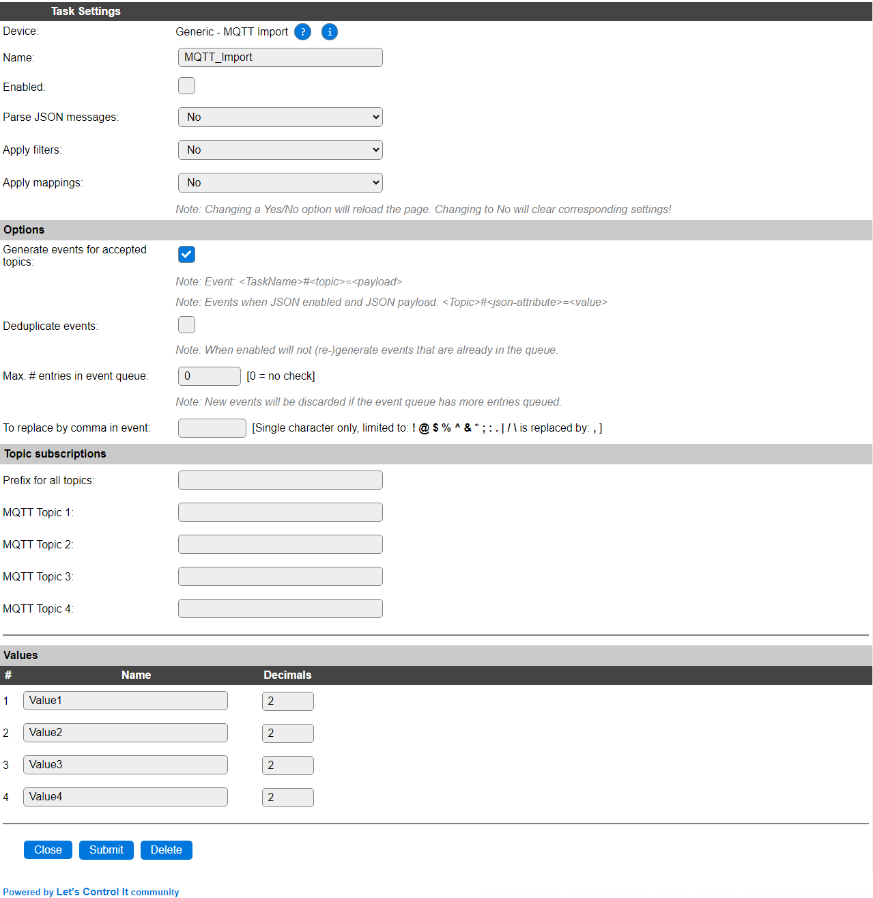
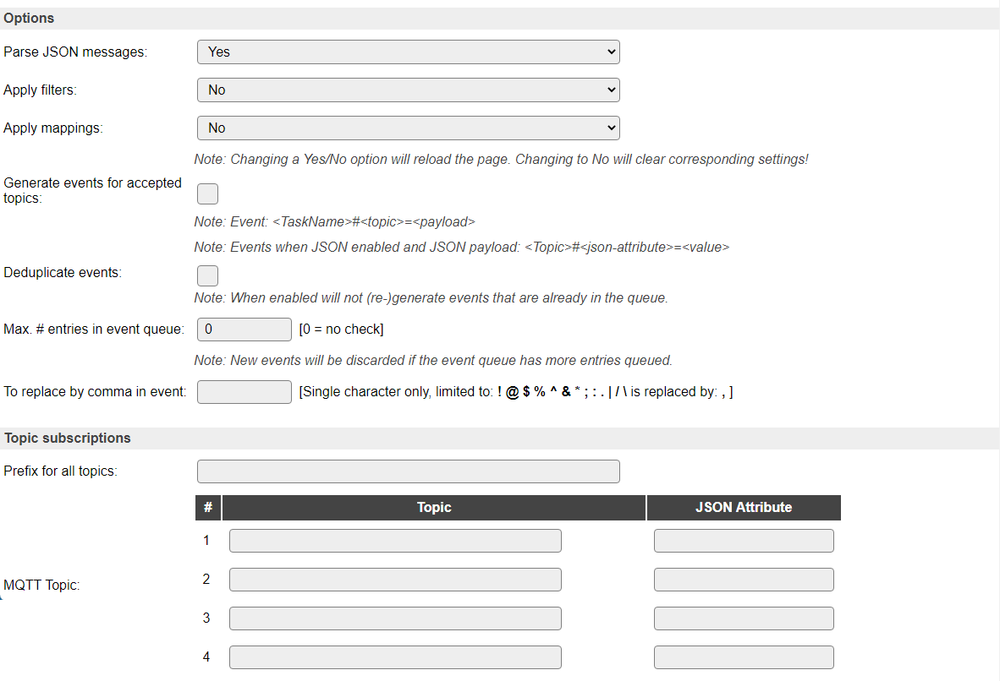
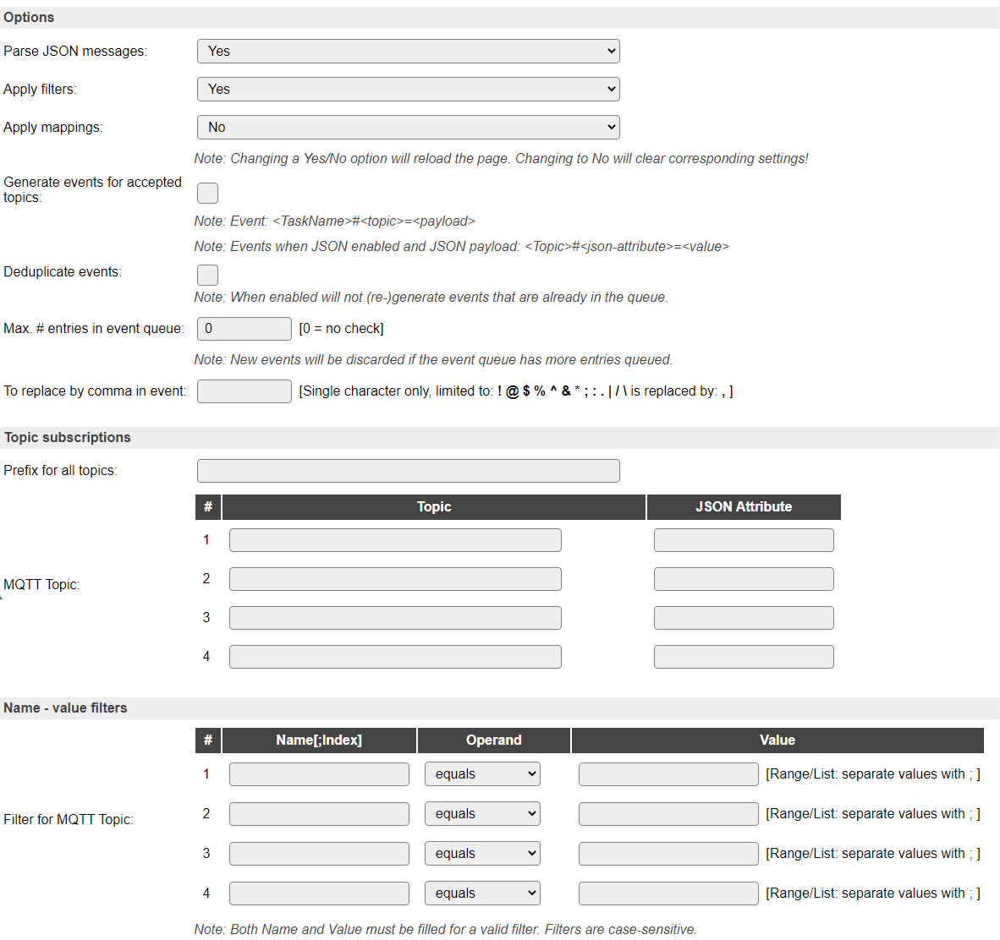
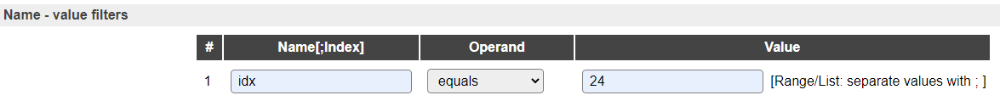
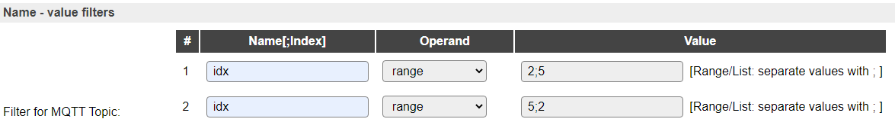
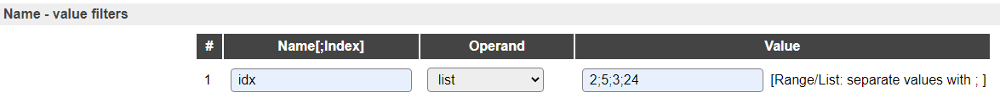
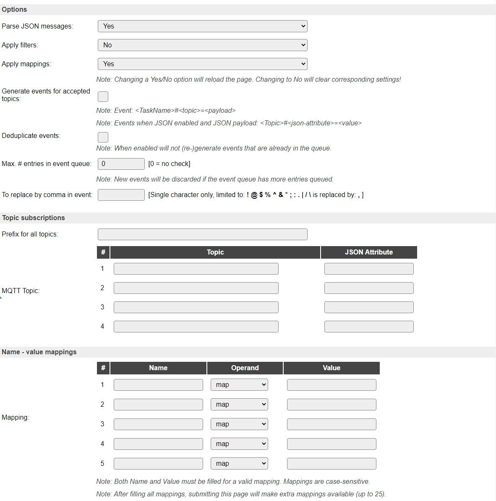
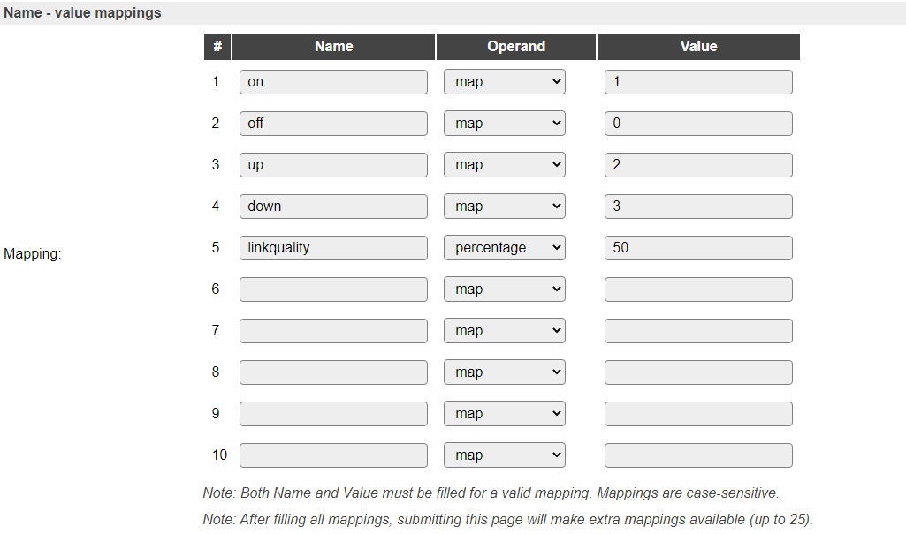

.. include:: ../Plugin/_plugin_substitutions_p03x.repl
.. _P037_page:

|P037_typename|
==================================================

|P037_shortinfo|

Plugin details
--------------

Type: |P037_type|

Name: |P037_name|

Status: |P037_status|

GitHub: |P037_github|_

Maintainer: |P037_maintainer|

Used libraries: |P037_usedlibraries|

Introduction
------------

You might want to use MQTT to send commands or values to your ESPEasy unit. To do this you use the plugin MQTT Import.

Only numbers can be stored in variables (Plugin Generic - Dummy Device), so either send numeric values, or use this plugin's feature of mapping string to numeric values to do the conversion, or define an event handler in Rules to react on a specific value (examples below).

Device configuration
--------------------

NB: To save space it is possible that not all features are available in all builds. The screenshots are taken including all options.

The options that can be included or excluded are:

* Parse JSON messages

* Apply filters

* Apply mappings

Initial setup after adding the plugin:

* **Name** is used to uniquely identify the plugin, and will be used in the standard events generated by the plugin.

* **Enabled** should be checked to enable the plugin.

Options
^^^^^^^^

Option: Parse JSON messages
~~~~~~~~~~~~~~~~~~~~~~~~~~~~

* **Parse JSON messages**: when changed to Yes, the page will be reloaded, and the corresponding settings will be made visible, an extra column next to the MQTT Topics, to specify the attribute from any JSON payload received on the topic specified.

When JSON is enabled, regular MQTT Topics will be processed normally.

The JSON Attribute column, when used, can be used to specify what data element to retrieve from a received JSON payload. If the resulting value is numeric it will be stored to the corresponding variable, and the regular event for that will be generated.

When receiving multiple-value attributes, like ``"svalue":"28.1;17.8;2;1010.3;0"``, an index can be appended to the attribute like ``svalue;4`` to get the 4th value, in this example ``1010.3`` (1-based index).

When receiving a JSON payload, an event can (in addition to the standard event when receiving a numeric value) be generated for the received Attribute, or for all attributes if no specific attribute is configured.

The event for such attribute looks like ``<topic>#<attribute>=<attribute_value>``, for example, when, on MQTT Topic ``zigbee2mqtt/eria_dimswitch_1``, receiving this JSON payload: ``{"action":"on","linkquality":5}`` will generate these events: ``zigbee2mqtt/eria_dimswitch_1#action=on`` and ``zigbee2mqtt/eria_dimswitch_1#linkquality=5``. If Mappings are configured, then the value *after* applying the mappings will be used!

In addition, for each accepted JSON attribute also an event is generated, like ``<devicename>#<valuename>=<value>``, for example ``MQTT_Import#Value1=on``. If Mappings are used, again the value after mapping is provided.

NB: When receiving non-numeric values, like above, you must explicitly name the event **and** value to trigger on, (this is an ESPEasy limitation), for example:

.. code-block:: none

  on zigbee2mqtt/eria_dimswitch_1#action=on do
    logentry,"Dimmerswitch 1 action = %eventvalue%"
    gpio,12,1 // Turn light on
  endon
  on zigbee2mqtt/eria_dimswitch_1#action=off do
    logentry,"Dimmerswitch 1 action = %eventvalue%"
    gpio,12,0 // Turn light off
  endon

Using ``%eventvalue1%`` (or the shortcut ``%eventvalue%``) will result in the 'on' or 'off' strings as provided to the event.

Option: Apply filters
~~~~~~~~~~~~~~~~~~~~~~

* **Apply filters**: when changed to Yes, the page will be reloaded and the Filters options will be made visible.

* **Filters** are a list of ``Name[;Index]`` ``Operand`` ``Value`` sets.

In the current (compile-time) configuration, there are the same amount of filters as there are MQTT Topics, and each Filter is applied to the matching MQTT Topic.

It is possible to reconfigure that to a higher number of filters, but then the filters will be applied to all MQTT Topics, and can not be applied on a specific Topic. Therefore this configuration of 1 Filter per Topic was chosen and documented.

* **Name**, with an optional Index, like the JSON Attribute above, specifies what to filter on, the **Operand** specifies how to compare that to the **Value**.

.. spacer

* **Operand**:

.. spacer

* Equals

* Range

* List

.. spacer

* **Equals**: A standard (double, so decimals are supported) comparison, the filter matches if the value is equal, for example:

* **Range**: Value must be in a range of values. The range can be inclusive, f.e. ``2;5`` means the value can be between 2 and 5, including 2 and 5. The range can be made exclusive, by reversing the 'from' and 'to' values, f.e. ``5;2`` means the value must be less than or equal (``<=``) to 2 or greater than or equal (``>=``) to 5. Examples:

* **List**: Value must be one of the values in the list, for example:

NB: Range and List Values must be semicolon-separated.

Option: Apply mappings
~~~~~~~~~~~~~~~~~~~~~~

* **Apply mappings**: when changed to Yes, the page will refresh and the Mappings options will be made visible.

* **Mappings** are a variable length list of ``Name`` ``Operand`` ``Value`` sets.

* **Name**: The received value (payload or JSON attribute value), for example the Adurosmart Eria dimmer switch (Zigbee) sends values 'on', 'off', 'up' and 'down' for the respective buttons. Normally ESPEasy wouldn't be able to process those values, but by mapping them to numeric values, the become usable with ESPEasy.

.. spacer

* **Operand**:

.. spacer

* Map

* Percentage

.. spacer

* **Map**: Simple replacement of the input by the Value

.. spacer

* **Percentage**: Convert the input to a percentage. Value is the 100% value. This allows to convert f.e. a 0 to 1024 input range to 0 to 100%. If the input exceeds the max. value, the percentage will be > 100, so an input of 2048 for this value will result in 200%. The % sign isn't part of the output.

Examples:

The number of mappings is currently limited to 25, but only the number of used mappings + 5 empty mappings are displayed on screen to keep the page smaller. Once the on screen list of mappings is full, submitting the page will store the values, and make up to 5 empty mappings available. Unless all 25 are used, of course.

Option: Generate events for accepted topics
~~~~~~~~~~~~~~~~~~~~~~~~~~~~~~~~~~~~~~~~~~~~

* **Generate events for accepted topics**: Enabling this option will generate an event for every incoming, and accepted if Filtering is used, non-JSON payload even when that has a non-numeric value. The event generated is: ``<devicename>#<valuename>=<value>``, for example ``MQTT_Import#Value1=on``.

When this option is disabled it has the backward-compatible behavior of discarding that message as invalid.

Topic Subscriptions
-------------------

By configuring a MQTT Topic, the plugin will subscribe to that Topic so the MQTT server will send any message for that topic to this ESPEasy unit.

Subscribing to high-trafic topics will cause quite some load on the ESP, so either use an ESP32 unit, or limit trafic by subscribing to more specific topics or use filtering to limit the number of accepted messages, and thus limit the number of events fired. F.e. subscribing to ``domoticz/out`` is such a high-trafic topic, when using Domoticz and an MQTT server. Filtering on the idx values that are of interest is then highly advised.

Wildcard MQTT Topic subscriptions (using ``+`` or ``#``) can be used, but please be aware this may cause a high load because of a high number of topics accepted. NB: The ``#`` wildcard, when used, *must* be the last element in a topic (according to MQTT specifications).

For systems that use long topics, the extra input field **Prefix for all topics** is available. The contents of this field will prefixed to *all* topics (without any extra characters, so slashes should be included as required). This field is optional.

Supported hardware
------------------

No ESPEasy related hardware is needed, though a MQTT server (local network or external), and a MQTT Controller configuration is required to be able to use this plugin, as it 'piggy-backs' on that connection to subscribe to, and receive, the topics.

Useful links
------------

Generic MQTT information: |mqtt_link|

A useful introduction to the MQTT basics: |mqttessentials_link|

(Links open in a new browser tab.)

.. |mqtt_link| raw:: html

   <a href="https://mqtt.org" target="_blank">Generic MQTT information</a>

.. |mqttessentials_link| raw:: html

   <a href="https://www.hivemq.com/mqtt-essentials/" target="_blank">MQTT Essentials</a>

|P037_usedby|

Events
------

.. include:: P037_events.repl

Change log
----------

.. versionchanged:: 2.0
  ...

  |added|
  Major overhaul for 2.0 release.

  2020-12-19:

  |added|
  Support for JSON parsing

  |added|
  Filtering

  |added|
  Mapping of incoming values

  |added|
  Generate (optional) events for non-numeric payloads

  |added|
  Prefix for all topics

.. versionadded:: 1.0
  ...

  |added|
  Initial release version.

