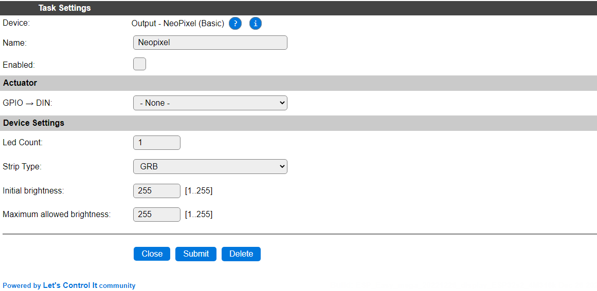

.. include:: ../Plugin/_plugin_substitutions_p03x.repl
.. _P038_page:

|P038_typename|
==================================================

|P038_shortinfo|

Plugin details
--------------

Type: |P038_type|

Name: |P038_name|

Status: |P038_status|

GitHub: |P038_github|_

Maintainer: |P038_maintainer|

Used libraries: |P038_usedlibraries|

Supported hardware
------------------

|P038_usedby|

A few examples of NeoPixel LEDs and strips (Image sourced from Aliexpress)

Power consumption
-----------------

.. include:: NeoPixel_Power.rst

Configuration
-------------

* **Name** A unique name should be entered here.

* **Enabled** The device can be disabled or enabled. When not enabled the device should not use any resources.

Actuator
~~~~~~~~

* **GPIO -> DIN**: Select the GPIO pin that the LED stripe is connected to.

* **Led Count**: The number of LEDs available. This is the amount of LEDs that will be allowed for the ``NeoPixel*`` commands to be set, and that will be set using the ``NeoPixelAll*`` commands.

* **Strip Type**: Select the type of the LEDs mounted on the strip:

* **Initial brightness**: The brightness that the stripe is initially set to. Default is 0, the max. available brightness, and default before this setting was introduced. Range: 0..255.

* **Maximum allowed brightness**: The brightness that is the maximum it can be set to, either from UI or via the ``NeoPixelBright`` command, to optionally help protect both the eyes and the power-supply powering the stripe. Default is 255. Range: 1..255.

*GRB* : Most commonly, the LEDs are of GRB type.

*GRBW* : If the LEDs also support Brightness control, then the GRBW type should be selected, and the Brightness can be added in the ``NeoPixel*`` commands.

Commands available
~~~~~~~~~~~~~~~~~~

.. include:: P038_commands.repl

.. Events
.. ~~~~~~

.. .. include:: P038_events.repl

Change log
----------

.. versionchanged:: 2.0
  ...

  |improved|
  2022-01: Make plugin multi-instance compatible, improve/fix pin selection, allow RGBW color selection for ``NeoPixelLine*`` commands.

  |added|
  Major overhaul for 2.0 release.

.. versionadded:: 1.0
  ...

  |added|
  Initial release version.

