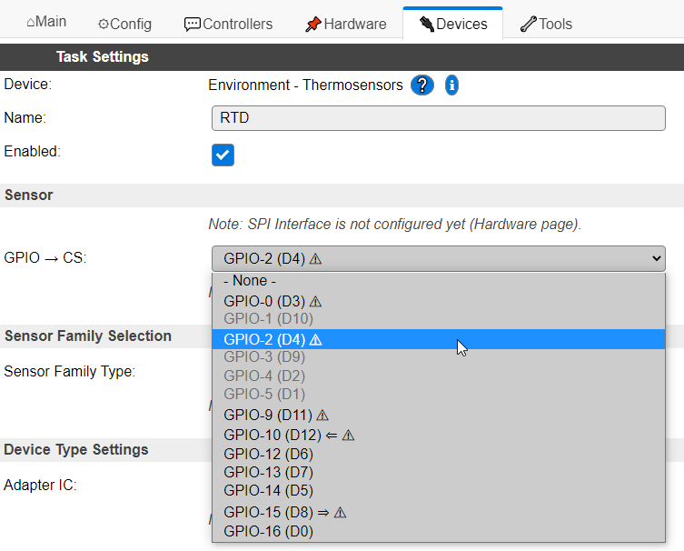
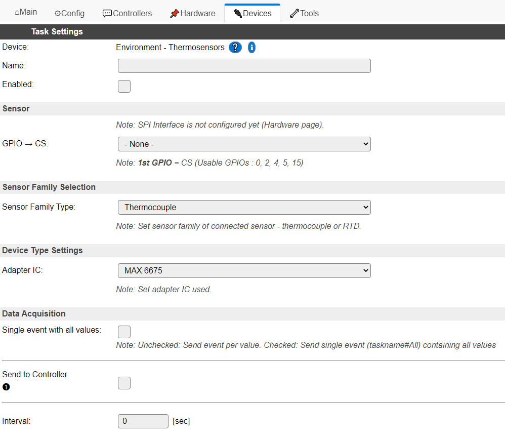
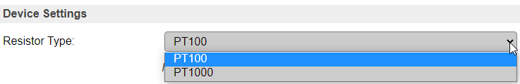
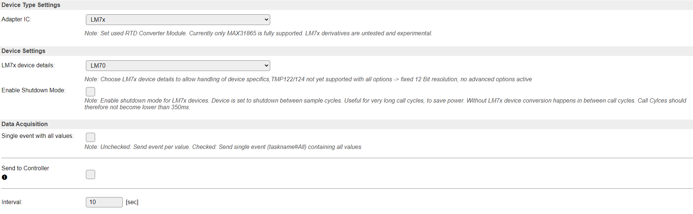

.. include:: ../Plugin/_plugin_substitutions_p03x.repl
.. _P039_page:

|P039_typename|
==================================================

|P039_shortinfo|

Plugin details
--------------

Type: |P039_type|

Name: |P039_name|

Status: |P039_status|

GitHub: |P039_github|_

Maintainer: |P039_maintainer|

Used libraries: |P039_usedlibraries|

|P039_usedby|

.. Commands available
.. ^^^^^^^^^^^^^^^^^^

.. .. include:: P039_commands.repl

.. Events
.. ~~~~~~

.. .. include:: P039_events.repl

Change log
----------

.. versionchanged:: 2.0
  ...

  |added|
  Major overhaul for 2.0 release.

.. versionadded:: 1.0
  ...

  |added|
  Initial release version.

Description
===========

This Plugin reads the data from Thermocouples and Resistor Temperature Detector sensors. You have to use an Adapter Board with a respective 
adapter/converter in order to read the values. Take a look at the usual sources to find such boards.

You can only use ESP8266 boards which expose the SPI Interface. This Plugin uses only the Hardware SPI Interface - no software SPI at the moment.
Nevertheless you need at least 3 Pins to use SPI. So using an very simple ESP-01 is unfortunately no option.

**Basic Information on Thermocouples**
`Wikipedia: Thrmocouples <https://en.wikipedia.org/wiki/Thermocouple>`_

**Basic Information on Resistor Temperature Detector Sensors**
`Wikipedia: Resistance Thermometers <https://en.wikipedia.org/wiki/Resistance_thermometer>`_

Wiring
------

Basic Information on SPI Bus you can find in `Wikipedia: SPI Bus <https://en.wikipedia.org/wiki/Serial_Peripheral_Interface>`_

You need an ESP8266 device with accessible SPI Pins. These Pins are:

====  =============  ======  ========  =========================================================================
Name  Description    PIO     NodeMCU   Notes
====  =============  ======  ========  =========================================================================
MOSI  Master Output  GPIO13  D7        Hardware SPI (only required in case of write access to device registers)
MISO  Master Input   GPIO12  D6        Hardware SPI
SCK   Clock Output   GPIO14  D5        Hardware SPI
CS    Chip Select    GPIO15  D8        Hardware SPI (CS is configurable through the web interface)
====  =============  ======  ========  =========================================================================

.. note:: Write Access to device registers is required for MAX 31856 and MAX 31865 devices so far.

Supported Hardware
------------------

**[2021-05-03]: Added support for RTD sensor adapters based on Maxim Device MAX21865.**

  This adapter device requires write access to internal configuration registers. For this device you will need to wire MOSI signal to your adapter.
  For MAX31865 multiple shields are available in the usual sources. Those are mostly based on `Adafruit MAX 31865 shield <https://www.adafruit.com/product/3328>`_ 
  and follow the original schematics and element values.

  .. image:: https://cdn-shop.adafruit.com/970x728/3328-01.jpg
    :width: 400
    :alt: image showing the Adafruit MAX 31865 adapter shield for SPI bus

  The adapter can be purchased prepared for the required senor type (PT 100 or PT 1000). Basically this will influence the choice of the reference 
  resistor. Those resistors are usualy chosen with the following values, but can be adjusted to the needs of the user and the application.

  ============  ===============================
  Sensor Type   Reference Resistor Value
  ============  ===============================
  PT 100        Rref = 430 Ohm
  PT 1000       Rref = 4300 Ohm
  ============  ===============================

  The populated value can be directly stated in the device configuration and therefore adjusted to any desired resistor value.

  The modules often allow usage of 2-wire, 3-wire and 4-wire connection of an appropriate sensor. For activation of the connection type, it requires 
  closing/opening of hardware bridges on the adapter **and** adjustment of the configuration in the ESPEasy device configuration.

  MAX31865 devices support filtering of noise frequencies resulting from the frequency of your power net. Basic filtering of 50/60 Hz noise 
  contributions can be adjusted in the device configuration. See configuration examples below.

**[2021-02-xx]:  Initial support of thermocouple sensors via Maxim devices MAX6675, MAX31855 and MAX31856**

  From the start this device allows usage of thermocouple sensors and adapters. Most of them are rather simple to use and access, as they only require read access to their SPI interface.
  Nevertheless they provide powerful options to sense high temperature ranges and difficult sensing scenarios. See system advantages and limitations on above mentioned Wikipedia page on Thermocouples.

  .. image:: https://cdn-shop.adafruit.com/145x109/3263-01.jpg
    :width: 400
    :alt: image of Adafruit MAX 31856 shield

  Depending on the type of adapter used, you will either have to chose the device according to the used sensor type (MAX6675/MAX31855 -> B, E, J, K, ...) or you can configure the sensor type 
  in ESPEasy configuration page (MAX31856).

  .. image:: https://cdn-shop.adafruit.com/970x728/269-03.jpg
    :width: 400
    :alt: image of Adafruit MAX 31855 shield

Configuration in ESPEasy
------------------------

Within ESPEasy tab "Devices" chose the plugin "Environment - Thermosensors" to use the plugin.

In the plugin configuration page you will be initially asked to define the unique name of the task and the CS pin used for activating the SPI communication.

At first you need to select the name of the task and the GPIO pin you want to use as CS for your SPI interface. You can select every GPIO that
is not blocked by another device or which is limited by its function capabilities, e.g. not possible to configure as OUTPUT.

Keep in mind some of the GPIOs require dedicated states during boot or have limited configuration options. E.g. D8 need to be pulled to GND during 
boot to allow proper boot. Some of the shields provide 10k pull-up resistors overriding any weak pull-down on an ESP 8266 and such avoid correct 
start up of ESP. In such cases solder an additional 4,7k resistor between GND and D8.

After that, the configuration page of the device provides a three step configuration:

#.  **Choose the type of sensor you want to use**
      
    Inital configuration step is to decide on which sensor family you want to use. This device support two:

    * Thermocouple  -->   Thermocoupling Sensors
    * RTD           -->   Resistor Temperature Device Sensors

    .. image:: P039_select_sensor_family_type.png
      :width: 800
      :alt: image showing the configuration section to select sensor type and the possible options - Thermocouple or RTD

    With the drop down field you can chose the sensor type you want to use.
  
#.  **Choose the type of the adapter device you use**

    In case you want to use RTD adatpers the further configuration looks like the following:

    When page has been updated after the submit you can decide on which adapter device you plan to use. 

    .. image:: P039_select_device_type.png
      :width: 800
      :alt: image showing the configuration section to select used adapter devices

    Depending on the chosen sensor type the drop box will adjust the possible choices to the supported devices
  

#.  **Configure the device details to match your needs**

    When page has been updated after the submit you can configure the device according to your needs.

    .. image:: P039_MAX31865_device_settings.png
      :width: 800
      :alt: image showing the configuration section for setting all options for your device

    In this section you can detail the configuration to adjust the behavior to your technical needs.
  
    .. image:: P039_press_submit.png
      :width: 200
      :alt: image showing the configuration section to submit the configuration so far

    After this selection select the enable check box in the upper section of this configuration page and submit the configuration to finalize the set up.

Details on Device Settings
==========================

MAX 6675, MAX 31855
-------------------

For these two devices there is no further device settings needed.

MAX 31856
---------

For this device currently three parameters can be selected:

#.  **Type of thermocouple used with the device**

    .. image:: P039_MAX31856_thermocouple_type_selection.png
      :width: 600
      :alt: image showing the selection of thermocouples used with the MAX 31856 adapter

    MAX 31856 supports multiple types of thermocouples to be used with the adapter. This allows optimum choice of the  sensor according to the measured temperature range.
    The following types of thermocouples are supported:

    ======= ================  =================  =================  ===========================  ========================
    TYPE    T-WIRE            T+ WIRE            TEMP RANGE         NOMINAL SENSITIVITY (μV/°C)  COLD-JUNCTION TEMP RANGE
    ======= ================  =================  =================  ===========================  ========================
    B       Platinum/Rhodium  Platinum/Rhodium    250°C to 1820°C   10.086  (+500°C to +1500°C)   0 to 125°C
    E       Constantan        Chromel            -200°C to +1000°C  76.373  (0°C to +1000°C)     -55°C to +125°C
    J       Constantan        Iron               -210°C to +1200°C  57.953  (0°C to + 750°C)     -55°C to +125°C
    K       Alumel            Chromel            -200°C to +1372°C  41.276  (0°C to + 1000°C)    -55°C to +125°C
    N       Nisil             Nicrosil           -200°C to +1300°C  36.256  (0°C to +1000°C)     -55°C to +125°C
    R       Platinum          Platinum/Rhodium   -50°C to +1768°C   10.506  (0°C to +1000°C)     -50°C to +125°C
    S       Platinum          Platinum/Rhodium   -50°C to +1768°C   9.587   (0°C to +1000°C)     -50°C to +125°C
    T       Constantan        Copper             -200°C to +400°C   52.18   (0°C to +400°C)      -55°C to +125°C
    ======= ================  =================  =================  ===========================  ========================

    Most commonly used type is Type "K", as it provides wide temperature range with medium/good sensitivity at reasonable prices.

    **Using “Unsupported” Thermocouple Types**

    To use a thermocouple type other than B, E, J, K, N, R, S, or T, select one of the voltage mode options from the following table. 
    Selecting “VM8” results in a full-scale input voltage range of ±78.125mV. “VM32” results in a full-scale input voltage range of ±19.531mV. 
    See the transfer functions from the table below. When voltage mode is selected, no linearization is performed on the conversion data. 
    Use the voltage data and the cold-junction temperature to calculate the thermocouple’s hot-junction temperature.

    ====  ========================  ===========================
    Mode  Short Description         Transformation Formula
    ====  ========================  ===========================
    VM8   Voltage Mode, Gain = 8    Code = 8 x 1.6 x 2 :superscript:`17` x V :subscript:`in`
    VM32  Voltage Mode, Gain = 32   Code = 32 x 1.6 x 2 :superscript:`17` x V :subscript:`in`
    ====  ========================  ===========================

    .. note:: Code is 19 bit signed number from TC registers and VIN is thermocouple input voltage. The plugin directly provides V :subscript:`in` value. TC Range failure bit (SR register, Bit 6) is ignored when using these modes.

#.  **Averaging Factor**

    .. image:: P039_MAX31856_averaging_selection.png
      :width: 600
      :alt: image showing the selection of averaging mode of MAX 31856 device

    MAX31856 supports on chip averaging of multiple measurement values. The number of measurements averaged to a result can be configured with this value.
    The device supports several modes.

    ====  ========================  ====================================
    Mode  Short Description         Effect*
    ====  ========================  ====================================
    1     1 sample (default)        no averaging
    2     2 samples averaged        up to 185ms + 40ms conversion time
    4     4 samples averaged        up to 185ms + 120ms conversion time
    8     8 samples averaged        up to 185ms + 280ms conversion time
    16    16 samples averaged       up to 185ms + 600ms conversion time
    ====  ========================  ====================================

    .. note:: see data sheet on more details. Conversion takes place in between read cycles.

    Adding samples increases the conversion time and reduces noise. Typical conversion times:

    * 1-shot or first conversion in Auto mode:
        = t :subscript::`CONV` + (samples -1) x 33.33mS (60Hz rejection)
        = t :subscript::`CONV` + (samples -1) x 40mS (50Hz rejection)

    * 2 thru n conversions in Auto mode
        = t :subscript::`CONV` + (samples -1) x 16.67mS (60Hz rejection)
        = t :subscript::`CONV` + (samples -1) x 20mS (50Hz rejection)

    .. note:: t :subscript:`CONV max.` = 185ms according to MAX31856 datasheet.

#.  **Selection of Power Net Filter**

    .. image:: P039_MAX31856_frequency_filter_selection.png
      :width: 600
      :alt: image showing the selection of power net filter type - 50/60Hz.

    Last but not least you need to select the power net filter according to the frequency of your local power net.

MAX 31865
---------

For MAX 31865 you can define the sensor according to its resistor value given at 0°C / 32°F.

Select the sensor wiring you plan to use with your RTD sensor - 2-/4-wire or 3-wire

After that you need to select the power net filter according to the frequency of your local power net

For this box you need to define the value of your reference resistor.

In this configuration box you can define an offset value which is added to the sensor result. It can be negative/positiv value and can be given with 0.01 K accuracy.

LM 7x
-----

  
For LM7x device family you have multiple options to be configured.

.. note:: At the given point in time LM7x device family is only supported experimental. Communication is tested to be present, but correct reading of values is not proven, due to missing hardware for testing.

Generic Plugin Configuration
----------------------------

Finally the plugin requires configuration of DAQ Mode and you can activate the communication to an exisiting controller from the ESPEasy "Controller" Tab.

