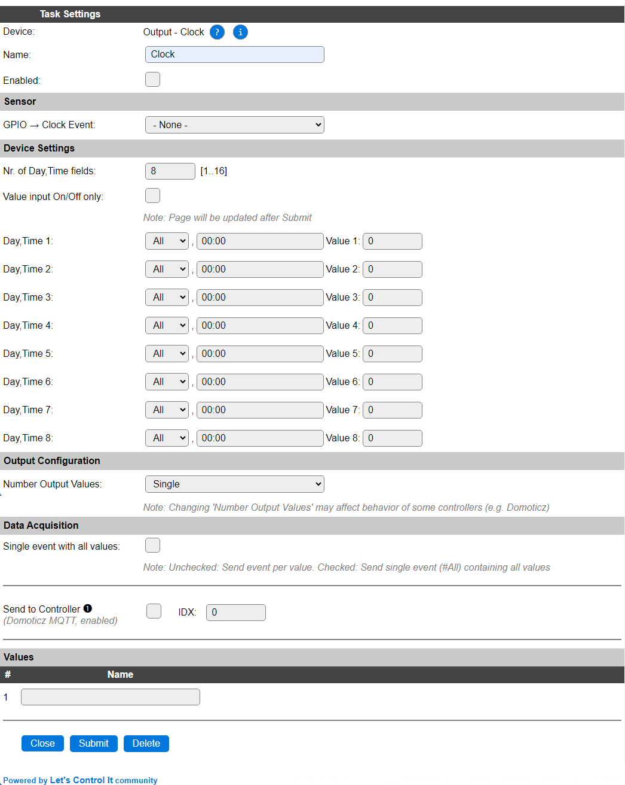

.. include:: ../Plugin/_plugin_substitutions_p04x.repl
.. _P043_page:

|P043_typename|
==================================================

|P043_shortinfo|

Plugin details
--------------

Type: |P043_type|

Name: |P043_name|

Status: |P043_status|

GitHub: |P043_github|_

Maintainer: |P043_maintainer|

Used libraries: |P043_usedlibraries|

|P043_usedby|

Description
-----------

Every minute the set schedule will be checked for a match, and if a value for a scheduled time is set, the GPIO will be set to that state (On/Off) when configured, or when no GPIO is configured and the value is not 0 or empty, an event is generated with the field number that caused the trigger, and another event with the set value if the Number Output Values is set to Dual or higher.

Configuration
-------------

* **Name**: Required by ESPEasy, must be unique among the list of available devices/tasks.

* **Enabled**: The device can be disabled or enabled. When not enabled the device should not use any resources.

Sensor
^^^^^^

* **GPIO -> Clock event** Select a GPIO that will get the stated as configured for the Day,Time. When a GPIO is configured, the allowed valies for a scheduled time will be empty, Off and On only.

Device Settings
^^^^^^^^^^^^^^^

* **Nr. of Day,Time fields**: Select a number between 1 and 16 for the number of Day,Time fields to be available. Will be applied after the page is submitted. (Default: 8)

* **Value input On/Off only**: When checked, the selection for Value will be for On/Off (or empty) only, to avoid misconfiguration for less experienced users, and the Output variable response the same as if a GPIO was selected. The default is unchecked.

* **Day,Time X**: Select the Day and Time that should be checked. For Limited builds the day and time have to be entered manually, for other builds, the Day can be selected from a combobox, and the time can be selected from a predefined list and set to a desired time.

For Day, the available options are All, Sun, Mon, Tue, Wed, Thu, Fri, Sat, Wrk (workday), Wkd (weekend).

For time, besides the 24h HH:MM notation, there can also be chosen to use ``%sunrise%`` or ``%sunset%``, optionally with an offset in hours, minutes or seconds like ``%sunrise-1h%`` or ``%sunset+30m%``.

Output Configuration
^^^^^^^^^^^^^^^^^^^^

* **Number Output Values**: Select Single (default), Dual, Triple or Quad. The Triple and Quad options aren't actually used in this plugin.

Data Acquisition
^^^^^^^^^^^^^^^^

This group of settings, **Single event with all values** and **Send to Controller** settings are standard available configuration items. Send to Controller is only visible when one or more Controllers are configured.

Values
^^^^^^

The default names for the values are named ``Output``, and get a numeric suffix for the Dual, Triple and Quad configuration.

Commands available
^^^^^^^^^^^^^^^^^^

.. include:: P043_commands.repl

Events
~~~~~~

.. include:: P043_events.repl

Get Config Values
^^^^^^^^^^^^^^^^^

Get Config Values retrieves values or settings from the sensor or plugin, and can be used in Rules, Display plugins, Formula's etc. The square brackets **are** part of the variable. Replace ``<taskname>`` by the **Name** of the task.

.. include:: P043_config_values.repl

Change log
----------

.. versionchanged:: 2.0
  ...

  |added| 2023-12-16:
  Selectors for Day and Time, ``%sunrise%`` and ``%sunset%`` support, ``config`` command and get config values.

  |added|
  Major overhaul for 2.0 release.

.. versionadded:: 1.0
  ...

  |added|
  Initial release version.

