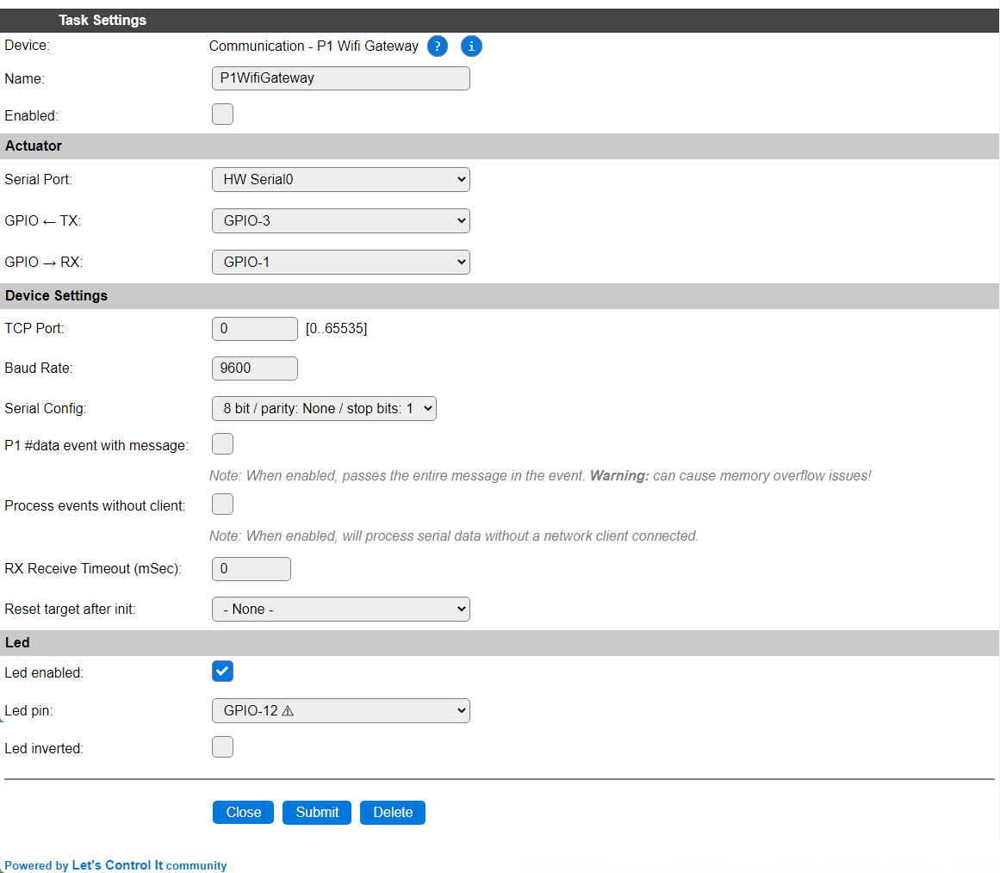

.. include:: ../Plugin/_plugin_substitutions_p04x.repl
.. _P044_page:

|P044_typename|
==================================================

|P044_shortinfo|

Plugin details
--------------

Type: |P044_type|

Name: |P044_name|

Status: |P044_status|

GitHub: |P044_github|_

Maintainer: |P044_maintainer|

Used libraries: |P044_usedlibraries|

Supported hardware
------------------

|P044_usedby|

.. note:: This plugin is now merged (back) into :ref:`P020_page` where it initially was forked off from, with using some predefined settings.

Configuration
-------------

* **Name** In the Name field a unique name should be entered.

* **Enabled** When unchecked the plugin is not enabled.

Sensor
^^^^^^

See: :ref:`SerialHelper_page`

Device Settings
^^^^^^^^^^^^^^^

* **TCP Port**: The port for an external network client to read the data from, range 1..65535. The used port number must be unique within the device.

* **Baud Rate / Serial config**: See *Serial helper configuration*, above.

* **P1 #data event with message**: When enabled, the *P1 WiFi Gateway* Event Processing option will include the received message. **WARNING** This may easily cause memory overflow exceptions, especially when running on ESP8266 or other low-memory situations!

* **Process events without client**: By default, if no network client is connected, no serial data will be received and processed either. Enabling this option enables receiving data and generating events without a TCP client connected.

* **RX Receive timeout (mSec)**: If parts of serial data packets are somewhat delayed, but should still be handled as a single message, then the delay to wait for the next part can be configured here. 0 disables the delay.

* **Reset target after init**: Select a GPIO pin that should be pulled low once during initialization of the plugin, used to synchronize the external serial data source with the plugin.

Led
^^^

* **Led enabled**: To enable a *data is being processed* activity led.

* **Led pin**: The GPIO pin the Led is connected to.

* **Led inverted**: Iverts the on/off state for the Led.

Change log
----------

.. versionchanged:: 2.0
  ...

  |changed| 2022-10-08: Merge of P020 and P044 to reduce code size and combine features, as P044 was initially started as a spin-off from P020, but not evolved with the P020 features.

  |added|
  Major overhaul for 2.0 release.

.. versionadded:: 1.0
  ...

  |added|
  Initial release version.

