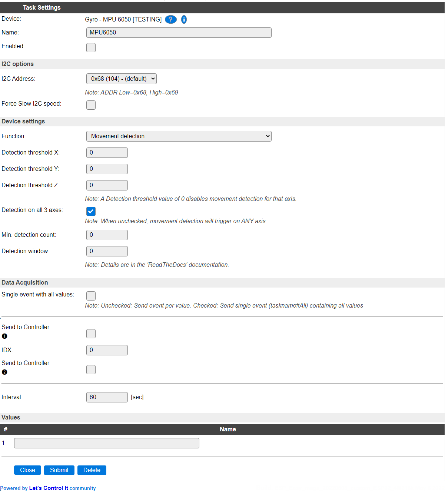
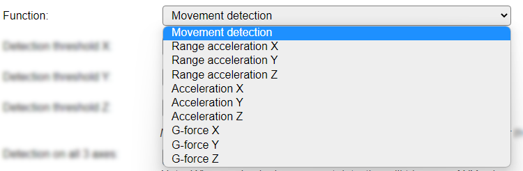

.. include:: ../Plugin/_plugin_substitutions_p04x.repl
.. _P045_page:

|P045_typename|
==================================================

|P045_shortinfo|

Plugin details
--------------

Type: |P045_type|

Name: |P045_name|

Status: |P045_status|

GitHub: |P045_github|_

Maintainer: |P045_maintainer|

Used libraries: |P045_usedlibraries|

|P045_usedby|

Description
-----------

The MPU6050 is an I2C gyro sensor with 3 axis measuring capability. This plugin supports to translate that into motion detection, with configurable threshold and time-windows.

Configuration
--------------

**Name** A unique name should be entered here.

**Enabled** The device can be disabled or enabled. When not enabled the device should not use any resources.

I2C Options 
^^^^^^^^^^^^

The available settings here depend on the build used. At least the **Force Slow I2C speed** option is available, but selections for the I2C Multiplexer can also be shown. For details see the :ref:`Hardware_page`

**I2C Address**: The address the device is using. Depending on the board used, when available an ADDR pin can be used to select the used address. If that address selection is not available, then an I2C multiplexer (in a matching ESPEasy build) can be used to use multiple sensors on a single ESPEasy unit.

Device Settings
^^^^^^^^^^^^^^^^

* **Function** Select the function this task should perform.

Available options:

Movement detection
~~~~~~~~~~~~~~~~~~

When selecting the **Movement detection** function, additional configuration is required for setting up the threshold and movement- and 'silence'- windows.

The Detection threshold can be configured per X, Y and Z axis (range 0..65535) and will be triggered when it exceeds the set threshold, where the axis is ignored if the threshold is set to 0. An actual threshold can be determined by selecting one of the Acceleration X/Y/Z functions, and making note of the value measured while an expected movement is applied to the sensor.

* **Detection on all 3 axes** When this option is enabled, all 3 axes need to exceed the configured threshold for the counter to be increased. When disabled, only one of the axis need to exceed the threshold to cause an increment.

* **Min. detection count** The minimum count of movements during the **Detection window** before the count is reset.

* **Detection window** The number of interval passes before the counter is actually increased.

Every 30 seconds a counter for the detection window is increased plus all axis are checked and if they *all* (or any when **Detection on all 3 axes** is unchecked) that are enabled exceeded the threshold values, a counter is increased.

Each period, defined by the **Detection window**, the counter is checked against the **Min. detection count** and if found equal or larger, movement is detected.

If in the next window the **Min. detection count** value is not met, movement has stopped. The **Detection window** cannot be smaller than the **Min. detection count**.

Data Acquisition
^^^^^^^^^^^^^^^^

The Single event with all values, Send to Controller and Interval settings are standard available configuration items. Send to Controller is only shown when one or more Controllers are configured.

**Interval** By default, Interval will be set to 60 sec. The minimum value allowed is 1 sec.

Values
^^^^^^

The measured value or the counter are available here, by default no name is given for the value, as this is usually chosen based on the function. No formula or decimals are available.

Change log
----------

.. versionchanged:: 2.0
  ...

  |added|
  2022-05-05 Checkbox for selecting ALL or ANY axis movement detection.

  |added|
  Major overhaul for 2.0 release.

.. versionadded:: 1.0
  ...

  |added|
  Initial release version.

