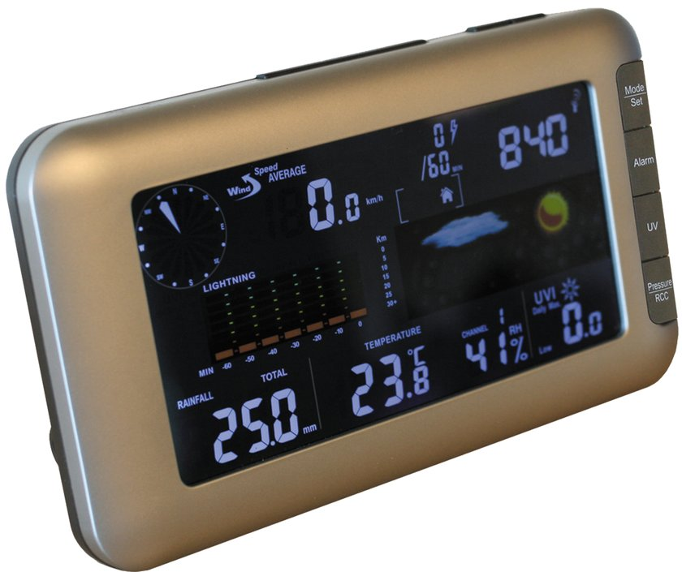
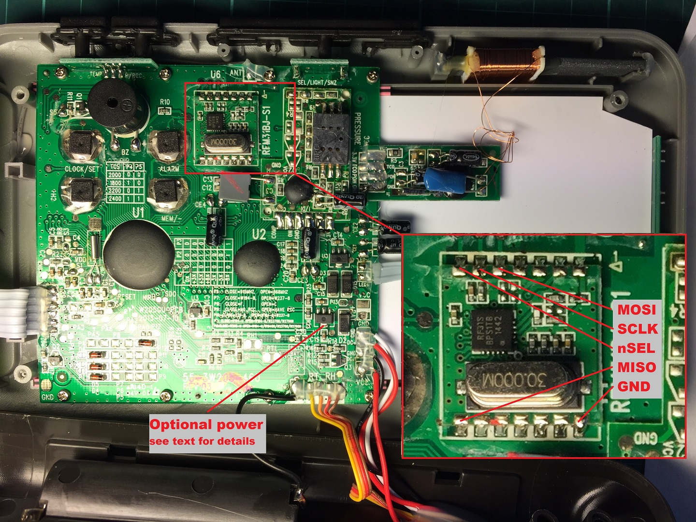

.. include:: ../Plugin/_plugin_substitutions_p04x.repl
.. _P046_Ventus_W266_page:

Ventus W266
===========

|P046_typename|
|P046_status|

Introduction
------------

The Plugin for the Ventus W266 is used to connect a Ventus W266 weather station to ESP
Easy universe. The **Ventus W266** weather station is also sold under the name of **RenkForce W205GU**.

The weather station is delivered with 2 units and a power supply. The outdoor sensor unit is battery
powered by 4 AA type batteries. It is recommended to use lithium type batteries so the power is stable
during the freezing winters.

Specifications (outdoor unit):
 * Outdoor temperature
 * Outdoor humidity
 * Wind direction
 * Average wind speed
 * Gust wind speed
 * Cumulative rainfall
 * UV index
 * Cumulative number of lightning strikes
 * Distance of the nearest lightning strike

Specifications (indoor unit):
  * Indoor temperature
  * Indoor humidity
  * Barometric pressure
  * DCF77 clock

.. note:: Be aware that this plugin is not build by default because it is disabled.
   The plugin uses quite a lot of resources like ram and ram. Since the hardware used
   is also something special we, the author and datux, decided to keep the plugin out
   of the normal builds. If you want to compile ESP Easy with this plugin enabled you
   can set the following line in your platformio.ini:

   .. code-block:: html

       [platformio]
       env_default = hard_Ventus_W266

The plugin can only **read** the sensors of the outdoor unit.

.. danger::
   CONNECTING THIS PLUGIN WILL VOID THE WARRANTY OF YOUR WEATHER STATION!

   If you are not yet prepared to void the warranty have a look at `P124_Ventus_W266_RFM69.ino <https://github.com/letscontrolit/ESPEasyPluginPlayground/blob/master/_P124_Ventus_W266_RFM69.ino>`_ in the playground.
   The RFM69HCW unit is able to communicate with the outdoor unit using radio, thus you aren't forced to do any tinkering with the indoor unit.

This device plugin is multi functional and you'll want to install multiple instances (add
the plugin multiple times) of this plugin to get all the different sensor readings. The outdoor
unit has up to 9 sensors values and a minimum of 5 sensor types. Most home controllers, like Domoticz,
can read multiple values per sensor type. The temperature sensor for instance also reads the humidity
and the wind sensor combines two types of windspeed and the direction. You'll need one instance per sensor type.

The plugin was originally written for use with (and tested on) Domoticz, which did not support
custom multi value sensors at the moment (February 2017). This means the lightning detection
is send as two instances. In total you could run as many as nine instances of the plugin to get all values.

Wiring
------

.. code-block:: html

    ESP               Ventus
    GPIO (4)   <-->   MOSI
    GPIO (12)  <-->   SCLK
    GPIO (14)  <-->   nSEL
    GPIO (5)   <-->   MISO

    Power
    5.0V       <-->   VCC (read note below)
    GND        <-->   GND

Set up the piggy back ESP unit according to this schematics. We recommend you using a Wemos D1 mini
board since these fit nicely.

.. note:: If your ESP module has it's own 3v3 regulator you could connect its power input to the optional power
    pin specified in the image. The supplied power supply however is not powerful enough to supply both the display
    with the backlight on and an ESP while transmitting. It is safe to exchange the power supply for a USB power
    supply of 1A (or higher). The display unit is happy and working fine with only the 5 volts. Some adapters supply
    more then 5 volts, since the original adapter supplied 6 volts this should not be a problem.

Be mindful when you install the ESP unit. Although the space on the right, above the white display,
seems to be perfect for placing the ESP, it is very close to the indoor temperature sensor and your readings
on the display will be off by approx. +2 degrees because of the heat generated by the ESP. A better position is
all the way on the left where a bare ESP-12E fits perfect, just be sure to supply it with 3.3V instead of the 5V
from the supply pin in the picture.

When using a bare ESP be sure to apply the necessary ~10K pull-up resistors to CH_PD (CD_EN), GPIO0 and
a pull-down to GPIO15 for stable performance and OTA capabilities.

.. note:: It is not possible to read the indoor sensors using the plugin nor is it in development or planned.

Setup
-----

.. .. image:: P046_Setup_Ventus_W266_1.png

Task settings
~~~~~~~~~~~~~

.. note::
    To get started you need to add the device plugin and set the instance to **Main + Temp/Hygro**.
    This instance contains the core functionality of the plugin and is needed to read the data send by
    the outdoor sensor unit. **This instance is the only one that has the ability to set the GPIO pins used.**

* **Device**: Name of plugin
* **Name**: Name of the task (example name **VentusW266**)
* **Enable**: Should the task be enabled or not

Sensor
^^^^^^

* **Plugin function**: Main, Wind, Rain etc...
* **1st GPIO (5-MOSI)**: **GPIO 4 (D2)**.
* **2nd GPIO (6-SCLK)**: **GPIO 12 (D6)**.
* **3rd GPIO (7-nSEL)**: **GPIO 14 (D5)**.
* **4th GPIO (8-MISO)**: **GPIO 5 (D1)**.

.. warning:: You must not have more than 1 main plugin function active! It will not work
   properly if you have more.

Data acquisition
^^^^^^^^^^^^^^^^

* **Send to controller** 1..3: Check which controller (if any) you want to publish to. All or no controller can be used.
* **Interval**: How often should the task publish its value (5..15 seconds is normal).

Indicators (recommended settings)
^^^^^^^^^^^^^^^^^^^^^^^^^^^^^^^^^

.. warning:: Although the "main" instance shows three values, only two will be send to the plugin as specified in the additional explanation.
      Only the main plugin instance has the ability to read the display unit. You need one, and only one, main instance.
      All other instances read the data fetched by the main plugin.

.. csv-table::
   :header: "Indicator", "Value Name", "Interval", "Decimals", "Extra information"
   :widths: 8, 5, 5, 5, 40

   "Temperature", "Celsius", "60", "1", "**Main + Temp/Hygro**: Gives the temperature with 1 decimal precision in degrees Celsius and the humidity in percent."
   "Humidity", "RH", "60", "0", "**Main + Temp/Hygro**"
   "Bearing", "Bearing", "60", "0", "**Wind**: Gives the wind direction in degrees, the average and gust wind speeds in **m/s** times 10."
   "Average wind speed", "WindSpeed", "60", "1", "**Wind**"
   "Gust wind speed", "GustSpeed", "60", "1", "**Wind**"
   "Rain per hour", "RainHour", "600", "0", "**Rain**: Gives the rain per **mm** per hour and the total rainfall (which will eventually roll over or reset if the batteries are changed)."
   "Rain total", "GustSpeed", "600", "0", "**Rain**"
   "UV index", "UV", "60", "1", "**UV**: Gives the UV index with 1 decimal precision."
   "Strikes per hour", "Strikes", "300", "0", "**Lightning strikes**: Gives the number of lightning strikes per hour during the last 5 minutes."
   "Lightning distance", "StrikeDistance", "60", "0", "**Lightning distance**: Gives the distance to the closest lightning strike (stormfront). When no lightning is detected the value is ``-1``."

.. note::
    Unknown 1, byte 6 - This value is partly unknown and observed to usually be 00. Turns to 01 when the battery of the outdoor unit is low.

    Unknown 2, byte 16 - This value is unknown but observed to always be 00.

    Unknown 3, byte 19 - This value is unknown but observed to always be 38 (decimal).

Rules examples
--------------

.. code-block:: html

 on VentusW266#UV do
  if [VentusW266#UV]>9
    Publish,%sysname%/Alarm,Stay inside today!
  endif
 endon

Commands available
~~~~~~~~~~~~~~~~~~

.. .. include:: P046_commands.repl

Where to buy
------------

.. csv-table::
   :header: "Store", "Link"
   :widths: 5, 40

   "Conrad","`Link 1 <https://www.conrad.com/ce/en/product/1208067/Wireless-digital-weather-station-Renkforce-W205GU-Forecasts-for-12-to-24-hours>`_"

|affiliate|

.. More pictures
.. -------------

.. .. image:: P046_Ventus_W266_3.jpg

.. .. image:: P046_Ventus_W266_4.jpg
