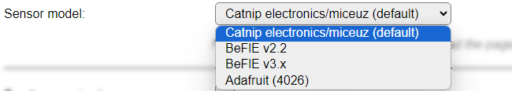

.. include:: ../Plugin/_plugin_substitutions_p04x.repl
.. _P047_page:

|P047_typename|
==================================================

|P047_shortinfo|

Plugin details
--------------

Type: |P047_type|

Name: |P047_name|

Status: |P047_status|

GitHub: |P047_github|_

Maintainer: |P047_maintainer|

Used libraries: |P047_usedlibraries|

Supported hardware
------------------

* Catnip electronics/miceuz:

  Where to buy: `Miceuz on Tindie.com <https://www.tindie.com/products/miceuz/i2c-soil-moisture-sensor/>`_

  Arduino library: `Miceuz on Github.com <https://github.com/Miceuz/i2c-moisture-sensor>`_ (only used for inspiration)

  .. image:: P047_CatnipMiceuzSensor.png

* BeFlE:

  Where to buy: `BeFlE on Amazon.de <https://www.amazon.de/BeFlE-kapazitiver-Bodenfeuchtesensor-SoMoSe-v1-1/dp/B091D6HNM6/ref=sr_1_3?keywords=somose+v2.2&qid=1679243526&sprefix=SoMoSe%2Caps%2C82&sr=8-3>`_
  
  Arduino library: `BeFlE on Github.com <https://github.com/BeFlE/SoMoSe>`_ (only used for inspiration)

  .. image:: P047_BeFlESensor.png

Though not directly applicable, as it is about selecting an Analog Soil-moisture sensor, `this Youtube video <https://www.youtube.com/watch?v=IGP38bz-K48>`_ has usable tips on finding a reliable sensor.

Configuration
-------------

* **Name** A unique name should be entered here.

* **Enabled** The device can be disabled or enabled. When not enabled the device should not use any resources.

I2C Options 
^^^^^^^^^^^^

The available settings here depend on the build used. At least the **Force Slow I2C speed** option is available, but selections for the I2C Multiplexer can also be shown. For details see the :ref:`Hardware_page`

* **I2C Address (Hex)**: The address the device is using. The default I2C address is prefilled, and can be configured to use a different address, see below. As this can be any valid I2C address in range: 0x01..0x7F, it has to be typed here, using a hexadecimal value.

.. note:: If the device doesn't stay enabled after setting the Enabled checkbox, then possibly the address of the sensor is changed from the default. The I2C Scan on the Tools page can be used to detect what I2C device addresses are in use (disconnect other I2C devices to avoid confusion). Possibly, another device-model is listed for this sensor, but that is caused by the feature that it can have any address set that's in the I2C allowed range of 0x00 to 0x7F.

Device Settings
^^^^^^^^^^^^^^^^

* **Sensor model**: Select the model of the used sensor. When changing the selection the page will be reloaded to adjust the content of the screen.

* *Catnip electronics/miceuz (default)*: The originally supported soil moisture sensor, that supports temperature, moisture and light measurement, has a sleep-mode, and can report a version number, to optionally validate if the sensor is supported.

* *BeFlE*: An I2C soil moisture sensor that supports temperature and moisture measurement. There is no sleep mode or version check available.

When selecting the BeFlE sensor, only these **Device Settings** will be available:

* **Send sensor to sleep**: When not actively reading the sensor, the device can be set to sleep-mode, to conserve some power. (Catnip sensor only).

* **Check sensor version**: To validate if the sensor is of the correct mode, the version can be validated. (Catnip sensor only).

* **Change sensor address**: To use multiple sensors connected to a single ESP unit, a sensor can be configured to use a different I2C address. To change that address, this checkbox has to be enabled, and a different I2C address should be entered in the **Change I2C Address to (Hex)** field in hexadecimal format, range: 0x01..0x7F.

* **Change I2C Addr. to (Hex)**: The new address to be used by the sensor. The change will be applied the next time the task is enabled. The **I2C Address (Hex)** field, above, will be updated with the new value. After the change is applied, **the tasks Settings have to be saved once more to save the new address** as the address to use.

.. note:: The newly set address is permanently stored in the sensor, and can be changed again at a later time if desired.

Data Acquisition
^^^^^^^^^^^^^^^^

The Data Acquisition, Send to Controller and Interval settings are standard available configuration items. Send to Controller only when one or more Controllers are configured.

**Interval** By default, Interval will be set to 60 sec. The minimum value allowed is 1 sec. but each read is taking at least 2 seconds, so selecting a value below 3 seonds might cause intermittent read failures or invalid values.

Values
^^^^^^

The measured values are available in ``Temperature``, ``Moisture`` and ``Light``. A formula can be set to recalculate. The number of decimals is by default set to 2, and can be set to 0 for ``Moisture``, as no decimals are provided from the measurement.

NB: The BeFlE sensor doesn't support a Light value, so that won't be available if that **Sensor model** is selected.

.. Commands available
.. ^^^^^^^^^^^^^^^^^^

.. .. include:: P047_commands.repl

.. Events
.. ~~~~~~

.. .. include:: P047_events.repl

Change log
----------

.. versionchanged:: 2.0
  ...

  |added|
  Major overhaul for 2.0 release.

.. versionadded:: 1.0
  ...

  |added|
  Initial release version.

