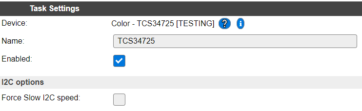
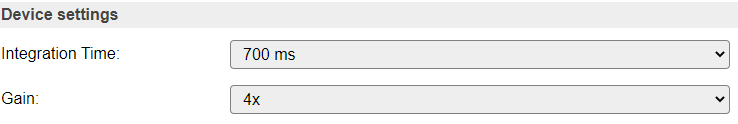
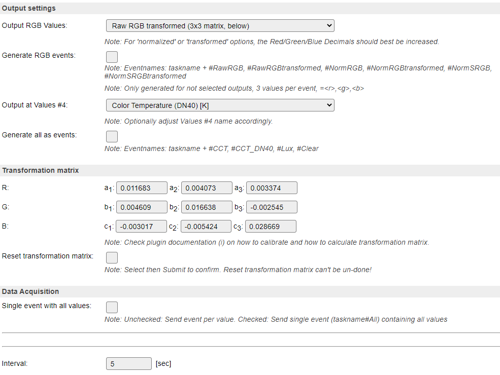
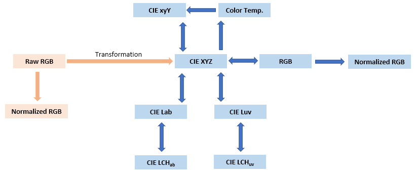
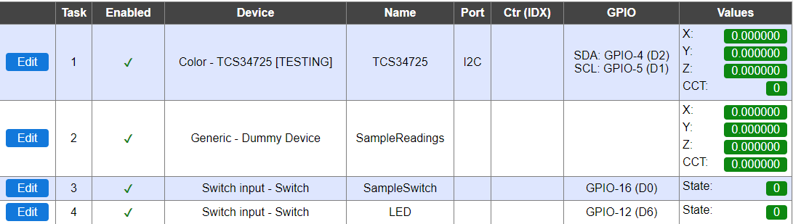
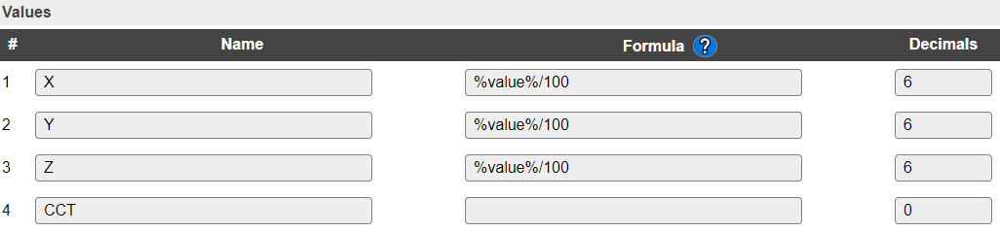
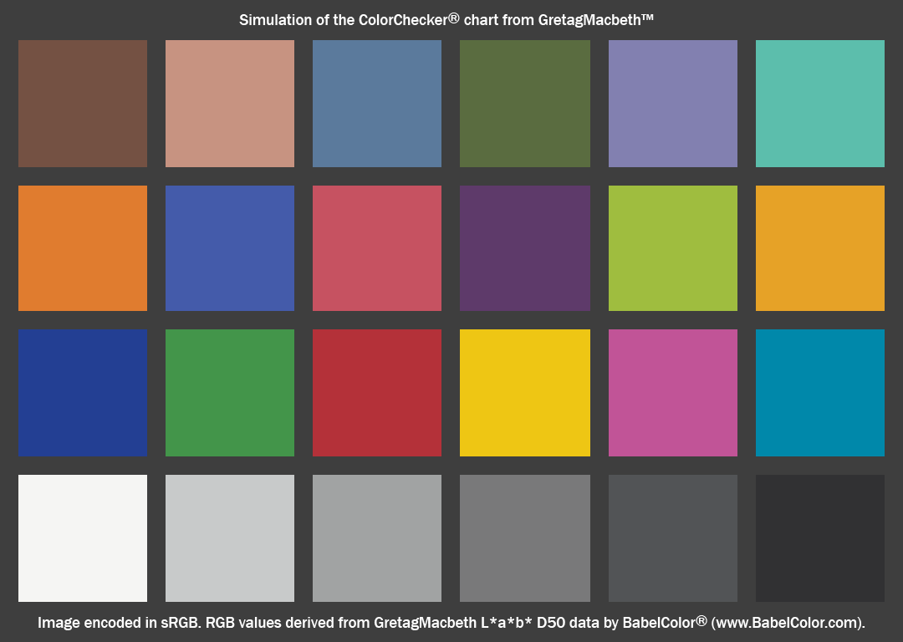

.. include:: ../Plugin/_plugin_substitutions_p05x.repl
.. _P050_page:

|P050_typename|
==================================================

|P050_shortinfo|

Plugin details
--------------

Type: |P050_type|

Name: |P050_name|

Status: |P050_status|

GitHub: |P050_github|_

Maintainer: |P050_maintainer|

Used libraries: |P050_usedlibraries|

TCS34725
========

.. image:: https://cdn-shop.adafruit.com/970x728/1334-05.jpg

Introduction
------------

The TCS34725 has RGB and Clear light sensing elements.
An IR blocking filter, integrated on-chip and localized to the color sensing photodiodes, minimizes the IR spectral component of the incoming light and allows accurately color measurements.

**Specifications:**

* RGB color and light sensor with 4 channel light sensing readings (Red, Green, Blue, Clear)
* Calculated light lux
* Calculated color temperature
* Adjustable integration time and gain
* Neutral 4150 °K temperature onboard LED to illuminate what you're trying to sense
* I2C 7-bit address (0x29) - fixed
* I2C pins can be used at 3.3V or 5V

Wiring
------

.. code-block:: none

  ESP                  TCS34725
  GPIO-4 (D2)   <-->   SDA
  GPIO-5 (D1)   <-->   SCL

  Power
  3.3V          <-->   3.3V
  GND           <-->   GND

The **onboard LED** can be turn off by pulling the sensor LED pin to LOW:

* **To turn off permanently**: Wire the sensor LED pin directly to the microcontroller ground

.. code-block:: none

  ESP                  TCS34725
  GND           <-->   LED

* **To control via an ESPEasy switch**: Wire the sensor LED pin to a spare microcontroller digital pin

.. code-block:: none

  ESP                  TCS34725
  GPIO-12 (D6)  <-->   LED

* **To control with setInterrupt()**: Wire the sensor LED pin to the sensor INT pin

.. code-block:: none

  TCS34725             TCS34725
  INT           <-->   LED

Setup
-----

.. note:: **I2C address: 0x29** Can not be changed

Gain and Integration Time
~~~~~~~~~~~~~~~~~~~~~~~~~

* The Integration Time of the sensor must be a value between 2.4-700 (in milliseconds)
* The gain of the sensor must be a value of 1, 4, 16, 60

In general:

* **Use the minimum Gain as possible**, since increasing the Gain amplifies the noise as well as the signal
* **Choose an Integeration Time long enough to produce a near full-scale value**, since this will give you the most effective use of the sensor's resolution

To adjust Gain and Integration Time settings:

* Switch to Raw RGB data plus the Clear channel
* Set Gain to 1
* Increase Integration Time until the Clear Channel value reach **65535 (maximum value) => Sensor is saturated**
* Decrease Integration Time by one level => **All channels MUST < 65535**
* Control that **Color Temperature (DN40)** value of daylight is **not 0**

**After applying transformation/calibration factors do NOT change** your settings of Gain and Integration Time (see chapter "Conditions")!

Output settings
~~~~~~~~~~~~~~~

* Raw RGB (0..65535)
* Raw RGB (0..65535) transformed (3x3 matrix, below)
* Normalized RGB (0-255)
* Normalized RGB (0-255) transformed (3x3 matrix, below)
* Normalized RGB (0.0000..1.0000)
* Normalized RGB (0.0000..1.0000) transformed (3x3 matrix, below)

* Color Temperature (DN25 - deprecated) [K]
* Color Temperature (DN40) [K]
* Ambient Light [Lux]
* Clear Channel
 
For detailed explanations see below chapter "Indicators (recommended settings)".

Transformation matrix
~~~~~~~~~~~~~~~~~~~~~

Example for a **Transformation into the CIE-XYZ color space**:

* Most common and most accurate approach

.. code-block:: none

  | X* |				| R‘ |
  | Y* |	=	| M |	*	| G‘ |
  | Z* |				| B‘ |
  
  - X*, Y* and Z* are the estimated CIE-XYZ values
  - R', G' and B' are the responses from the sensor's Raw RGB output channels
  - | M | is the transformation matrix based on your sensor calibration

* Conversions from CIE-XYZ color space into RGB (e.g. sRGB, Adobe RGB (1998), ...) or other color spaces are easyly to manage (see chapter "Conversions from CIE-XYZ color space into other color spaces")

The sensor **without any kind of calibration** can **only** provide **a raw color estimation** (see chapter "Normalized RGB")!

Please **follow the chapter "Sensor calibration"** to understand the procedure for setting up and to calculate a transformation matrix fitting to your specific need.

**After applying transformation/calibration factors do NOT change your settings of Gain and Integration Time** (see chapter "Conditions")!

Rules examples
--------------

The following example is based on:

* a Switch which will start a Sample and will indicate that the Sample is finished
* an LED (onboard of your TCS34725 or placed somewhere else in your case) to illuminate what you're trying to sense
* a Dummy Device for the recording of your Sample Readings
* a Rule Set for synchronization
 

.. code-block:: none

  On System#Boot do
    Let,1,0						// LoopCounter
    Let,3,0						// SampleMode off
    Let,5,0						// Sample averages
    Let,6,0
    Let,7,0
    Let,10,16						// SampleSwitch GPIO
    Let,11,12						// LED GPIO
    Pulse,[INT#11],1,1000
  endon
  
  on ResetSampleReadings do
    TaskValueSet,%eventvalue1%,1,0			// SampleReadings
    TaskValueSet,%eventvalue1%,2,0
    TaskValueSet,%eventvalue1%,3,0
  endon
  
  on UpdateSampleReadings do
    TaskValueSet,2,%eventvalue1%,%eventvalue2%		// SampleReadings
    if %eventvalue1%=3
      GPIO,[INT#10],0					// SampleSwitch off
    endif
  endon
  
  on Sample#State=1 do					// SampleSwitch on
    GPIO,[INT#11],1					// LED on
    asyncevent,ResetSampleReadings=2			// SampleReadings reset
    Let,3,1						// SampleMode on
    TaskRun,1						// Sample start
  endon
  
  on TCS34725#X do
    if [INT#3]>0					// SampleMode on
      Let,1,[INT#1]+1					// LoopCounter
      if [INT#1]>1 and [INT#1]<6			// Skip values for 1. Loop
        Let,5,[VAR#5]+[TCS34725#X]			// SampleAverages for Loop 2,3,4,5,6
        Let,6,[VAR#6]+[TCS34725#Y]
        Let,7,[VAR#7]+[TCS34725#Z]
      elseif [INT#1]=6
        Let,5,([VAR#5]+[TCS34725#X])/5
        Let,6,([VAR#6]+[TCS34725#Y])/5
        Let,7,([VAR#7]+[TCS34725#Z])/5
        asyncevent,UpdateSampleReadings=1,[VAR#5]	// SampleReadings update
        asyncevent,UpdateSampleReadings=2,[VAR#6]
        asyncevent,UpdateSampleReadings=3,[VAR#7]
        GPIO,[INT#11],0					// LED off
        Let,1,0						// LoopCounter reset
        Let,5,0						// SampleAverage reset
        Let,6,0
        Let,7,0
        Let,3,0						// SampleMode off
      endif
      TaskRun,1						// Loop
    endif
  endon

Indicators (recommended settings)
---------------------------------

.. csv-table::
  :header: "Indicator", "Value Name", "Range", "Interval", "Decimals", "Extra information"
  :widths: 8, 5, 5, 5, 5, 40

  "Raw RGB", "- R
  - G
  - B", "* 0..65535", "", "0", "* For adjustment of Gain and Integration Time settings
  * For sensor calibration"
  "Clear Channel", "* Clear", "* 0..65535", "", "0", "* For adjustment of Gain and Integration Time settings"
  "CIE-XYZ", "- X
  - Y
  - Z", "* 0..1", "", "6", "* Transformed Raw RGB"
  "Normalized RGB", "* R
  * G
  * B", "* 0..1
  * 0..255", "", "4", "* Not equal to sRGB
  * Only a raw estimation"
  "Correlated Color Temperature [K]", "* CCT", "* 1000..20000", "", "0", "* Calculated - Only a raw estimation
  * Method 1: deprecated, AMS DN25
  * Method 2: preferred, AMS DN40"
  "Intensity of Ambient Light [Lux]", "* AmbientLight", "* 0..100000", "", "0", "* Calculated - Only a raw estimation"

Normalized RGB
~~~~~~~~~~~~~~

* **Normalized RGB  ≠ sRGB** (not equal to sRGB)
* **Sum of Normalized RGB channels is 255**
* You're losing information - **Only a raw estimation** (see: https://aishack.in/tutorials/normalized-rgb/)

Example for **Yellow** ColorChecker Patch [Index No 16, sRGB(238 198 20)]:

.. code-block:: none
  
  Raw RGB (Range: 0..65535)      R   :                   3486.0
                                 G   :                   2777.2
                                 B   :                   1163.2
  ------------------------------------------------------------------
                                 Sum :                   7426.4
  
  Normalized RGB (Range: 0..1)   R   : 3486.0 / 7426.4 =    0.469406
                                 G   : 2777.2 / 7426.4 =    0.373963
                                 B   : 1163.2 / 7426.4 =    0.156630
  ------------------------------------------------------------------
                                 Sum :                      1
  
  Normalized RGB (Range: 0..255) R   : 0.469406 * 255  =  120
                                 G   : 0.373963 * 255  =   95
                                 B   : 0.156630 * 255  =   40
  ------------------------------------------------------------------
                                 Sum :                    255

Compared to their corresponding sRGB values:

.. code-block:: none
  
  sRGB (Range: 0..255)           R   :                    238
                                 G   :                    198
                                 B   :                     20
  ------------------------------------------------------------------
                                 Sum :                    456

Adjust sensor's values (precision)
~~~~~~~~~~~~~~~~~~~~~~~~~~~~~~~~~~

Use 6 digit precision for the 3 color channels if additional transformations into other CIE Color or RGB standards are required.

Where to buy
------------

.. csv-table::
  :header: "Store", "Link"
  :widths: 5, 40

  "adafruit","`TCS34725 (7.95$) <https://www.adafruit.com/product/1334>`_"

|affiliate|

More pictures
-------------
.. image:: https://cdn-shop.adafruit.com/970x728/1334-06.jpg
.. image:: https://cdn-shop.adafruit.com/970x728/1334-03.jpg

Sensor calibration
------------------

General information
~~~~~~~~~~~~~~~~~~~

Below calibration method is following "ams Color Classification with the TCS230" (https://ams.com/documents/20143/80162/ColorSensors_AN000518_1-00.pdf).

Reference Measurements
~~~~~~~~~~~~~~~~~~~~~~

Color charts/references such as the **ColorChecker** can be perfectly used for reference measurements.

Because of its wide availability and use, its careful design, its consistency and because comprehensive spectrophotometric measurements are available, the ColorChecker has also been used in academic research into topics such as spectral imaging:

* https://xritephoto.com/documents/literature/en/ColorData-1p_EN.pdf
* https://www.babelcolor.com/colorchecker-2.htm
* https://www.babelcolor.com/index_htm_files/ColorChecker_RGB_and_spectra.zip

Above chart is converted from BabelColor: https://www.babelcolor.com/index_htm_files/ColorChecker_sRGB_from_Lab_D50.tif

**Nominal chromaticities** of ColorChecker patches in the CIE 1931 xy chromaticity diagram:

.. image:: https://upload.wikimedia.org/wikipedia/commons/b/b4/CIE1931xy_ColorChecker_SMIL.svg

(https://en.wikipedia.org/wiki/ColorChecker)

Conditions
~~~~~~~~~~

* Measurement under **specific Light** (Wavelength, Illuminance (lux), Color Temperature (CCT), Daylight, LED light, ...)
* Constant **Distance** between **Light source** <-> **Object** <-> **Sensor**
* Constant Light **Reflectance** - Beam angel
* Proper **Gain** and **Integration Time** settings

In case you illuminate via your LED monitor ensure proper monitor calibration first:

* https://www.simpelfilter.de/en/colorman/monitorcalibration.html

**After applying transformation/calibration factors do NOT change your settings of Gain and Integration Time!**

"White point" calibration - the most simple one 
~~~~~~~~~~~~~~~~~~~~~~~~~~~~~~~~~~~~~~~~~~~~~~~

Good wikipedia article about color calibration ("Color balance")

* https://en.wikipedia.org/wiki/Color_balance

Illuminate a white paper with white/day light (please see above conditions) and measure sensor's Normalized RGB values:

.. code-block:: none

  R'w = 77.4623
  G'w = 90.4528
  B'w = 87.0849

Calculate calibration factors for "White Point" [sRGB(255 255 255)]:

.. code-block:: none

  | R* |		| 255 / R’w	0		0		|		| R‘ |
  | G* |	= 	| 0		255 / G’w	0		|	*	| G‘ |
  | B* |		| 0		0		255 / B’w	|		| B‘ |
  
  cR' = 255 / R'w = 3.291924
  cG' = 255 / G'w = 2.81915
  cB' = 255 / B'w = 2.928177

But these factors obviously are ONLY for raw color estimations (see chapter "Normalized RGB") ...

Mapping of sensor's Raw RGB output channels to ColorChecker XYZ references
~~~~~~~~~~~~~~~~~~~~~~~~~~~~~~~~~~~~~~~~~~~~~~~~~~~~~~~~~~~~~~~~~~~~~~~~~~

* Most common and most accurate approach

.. image:: P050_TCS34725_8.png

**Transformation matrix**

.. code-block:: none

 	 		| X"1	X"2	...	X"n |		| R'1	R'2	...	R'n |	-1
  | M |		=	| Y"1	Y"2	...	Y"n |	*	| G'1	G'2	...	G'n |
 	 		| Z"1	Z"2	...	Z"n |		| B'1	B'2	...	B'n |
  
  - X"[1-n], Y"[1-n] and Z"[1-n] are the CIE-XYZ reference values for ColorChecker Patches
  - R'[1-n], G'[1-n] and B'[1-n] are the responses from the sensor's Raw RGB output channels
  - | M | is the transformation matrix

To find the inverse matrix: https://comnuan.com/cmnn0100f/cmnn0100f.php

Based on above calibration measurements the transformation matrix looks like

.. code-block:: none

 	 		|  0.011683	 0.004073	 0.003374 |
  | M |		=	|  0.004609	 0.016638	-0.002545 |
 	 		| -0.003017	-0.005424	 0.028669 |

But **be careful**: Above transformation matrix is **ONLY working for specific conditions** (see chapter "Conditions).

You have to **setup and** to **calculate** a transformation matrix **fitting to your specific need**.

**Transformation into CIE-XYZ color space**

.. code-block:: none

  | X* |				| R‘ |
  | Y* |	=	| M |	*	| G‘ |
  | Z* |				| B‘ |
  
  - X*, Y* and Z* are the estimated CIE-XYZ values
  - R', G' and B' are the responses from the sensor's Raw RGB output channels
  - | M | is above transformation matrix

Conversions from CIE-XYZ color space into other color spaces
------------------------------------------------------------

Conversions from CIE-XYZ color space into RGB (e.g. sRGB, Adobe RGB (1998), ...) or other color spaces are easyly to manage:

See: http://www.brucelindbloom.com/index.html?Math.html

Conclusion
----------

A average of **3.59 ΔE*ab (Max ΔE*ab: 6.31)** between ColorChecker XYZ references and their corresponding estimated XYZ values is not so bad for an 7.95$ cheap sensor ;-)

References
----------

* Adafruit product page: https://www.adafruit.com/product/1334
* ams TCS34725 product page: https://ams.com/tcs34725
* ams TCS34725 data sheet: https://ams.com/documents/20143/36005/TCS3472_DS000390_3-00.pdf
* Lux and CCT Calculations using ams Color Sensors (DN40): https://ams.com/documents/20143/36005/ColorSensors_AN000166_1-00.pdf
* Calculating Color Temperature and Illuminance using ams Color Sensors (DN25): https://ams.com/documents/20143/36005/TCS34xx_AN000517_1-00.pdf
* Improving Color Sensor Lux Accuracy using ams Color Sensors: https://ams.com/documents/20143/36005/ColorSensors_AN000261_1-00.pdf
* ams Color Classification with the TCS230: https://ams.com/documents/20143/80162/ColorSensors_AN000518_1-00.pdf
* ams Colorimetry Tutorial (DN 20): https://ams.com/documents/20143/36005/LightSensors_AN000519_1-00.pdf
* X-Rite ColorChecker reference data (2009): https://xritephoto.com/documents/literature/en/ColorData-1p_EN.pdf
* Descriptions and pictures of the ColorChecker: https://www.babelcolor.com/colorchecker.htm
* CIE Color Calculator: http://www.brucelindbloom.com/index.html?ColorCalculator.html
* CIE Color Difference Calculator: http://www.brucelindbloom.com/ColorDifferenceCalc.html
* Useful Color Equations: http://www.brucelindbloom.com/index.html?Math.html

Change log
----------

.. versionchanged:: 2.0
  ...

  |added|
  Major overhaul for 2.0 release.

.. versionadded:: 1.0
  ...

  |added|
  Initial release version.

