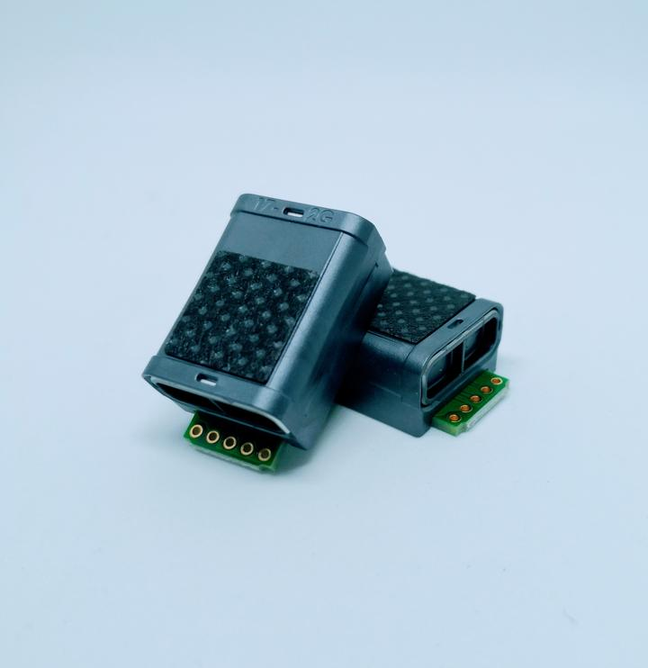
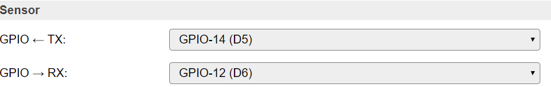
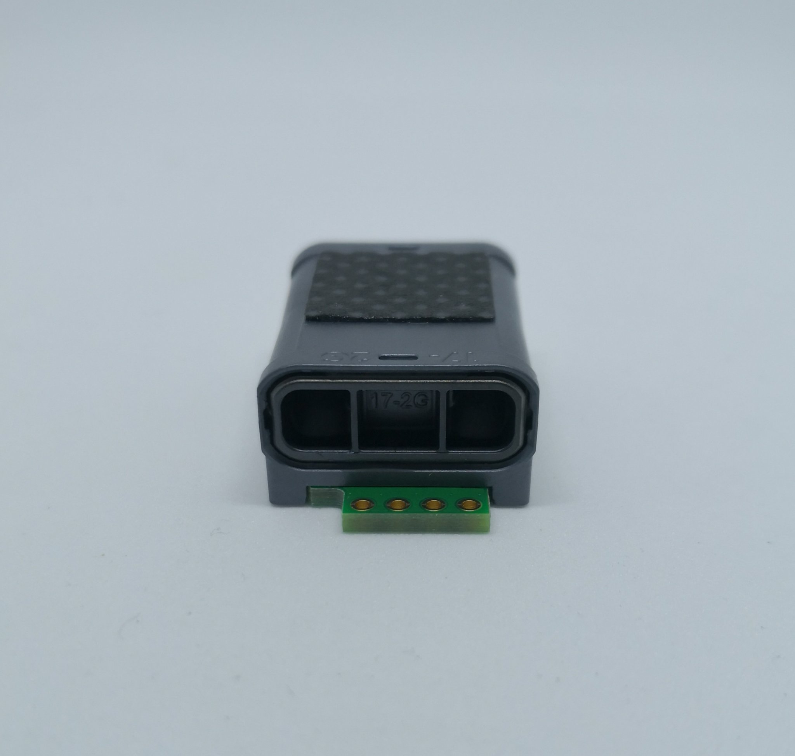
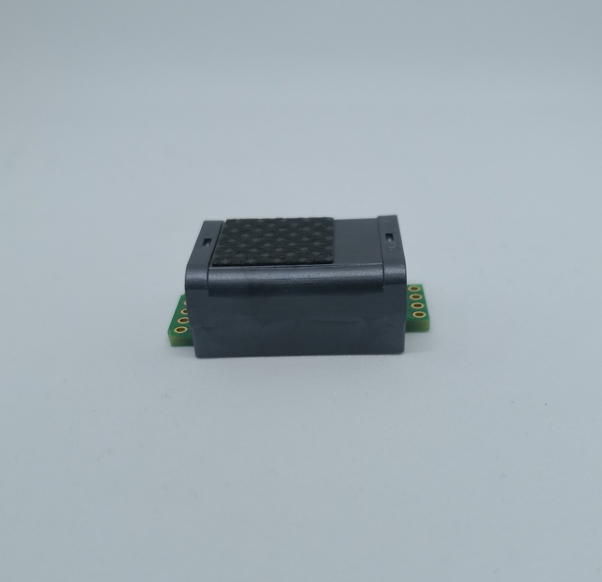

.. include:: ../Plugin/_plugin_substitutions_p05x.repl
.. _P052_S11_page:

S11
===

|P052_typename|
|P052_status|

Introduction
------------

This is the flagship CO2 sensor from Swedish company Senseair.

Specifications:
 * 400 to 5000 ppm
 * 5V (3.05-5.5VDC)
 * Peak 125mA, avarage 38μA
 * 11.5 x 33.5 x 19.7 mm
 * UART/I2C communication
 * More than 15 years life span
 * No burn-in needed, will stabilize after 8 days at worst depending on placement environment

Wiring
------

Circuit wiring (S11 seen from top, with the 5 holes left and the 4 holes right):

.. code-block:: none

    ESP               S11 (UART)
    GPIO (14)  <-->   TX (5th hole of the 5 holes)
    GPIO (12)  <-->   RX (4th hole [below TX])

    Power
    5.0V       <-->   VBB (2nd hole of the 5 holes, 3.3V can also be used)
    GND        <-->   GND (1st hole)
    3.3V       <-->   VDDIO (3rd hole [middle])

As you can see only pins on the "5 via side" are being used. But...

Set up the S11 according to this simple schematics. For continuous use you should connect
the EN (S11) to VBB (S11), EN is used to wake the sensor on demand. By using VBB this will
make the EN go high = sensor is activated. But currently the feature of putting the S11 to
sleep isn't supported by the plugin, thus you need to have EN set to high using VBB.

The COMSEL pin is used if you want to use I2C communication, in that case you pull this
low (0.4V or less). Leave open/floating if UART is used.

VDDIO is supply voltage for TX/SCL/nRDY and thus need 3.3V.

nRDY is an output signaling when the measurement is ready. The plugin does not use that pin.

DVCC is an output, only to be used for driving small loads like a level converter.

.. danger::
  Power needed: 3.05-5.5V. PLEASE OBSERVE THAT FEEDING THE S11 WITH 5.5+V WILL DAMAGE THE INTERNAL LAMP AND BREAK THE UNIT - GIVING FALSE VALUES!

Setup
-----

Task settings
~~~~~~~~~~~~~

* **Device**: Name of plugin
* **Name**: Name of the task (example name **CO2**)
* **Enable**: Should the task be enabled or not

Sensor
^^^^^^

* **GPIO <-- TX**: TX is generally set to **GPIO 14 (D5)**.
* **GPIO --> RX**: RX is generally set to **GPIO 12 (D6)**.
* **Sensor**: Only **Carbon Dioxide** is supported by the S11.

Data acquisition
^^^^^^^^^^^^^^^^

* **Send to controller** 1..3: Check which controller (if any) you want to publish to. All or no controller can be used.
* **Interval**: How often should the task publish its value (5..15 seconds is normal).

Indicators (recommended settings)
^^^^^^^^^^^^^^^^^^^^^^^^^^^^^^^^^

.. csv-table::
   :header: "Indicator", "Value Name", "Interval", "Decimals", "Extra information"
   :widths: 8, 5, 5, 5, 40

   "Error status", "N/A", "", "", "Used for tSense (K70), K30, K33"
   "Carbon dioxide", "ppm", "16", "0", ""
   "Temperature", "N/A", "", "", "Used for tSense (K70), K30, K33"
   "Humidity", "N/A", "", "", "Used for tSense (K70), K30, K33"
   "Relay status", "N/A", "", "", "Used for tSense (K70), K30, K33"
   "Temperature adjustment", "N/A", "", "", "Used for tSense (K70), K30, K33"
   "ABC period", "N/A", "", "", "Used for tSense (K70), K30, K33"

.. note:: If you want to use the relative carbon dioxide percentage (2000ppm = 100% and 350ppm = 0%) you should use this
          :code:`100-(2000-%value%)/(2000-350)*100` as a formula. And instead of :code:`ppm` as value name you should use
          :code:`RCO2` (relative CO2) and 1 decimal.

Rules examples
--------------

.. code-block:: none

 on CO2#Level do
  if [CO2#Level]>2000
    Publish,%sysname%/Alarm,CO2 level is too high!
  endif
 endon

Commands available
~~~~~~~~~~~~~~~~~~

.. include:: P052_commands.repl

Where to buy
------------

.. csv-table::
   :header: "Store", "Link"
   :widths: 5, 40

   "First Byte","`Link 1 ($) <https://firstbyte.shop/products/s11>`_"

|affiliate|

More pictures
-------------

.. image:: P052_S11_2.png

