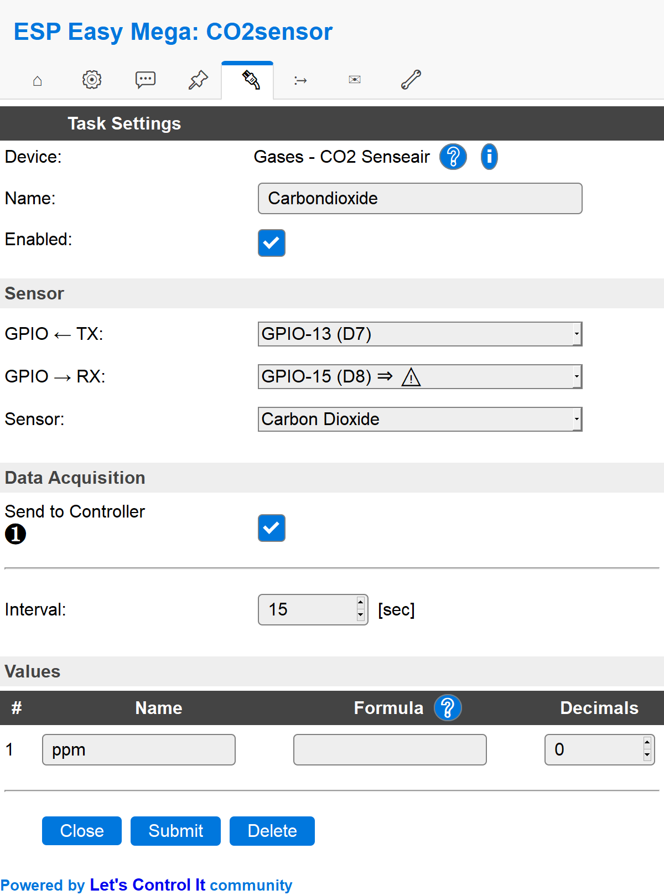
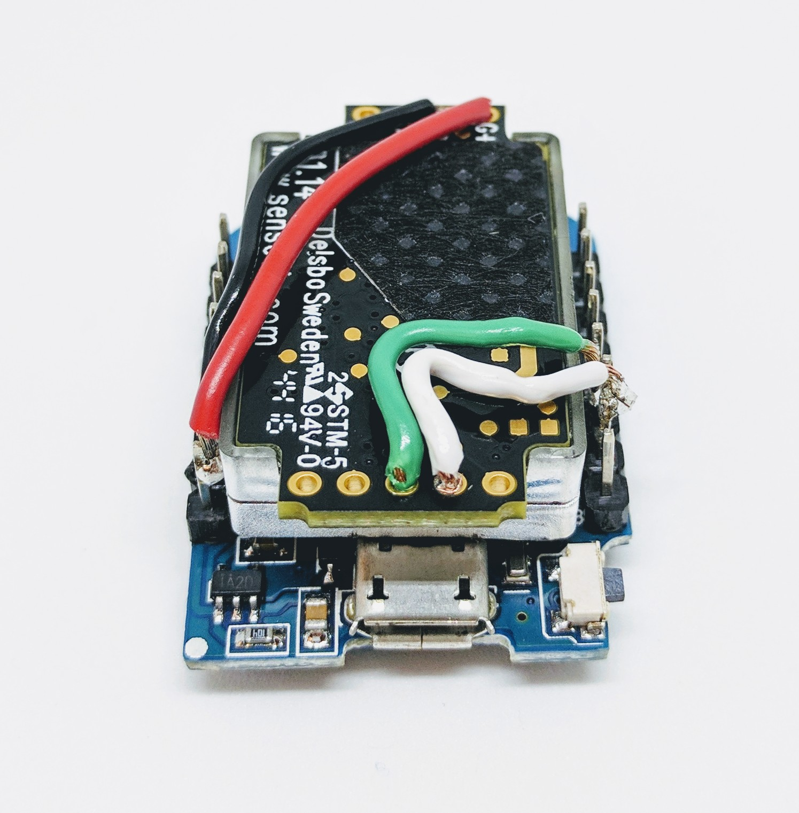

.. include:: ../Plugin/_plugin_substitutions_p05x.repl
.. _P052_S8_page:

S8
==

|P052_typename|
|P052_status|

.. image:: P052_S8_1.jpg

Introduction
------------

This is the flagship CO2 sensor from Swedish company Senseair.

Specifications:
 * 400 to 2000 ppm
 * 5V (4.5-5.25VDC)
 * Peak 300mA, avarage 30mA
 * 8.5 x 33.5 x 20 mm
 * UART communication
 * 15 years life span
 * No burn-in needed, will stabilize after 8 days at worst depending on placement environment

Wiring
------

Circuit wiring (S8 seen from PCB side, with the 5 vias down and the 4 vias up):

.. code-block:: html

    ESP               S8
    GPIO (7)   <-->   TX (3rd via [middle] of the 5 vias)
    GPIO (8)   <-->   RX (4th via [right of TX])

    Power
    5.0V       <-->   VCC (4th via of the 4 vias, 300 mA peak/30 mA average)
    GND        <-->   GND (3rd via [left of VCC])

Set up the S8 according to this simple schematics. If you want to take extra precautions you should add 47R
resistor or similar to the TX and RX signals (this is not used in the pictures below). In this example we
use the Wemos D1 mini as the host of the 5V input to the S8 and connect the Wemos to USB for power.

.. danger::
  Power needed: 4.5-5.25V. PLEASE OBSERVE THAT FEEDING THE S8 WITH 5.2+V WILL DAMAGE THE INTERNAL LAMP AND BREAK THE UNIT - GIVING FALSE VALUES!

Setup
-----

Task settings
~~~~~~~~~~~~~

* **Device**: Name of plugin
* **Name**: Name of the task (example name **CO2**)
* **Enable**: Should the task be enabled or not

Sensor
^^^^^^

* **GPIO <-- TX**: TX is generally set to **GPIO 13 (D7)**.
* **GPIO --> RX**: RX is generally set to **GPIO 15 (D8)**.
* **Sensor**: Only **Carbon Dioxide** is supported by the S8.

.. note:: TX GPIO 1 (D10) and RX GPIO 3 (D9) is hardware serial and have been reported to work better for some users over time compared to the
   bit-banging (soft) serial used over GPIO 13 and 15.

Data acquisition
^^^^^^^^^^^^^^^^

* **Send to controller** 1..3: Check which controller (if any) you want to publish to. All or no controller can be used.
* **Interval**: How often should the task publish its value (5..15 seconds is normal).

Indicators (recommended settings)
^^^^^^^^^^^^^^^^^^^^^^^^^^^^^^^^^

.. csv-table::
   :header: "Indicator", "Value Name", "Interval", "Decimals", "Extra information"
   :widths: 8, 5, 5, 5, 40

   "Error status", "N/A", "", "", "Used for tSense (K70), K30, K33"
   "Carbon dioxide", "ppm", "15", "0", ""
   "Temperature", "N/A", "", "", "Used for tSense (K70), K30, K33"
   "Humidity", "N/A", "", "", "Used for tSense (K70), K30, K33"
   "Relay status", "N/A", "", "", "Used for tSense (K70), K30, K33"
   "Temperature adjustment", "N/A", "", "", "Used for tSense (K70), K30, K33"
   "ABC period", "N/A", "", "", "Used for tSense (K70), K30, K33"

.. note:: If you want to use the relative carbon dioxide percentage (2000ppm = 100% and 350ppm = 0%) you should use this
          :code:`100-(2000-%value%)/(2000-350)*100` as a formula. And instead of :code:`ppm` as value name you should use
          :code:`RCO2` (relative CO2) and 1 decimal.

Rules examples
--------------

.. code-block:: html

 on CO2#Level do
  if [CO2#Level]>2000
    Publish,%sysname%/Alarm,CO2 level is too high!
  endif
 endon

Commands available
~~~~~~~~~~~~~~~~~~

.. include:: P052_commands.repl

Where to buy
------------

.. csv-table::
   :header: "Store", "Link"
   :widths: 5, 40

   "AliExpress","`Link 1 ($) <http://s.click.aliexpress.com/e/cg1fhDDI>`_"
   "Ebay","`Link 2 ($) <http://rover.ebay.com/rover/1/711-53200-19255-0/1?ff3=4&pub=5575404073&toolid=10001&campid=5338336929&customid=&mpre=https%3A%2F%2Fwww.ebay.com%2Fitm%2FS8-0053-carbon-dioxide-infrared-CO2-sensors-FOR-SenseAir%2F112303432827%3Fhash%3Ditem1a25ce647b%3Ag%3A%7EHcAAOSw1WJZJ%7E8Y>`_"
   "First Byte","`Link 3 ($) <https://firstbyte.shop/products/s8>`_"

|affiliate|

More pictures
-------------

.. image:: P052_S8_2.jpg

