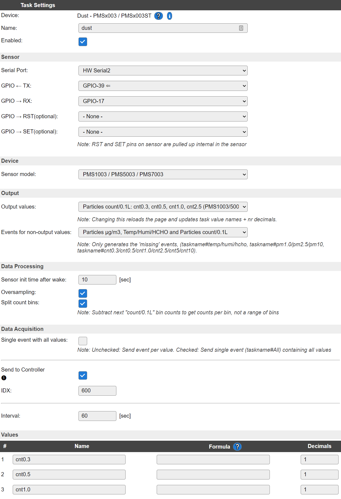
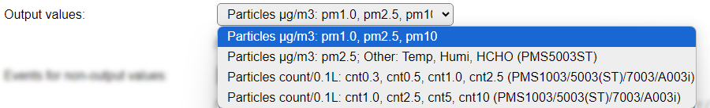
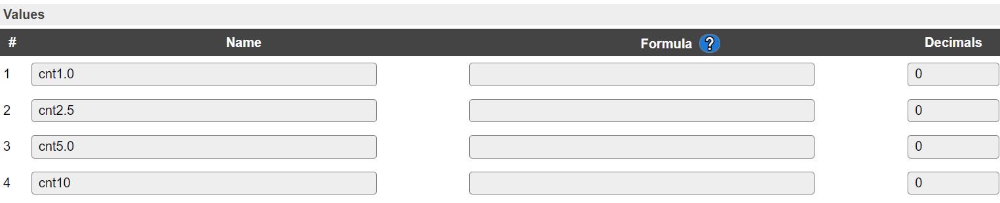
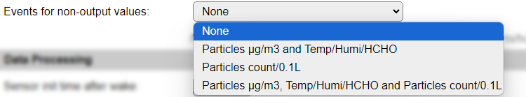

.. include:: ../Plugin/_plugin_substitutions_p05x.repl
.. _P053_page:

|P053_typename|
==================================================

|P053_shortinfo|

Plugin details
--------------

Type: |P053_type|

Port Type: |P053_porttype|

Name: |P053_name|

Status: |P053_status|

GitHub: |P053_github|_

Maintainer: |P053_maintainer|

Used libraries: |P053_usedlibraries|

Introduction
------------

The Plantower PMSx003 modules are laser based particle sensors.

Particles are measured by blowing air through the enclosure with a laser inside. By measuring diffusion of the laser beam, the amount of particles is counted.

Measurement information is transmitted over a serial interface.

In opposition to the GP2Y10 this sensors have an own microprocessor that does reading and differing into the PM1.0, PM2.5 and PM10 sizes. The values can be read directly from the serial interface.

Supported hardware
------------------

The supported Plantower devices are the types PMS1003, PMS2003, PMS3003, PMS5003, PMS5003ST and PMS7003. (Not all models actually tested, based on available documentation!)

A few images:

PMS5003:

.. image:: P053_PMSx003_Pin1_Text.jpg

PMS7003:

.. image:: P053_Pms7003-front-view.png

Precautions
-----------

The PMSx003 run on 5V. All inputs and outputs are TTL 3.3V compatible so no level converter is needed.

The external circuitry is small, it needs just two resistors and a capacitor.

Pins:

.. code-block:: none

  VCC   - 5V (for fan and internal logic)
  GND   - Ground (Note that chassis/case are ground also)
  RX/TX - 3V3 UART 9600 8N1
  SET   - Standby function, when pulled down the module does not send information over serial and goes into a low power state.
  RESET - Reset the module, similar to power-up, it takes ~30 seconds before data is received

Hardware
--------

The PMSx003 sensor is easy to connect. Just connect it as shown in the schematic:

The resistors are "pull-up" resistors to give a defined "high" level of 3.3V. The capacitor covers the high current consumption of the laser pulses avoiding influence to the power supply of the circuit.

.. image:: P053_PMSx003_Schematics.jpg

.. note::

  Pin numbers shown in schematics refer to PMS5003

.. code-block:: none

  PMS	Pin  PMS5003  PMS7003  ESP
  VCC         1       1,2    5V
  GND         2       3,4    GND
  Set         3       10     D0(GPIO16) + Resistor to 3.3V
  Tx          4       9      D7(GPIO12)
  Rx          5       7      D6(GPIO13)
  Reset       6       5      D5(GPIO14) + Resistor to 3.3V
  Spare      7,8     6,8     (not connected)

This setup uses "software serial" emulating a serial port on the ESP.

It is possible to use the hardware serial for this purpose:

.. code-block:: none

  PMS	Pin  PMS5003  PMS7003  ESP
  Tx          4       9      RX(GPIO3)
  Rx          5       7      TX(GPIO1)

Configuration
-------------

**Name** A unique name should be entered here.

**Enabled** The device can be disabled or enabled. When not enabled the device should not use any resources.

Sensor
^^^^^^

**GPIO -> Reset** The pin to control the Reset signal. Not used when set to None.

The serial settings depend on the type of **Serial Port** selected.

Device
^^^^^^

**Sensor model** The actual type of sensor in use. If the wrong type is selected, the data cannot be read, because they use a somewhat different serial format, causing Checksum errors in the log.

Available options:

.. image:: P053_DeviceModelOptions.png

Select the option that shows the connected sensor model, to adjust the data retrieval process to the emitted data stream.

Output
^^^^^^

**Output values** With most **Sensor model** options, except the PMS2003 and PMS3003 models, extra output values are available. To choose which values are made available in the task, this combobox provides the available options

Available options:

*Particles µg/m3: pm1.0, pm2.5, pm10* The default output values, available for all supported sensors.

- PM1.0 - Concentration of particles > 1 micron (µg/m3)
- PM2.5 - Concentration of particles > 2.5 micron (µg/m3)
- PM10 - Concentration of particles > 10 micron (µg/m3)

*(As shown in the overview screenshot above)*

*Particles µg/m3: pm2.5; Other: Temp, Humi, HCHO (PMS5003ST)* Particles > 2.5 micron (µg/m3) combined with other measurement values only supported by the PMS5003ST sensor.

- PM2.5 - Concentration of particles > 2.5 micron (µg/m3)
- Temp - Temperature
- Humi - Humidity
- HCHO - Formaldehyde concentration measurement (Formula: CH\ :sub:`2`\ O, or H-CHO)

.. image:: P053_OutputValues4.png

*(Value names adjusted manually)*

*Particles count/0.1L: cnt1.0, cnt2.5, cnt5, cnt10 (PMS1003/5003(ST)/7003)* Count of Particles per 0.1 L of air, available on the PMS1003, PMS5003, PMS5003ST and PMS7003 sensor models.

- cnt1.0 - Count of particles > 1 micron per 0.1L of air
- cnt2.5 - Count of particles > 2.5 micron per 0.1L of air
- cnt5 - Count of particles > 5 micron per 0.1L of air
- cnt10 - Count of particles > 10 micron per 0.1L of air

*(Value names adjusted manually)*

When changing this option, the page will be reloaded, to display the adjusted number of output values.

**Events for non-output values** When an option other than **None** is selected, the **Output values** that are not directly available, will be sent via events.

Available options:

*Particles µg/m3 and Temp/Humi/HCHO*:

When *Particles µg/m3: pm1.0, pm2.5, pm10* is selected: ``<Taskname>#Temp``, ``<Taskname>#Humi`` and ``<Taskname>#HCHO``, with the measured value available in ``%eventvalue1%`` (or it's alias ``%eventvalue%``).

When *Particles µg/m3: pm2.5; Other: Temp, Humi, HCHO (PMS5003ST)* is selected: ``<Taskname>#pm1.0`` and ``<Taskname>#pm10``.

*Particles µg/m3, Temp/Humi/HCHO and Particles count/0.1L*:

All of the above, and also ``<Taskname>#pm2.5``, ``<Taskname>#cnt1.0``, ``<Taskname>#cnt2.5`` and ``<Taskname>#cnt10`` events are generated if these are not selected as **Output values**.

These events can be used to store the values in a Dummy Device, so they can be sent out using a Controller, or they can be directly sent to an external system.

Example: (Sensor device using model PMS5003ST and Dummy device named ``Particles`` with 2 values named ``pm1.0`` and ``pm10``)

.. code-block:: none

  On PMS5003ST#pm1.0 do
    TaskValueSet,Particles,pm1.0,%eventvalue1%
  Endon
  On PMS5003ST#pm10 do
    TaskValueSet,Particles,pm10,%eventvalue1%
  Endon

These events will *only* be generated when the **Rules** option is enabled on the Tools/Advanced page.

Lifetime Helper
^^^^^^^^^^^^^^^^

The laser diode inside the PMSx003 has a lifetime of about 8000 h, nearly one year. With the actual plugin the sensor is powered permanently so we have to take some care about this.
In the example setup, D0 (GPIO16) is connected to the ``SET`` input of the PMSx003. If it is pulled low the sensor sleeps.

Some rules can be used to set the sensor up to sleep most of the time:

.. code-block:: none

  on System#Boot do
    gpio,16,0
    LoopTimerSet,1,50
  endon
  On Rules#Timer=1 do
    LongPulse,16,1,5
  endon

These rules use the ``System#Boot`` event to set GPIO16 to low (0) and start a 50 sec loop-timer. (Another timer nr. can be used if desired, then also adjust the ``On Rules#Timer=n do`` n value)

The ``Rules#Timer=1`` event is triggered by this timer and sends a 5 second "high" pulse to the sensor waking it up and starting a measurement.

Set the delay inside the dustsensor task to 60 seconds (default setting) for this. The plugin gets the data and stores it when the sensor gets active.

Troubleshooting
^^^^^^^^^^^^^^^^

If you don't see any values in the task list this failure usually results of cabling faults. Check all cablings according to the schematics. If you are testing on a breadboard, the breadboard contacts might be worn out or you got some faulty cables. A digital multimeter will help with this situations.

References:

* `PMS5003 english manual <https://www.digikey.jp/htmldatasheets/production/2903006/0/0/1/pms5003-series-manual.html>`_
* `AQICN.org <http://aqicn.org/sensor/>`_

.. .. |P053_usedby|

.. Commands available
.. ^^^^^^^^^^^^^^^^^^

.. .. include:: P053_commands.repl

.. Events
.. ~~~~~~

.. .. include:: P053_events.repl

Change log
----------

.. versionchanged:: 2.0
  ...

  |added|
  2021-07-22 Add support for PMS2003, PMS3003, PMS5003ST (with extra output values and optional events).

  |added|
  Major overhaul for 2.0 release.

.. versionadded:: 1.0
  ...

  |added|
  Initial release version.

