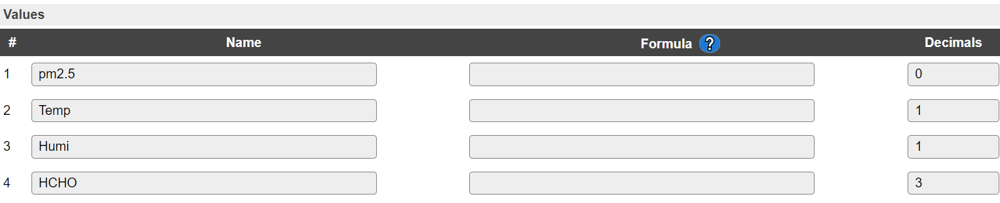

.. include:: ../Plugin/_plugin_substitutions_p05x.repl
.. _P053_page:

|P053_typename|
==================================================

|P053_shortinfo|

Plugin details
--------------

Type: |P053_type|

Port Type: |P053_porttype|

Name: |P053_name|

Status: |P053_status|

GitHub: |P053_github|_

Maintainer: |P053_maintainer|

Used libraries: |P053_usedlibraries|

Introduction
------------

The Plantower PMSx003 modules are laser based particle sensors.

Particles are measured by blowing air through the enclosure with a laser inside. By measuring diffusion of the laser beam, the amount of particles is counted.

Measurement information is transmitted over a serial interface.

In opposition to the GP2Y10 this sensors have an own microprocessor that does reading and differing into the PM1.0, PM2.5 and PM10 sizes. The values can be read directly from the serial interface.

Units of Measure
----------------

Dust Particles
^^^^^^^^^^^^^^

All supported Plantower PMSx003 modules can measure the concentration of dust particles, binned per size of the particle.

The measured values are either in counts per 0.1 liter, or in µg/m3.

To indicate the kind of particles that can be measured by the Plantower sensors:

`Image source <https://forums.adafruit.com/viewtopic.php?f=48&t=136528#p767725>`_

The counts per 0.1 liter can be specified in a larger number of bins.
However, the Plantower particle sensors appear to be estimating particles larger than roughly 2.5 - 3 micron.
The bins ranging from 0.3 ... 2.5 micron are actually being measured, but the larger ones are estimates.
This has as side effect that it may not show anything if there are no particles smaller than roughly 3 micron.

Conversion count/100ml to mg/m3
"""""""""""""""""""""""""""""""

Conversion between counts per volume into weight per volume (e.g. mg/m3) is a bit more complicated than using a single multiplier factor.
As can be seen in the particle size chart above, the average molecular weight of particles will be different per bin and also there is no such thing as an universal mixture ratio of particles all over the world.

There seem to be standardized conversion factors for:

* PM10  consists of coarse particles that have diameters that are less than or equal to 10 micrometres
* PM2.5  consists of fine particles with diameters less than or equal to 2.5 micrometres
* PM1  (particles <= 1 micron)

However, a simple conversion rate is hard to find even though it seems to be standardized.
What makes it even harder to perform such a conversion from counts per volume to weight per volume is the fact that the Plantower sensors count particles of a specific size and above.

For example:

* PM2.5 is about particles **less than or equal** to 2.5 micrometres
* cnt2.5/100ml indicates the number of particles with diameter **beyond** 2.5 micrometres in 0.1 L of air. (datasheet Plantower PMS5003)

.. note:: ``PMxx`` values relate to particles **less than or equal** to said size, while count/100ml relates to  particles of **at least** said size.
   Except when "Split count bins" is checked, then the "count/0.1L" values represent only a single bin.

Effects of Humidity
"""""""""""""""""""

There are some reports suggesting that some particles may stick together causing a shift in the bins.
For example, if one would draw a histogram of the counted particles per bin, the chart would appear to be shifted a bit to the more larger particles.

`Image source <https://forums.adafruit.com/viewtopic.php?f=48&t=136528#p767725>`_

The apparent size shift vs. humidity is only for soluble particles. 
Water won't adhere to insoluble particles, so high humidity won't affect particle counts of soot, ash, or most dusts, but it will have an effect with salts (like sea salt spray) or organic compounds.

In some setups this may also make the counted values appear lower, since the sensor can only estimate the particles larger than 3 micron if there are also smaller particles detected.
When the smaller particles all stick together thus no small particles will be observed by the sensor, the reading may be (much) lower than it actually should be.
Try to have the sensor running in environments with relatively low humidity (less than 80%).

A very good video describing hazards of dust particles: `Sabine Hossenfelder - How bad is Diesel? <https://www.youtube.com/watch?v=apbS205t53w>`_

Air Quality Index
"""""""""""""""""

There is a lot of information to be found online about the effects and health issues of exposure to dust particles.
For example the UK guidelines of average daily exposure on Wikipedia:

Source: `Wikipedia - Air Quality Index <https://en.wikipedia.org/wiki/Air_quality_index#United_Kingdom>`_

Such an Air Quality Index can then be used to indicate the maximum exposure (in days per year) which can be considered safe.

A website to check your local air quality: `IQAir <https://www.iqair.com/>`

Temperature/Humidity
^^^^^^^^^^^^^^^^^^^^

Plantower sensors with ``T`` or ``ST`` in their model name, can also measure temperature and humidity.

It is likely that the modules capable of measuring humidity can also compensate for this humidity when calculating the concentration in µg/m3.
However, so far it is unclear whether these sensors actually do compensate for this as humidity might cause the smaller particles to stick together.
But this depends on the type of particles as not all may adhere to water, which makes it almost impossible to have a simple universal compensation factor for humidity.

It is up to the user to interpret (and correct) the data, as the user may have more information on the composition of the measured air.

Formaldehyde
^^^^^^^^^^^^

Plantower sensors with ``S`` or ``ST`` in their model name, can also measure Formaldehyde.

When comparing concentration levels, one may encounter concentrations in ppm or µg/m3.

To compare these, use as conversion factor:  1 ppm = 1.25 mg/m3 (1 atm pressure, 20 degree C)

The Plantower sensors report the concentration in mg/m3.

The information below on Formaldehyde is an excerpt of the online found documents, written by `WHO Regional  Office  for Europe,  Copenhagen,  Denmark,  2001 <https://www.euro.who.int/__data/assets/pdf_file/0014/123062/AQG2ndEd_5_8Formaldehyde.pdf>`_

Formaldehyde  is  the  most common aldehyde in the environment. The natural background concentration is < 1 µg/m3  with a mean of about 0.5 µg/m3.

In urban environments, outdoor air concentrations are more variable and depend on local conditions; 
annual averages are usually  between 1 and 20 µg/m3. 

Short-term peaks,  e.g.  in heavy traffic or during severe inversions, can range up to 100 µg/m3. (0.1 mg/m3)
The levels of formaldehyde in indoor air are often higher than those in outdoor air. 
Major sources of formaldehyde in some dwellings are off-gassing of urea–formaldehyde foam insulation, particle board and formaldehyde-based resins. 
In the early 1980s, mean levels of 490 µg/m3 were measured in mobile homes, with individual measurements as high as several mg/m3 in new mobile homes. 
Now formaldehyde levels in mobile homes are typically around 100 µg/m3  or less.  
Mean levels in conventional homes with no urea–formaldehyde foam insulation range from 25 to 60 µg/m3

Exposure Guidelines
"""""""""""""""""""

Formaldehyde has been shown to be toxic in higher concentrations.
Concentration was more important than dose (concentration × length of exposure)  in  determining  the  cytotoxic  effects of  formaldehyde.

* A short-term (30-minute) guideline of 0.1 mg/m3 is recommended as preventing sensory irritation in the general population.
* A long-term exposure guideline of 0.21 mg/m3 for the protection of health for long-term effects, including cancer.

Source: `WHO Guidelines for Indoor Air Quality: Selected Pollutants <https://www.ncbi.nlm.nih.gov/books/NBK138711/>`_

Supported hardware
------------------

The supported Plantower devices are the types PMS1003, PMS2003, PMS3003, PMS5003, PMS5003ST and PMS7003. (Not all models actually tested, based on available documentation!)

A few images:

PMS5003:

.. image:: P053_PMS5003_2.jpg

PMS7003:

Precautions
-----------

The PMSx003 run on 5V. All inputs and outputs are TTL 3.3V compatible so no level converter is needed.

The external circuitry is small, it needs just two resistors and a capacitor.

Pins:

.. code-block:: none

  VCC   - 5V (for fan and internal logic)
  GND   - Ground (Note that chassis/case are ground also)
  RX/TX - 3V3 UART 9600 8N1
  SET   - Standby function, when pulled down the module does not send information over serial and goes into a low power state.
  RESET - Reset the module, similar to power-up, it takes ~30 seconds before data is received

Hardware
--------

The PMSx003 sensor is easy to connect. Just connect it as shown in the schematic:

The resistors are "pull-up" resistors to give a defined "high" level of 3.3V. The capacitor covers the high current consumption of the laser pulses avoiding influence to the power supply of the circuit.

Plantower does mention in the datasheet that these pins can also be left unconnected, which suggests there is an internal pull-up resistor present in the sensors.

Due to the need for a pull-up resistor, these pins cannot be connected to a GPIO pin on the ESP which must be low during boot. (e.g. GPIO 15 on ESP8266)

.. note::

  Pin numbers shown in schematics refer to PMS5003

.. code-block:: none

  PMS	Pin  PMS5003  PMS7003  ESP
  VCC         1       1,2    5V
  GND         2       3,4    GND
  Set         3       10     D0(GPIO16) + Resistor to 3.3V
  Tx          4       9      D7(GPIO12)
  Rx          5       7      D6(GPIO13)
  Reset       6       5      D5(GPIO14) + Resistor to 3.3V
  Spare      7,8     6,8     (not connected)

This setup uses "software serial" emulating a serial port on the ESP.

It is possible to use the hardware serial for this purpose:

.. code-block:: none

  PMS	Pin  PMS5003  PMS7003  ESP
  Tx          4       9      RX(GPIO3)
  Rx          5       7      TX(GPIO1)

Configuration
-------------

.. image:: P053_DeviceConfiguration.png

**Name** A unique name should be entered here.

**Enabled** The device can be disabled or enabled. When not enabled the device should not use any resources.

Sensor
^^^^^^

**GPIO -> Reset** The pin to control the Reset signal. Not used when set to None.

The serial settings depend on the type of **Serial Port** selected.

Device
^^^^^^

**Sensor model** The actual type of sensor in use. If the wrong type is selected, the data cannot be read, because they use a somewhat different serial format, causing Checksum errors in the log.

Available options:

Select the option that shows the connected sensor model, to adjust the data retrieval process to the emitted data stream.

Output
^^^^^^

Output values
"""""""""""""

With most **Sensor model** options, except the PMS2003 and PMS3003 models, extra output values are available. To choose which values are made available in the task, this combobox provides the available options.

.. note:: Changing this output selector will toggle a reload of the page. When the output selection has changed, the task value names will be reset to their (new) default names and the nr. of decimals will be set to proper values. (e.g. 1 decimal for temp/hum and 3 decimals for Formaldehyde) The nr of decimals will be set to at least 1 when oversampling is enabled.

Available options:

.. image:: P053_OutputValuesOptions.png

*Particles µg/m3: pm1.0, pm2.5, pm10* The default output values, available for all supported sensors.

- ``PM1.0`` - Concentration of particles < 1 micron (µg/m3)
- ``PM2.5`` - Concentration of particles < 2.5 micron (µg/m3)
- ``PM10`` - Concentration of particles < 10 micron (µg/m3)

*(As shown in the overview screenshot above)*

*Particles µg/m3: pm2.5; Other: Temp, Humi, HCHO (PMS5003ST)* Particles > 2.5 micron (µg/m3) combined with other measurement values only supported by the PMS5003ST sensor.

- ``PM2.5`` - Concentration of particles < 2.5 micron (µg/m3)
- ``Temp`` - Temperature
- ``Humi`` - Humidity
- ``HCHO`` - Formaldehyde concentration measurement (Formula: CH\ :sub:`2`\ O, or H-CHO)

Two choices for particle counts in *count/0.1L* (PMS1003/5003(ST)/7003) :

- Particles count/0.1L: cnt1.0, cnt2.5, cnt5, cnt10
- Particles count/0.1L: cnt0.3, cnt0.5, cnt1.0, cnt2.5

With:

- ``cnt0.3`` - Count of particles > 0.3 micron per 0.1L of air
- ``cnt0.5`` - Count of particles > 0.5 micron per 0.1L of air
- ``cnt1.0`` - Count of particles > 1 micron per 0.1L of air
- ``cnt2.5`` - Count of particles > 2.5 micron per 0.1L of air
- ``cnt5`` - Count of particles > 5 micron per 0.1L of air
- ``cnt10`` - Count of particles > 10 micron per 0.1L of air

.. image:: P053_OutputValuesCnt.png

.. note:: ``PMxx`` values relate to particles **less than or equal** to said size, while count/100ml relates to  particles of **at least** said size.
   Except when "Split count bins" is checked, then the "count/0.1L" values represent only a single bin.

Events for non-output values
""""""""""""""""""""""""""""

When an option other than **None** is selected, the **Output values** that are not directly available, will be sent via events.
If there is some overlap in selected output values and the extra event selector, only those values which were not already sent as regular task values, will be sent in extra events.

.. note:: The "Single event with all values" option only combines the 4 selected task values in 1 event. Extra events will only contain 1 value per event.

Available options:

.. image:: P053_EventOptions.png

*Particles µg/m3 and Temp/Humi/HCHO*:

When *Particles µg/m3: pm1.0, pm2.5, pm10* is selected: ``<Taskname>#Temp``, ``<Taskname>#Humi`` and ``<Taskname>#HCHO``, with the measured value available in ``%eventvalue1%`` (or it's alias ``%eventvalue%``).

When *Particles µg/m3: pm2.5; Other: Temp, Humi, HCHO (PMS5003ST)* is selected: ``<Taskname>#pm1.0`` and ``<Taskname>#pm10``.

*Particles µg/m3, Temp/Humi/HCHO and Particles count/0.1L*:

All of the above, and also ``<Taskname>#pm2.5``, ``<Taskname>#cnt1.0``, ``<Taskname>#cnt2.5`` and ``<Taskname>#cnt10`` events are generated if these are not selected as **Output values**.

These events can be used to store the values in a Dummy Device, so they can be sent out using a Controller, or they can be directly sent to an external system.

Example: (Sensor device using model PMS5003ST and Dummy device named ``Particles`` with 2 values named ``pm1.0`` and ``pm10``)

.. code-block:: none

  On PMS5003ST#pm1.0 do
    TaskValueSet,Particles,pm1.0,%eventvalue1%
  Endon
  On PMS5003ST#pm10 do
    TaskValueSet,Particles,pm10,%eventvalue1%
  Endon

These events will *only* be generated when the **Rules** option is enabled on the Tools/Advanced page.

Data Processing
^^^^^^^^^^^^^^^

(Added: 2021-10-14)

The PMSx003 sensors may output samples quite often.
Typically a sample is sent every 800 msec, with shorter intervals when the data does change a lot between readings.
However, the sensor itself does not always have new data when a packet is sent by the sensor.
These duplicate messages are detected and ignored.

Sensor init time after wake
"""""""""""""""""""""""""""

The Plantower datasheet suggests to let the sensor run for at least 30 seconds after power on (or wake up) to get a reliable reading.

When set to a value over 0 seconds, a timer will be set when the sensor is called to wakeup.
During this period, any received sample will be ignored.

If running the sensor at an interval to save energy consumption and extend the sensors lifetime, make sure the "active" duration is longer than this sensor init time.
The sensor typically needs 2.3 seconds to complete a measurement.

So a good duration for wake time is at least 35 - 40 seconds (oversampling enabled).

Oversampling
""""""""""""

By default, only the last sample is output by the task.
But since the counted values may change quite a lot between samples, it is adviced to enable oversampling.
With oversampling enabled, the reported values are averaged over the period between calls of ``PLUGIN_READ``.
This may give a more stable output value to process.

The default nr of decimals will be set to 1 when oversampling is enabled. (may require to switch the output values combo box)

.. note:: When putting the sensor to sleep, any collected data in the averaging buffer is flushed by scheduling a ``PLUGIN_READ``. This will output the data to any connected controller and generate the appropriate events.
   Any data still present in the buffer when waking the sensor is flushed, to make sure no old and new data is merged.

Split count bins
"""""""""""""""""""""""

The "count/0.1L" values are based on particles with at least the given size.
Thus a ``cnt0.3`` value describes all particles with a size of at least 0.3 micron.

In some use cases it can be useful to count only the particles of a specific size, like 0.3 ... 0.5 micron.
When "Split count bins" is checked, the recorded counted values will be split over single bins.

Lifetime Helper
^^^^^^^^^^^^^^^^

The laser diode inside the PMSx003 has a lifetime of about 8000 h, nearly one year. With the actual plugin the sensor is powered permanently so we have to take some care about this.

wake/sleep command
""""""""""""""""""

(Added: 2021-10-14)

Using the ``pmsx003,sleep`` and ``pmsx003,wake`` commands can be used to reduce the energy consumption and extend the laser lifetime.

Example rules:

.. code-block:: none

   On System#Boot do    //When the ESP boots, do
     looptimerset,1,300  // Start loop timer 1, 300 sec interval
     timerSet,2,30 // Set timer 2 to put the sensor to sleep again
   endon
   
   On Rules#Timer=1 do
     timerSet,2,30 // Set timer 2 to put the sensor to sleep again
     pmsx003,wake
   endon
   
   On Rules#Timer=2 do
     pmsx003,sleep
   endon

Toggle SET pin on PMSx003 module
""""""""""""""""""""""""""""""""

In the example setup, D0 (GPIO16) is connected to the ``SET`` input of the PMSx003. If it is pulled low the sensor sleeps.

Some rules can be used to set the sensor up to sleep most of the time:

.. code-block:: none

  on System#Boot do
    gpio,16,0
    LoopTimerSet,1,50
  endon
  On Rules#Timer=1 do
    LongPulse,16,1,5
  endon

These rules use the ``System#Boot`` event to set GPIO16 to low (0) and start a 50 sec loop-timer. (Another timer nr. can be used if desired, then also adjust the ``On Rules#Timer=n do`` n value)

The ``Rules#Timer=1`` event is triggered by this timer and sends a 5 second "high" pulse to the sensor waking it up and starting a measurement.

Set the delay inside the dustsensor task to 60 seconds (default setting) for this. The plugin gets the data and stores it when the sensor gets active.

Troubleshooting
^^^^^^^^^^^^^^^^

If you don't see any values in the task list this failure usually results of cabling faults. Check all cablings according to the schematics. If you are testing on a breadboard, the breadboard contacts might be worn out or you got some faulty cables. A digital multimeter will help with this situations.

References:

* `PMS5003 english manual <https://www.digikey.jp/htmldatasheets/production/2903006/0/0/1/pms5003-series-manual.html>`_
* `AQICN.org <http://aqicn.org/sensor/>`_

.. .. |P053_usedby|

Commands available
^^^^^^^^^^^^^^^^^^

(added: 2021-10-12)

.. include:: P053_commands.repl

Events
^^^^^^

A task running the PMSx003 can be configured to output a number of values as standard task values.
However the sensor outputs more values than can be used as ESPEasy task values.

To overcome this limitation, one can set what other measured values can be useful to have as an event for processing in the rules.

Which of the  following events may be sent, depends on this setting and also whether the sensor is capable of measuring the described unit of measure.
For example, temperature and humidity can only be measured on ``PMS5003T`` and ``PMS5003ST``.

.. include:: P053_events.repl

Change log
----------

.. versionchanged:: 2.0
  ...

  |added|
  2021-10-12 Cleanup + Add commands to reset/sleep/wake and check for duplicate messages.

  |added|
  2021-07-22 Add support for PMS2003, PMS3003, PMS5003ST (with extra output values and optional events).

  |added|
  Major overhaul for 2.0 release.

.. versionadded:: 1.0
  ...

  |added|
  Initial release version.

