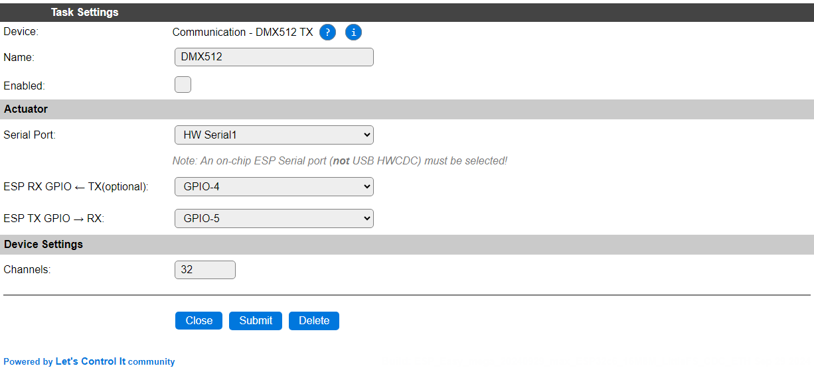
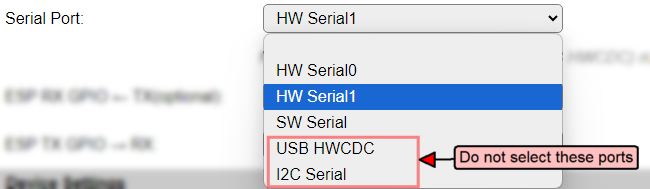

.. include:: ../Plugin/_plugin_substitutions_p05x.repl
.. _P054_page:

|P054_typename|
==================================================

|P054_shortinfo|

Plugin details
--------------

Type: |P054_type|

Name: |P054_name|

Status: |P054_status|

GitHub: |P054_github|_

Maintainer: |P054_maintainer|

Used libraries: |P054_usedlibraries|

|P054_usedby|

Description
-----------

For controlling DMX512 equipment, this plugin can be used for sending commands to a DMX bus. As an ESP only has a 5V compatible serial interface, usually a RS485 or DMX converter is needed to connect to the DMX bus.

This plugin can only send out commands to the DMX bus, no receiving or recording features are available.

Configuration
-------------

* **Name** In the Name field a unique name should be entered.

* **Enabled** When unchecked the plugin is not enabled.

Actuator
^^^^^^^^

See: :ref:`SerialHelper_page`

.. warning:: The selected serial port **must** use on-ESP GPIO pins, as the DMX protocol has some specific coding that is not supported by regular serial chips, and is implemented by directly interacting with the ESP TX pin.

Example selection list (taken from an ESP32-C6 configuration):

* *HW Serial0*: First serial port, usually also in use for the serial log, so should best be avoided.

* *HW Serial1*: Secondary serial port. Selected as the default, and required to be used on ESP8266.

* *HW Serial2*: (Not available on an ESP32-C6, but is available on some other ESP32 models) Can be used.

* *SW Serial*: Can be tried, and used if working as intended, but should better be avoided because of the high serial speed (250000 baud).

* *USB HWCDC*: Can not be used.

* *USB CDC*: Can not be used.

* *I2C Serial*: Can not be used.

Device Settings
^^^^^^^^^^^^^^^

* **Channels**: The number of DMX channels to be used. Determines the size of a memory buffer. Keep as small as possible, especially on ESP8266, where available memory can be limited.

Commands available
^^^^^^^^^^^^^^^^^^

.. include:: P054_commands.repl

.. Events
.. ~~~~~~

.. .. include:: P054_events.repl

Change log
----------

.. versionchanged:: 2.0
  ...

  |added| 2024-09-29: Add selection for Serial port and GPIO on ESP32.

  |added|
  Major overhaul for 2.0 release.

.. versionadded:: 1.0
  ...

  |added|
  Initial release version.

