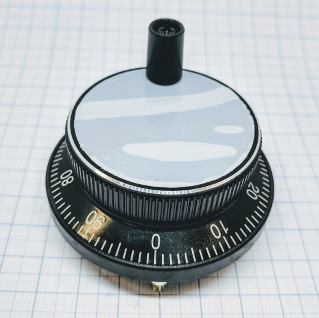
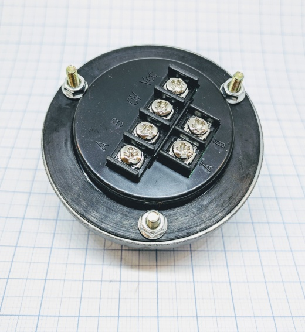
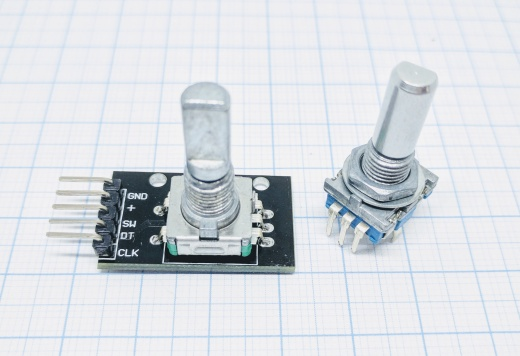
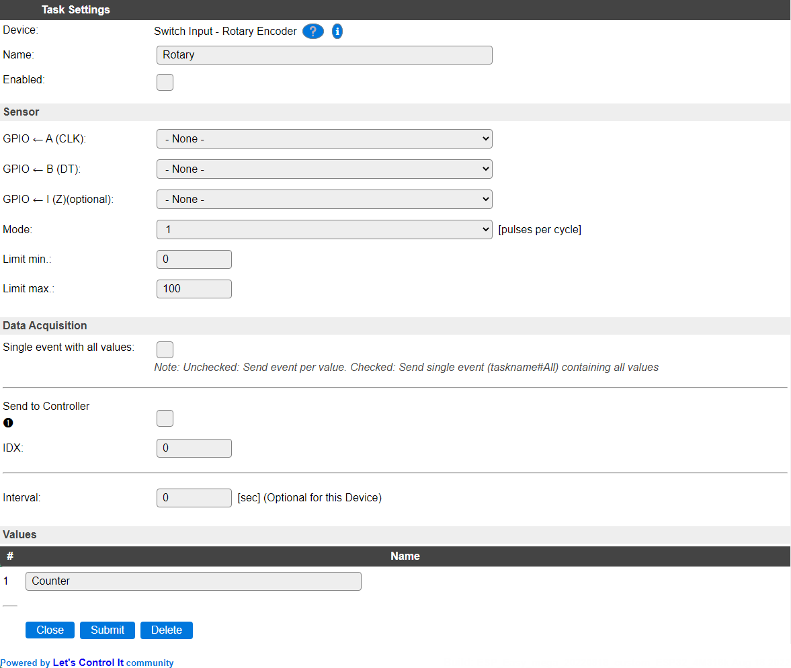

.. include:: ../Plugin/_plugin_substitutions_p05x.repl
.. _P059_page:

|P059_typename|
==================================================

|P059_shortinfo|

Plugin details
--------------

Type: |P059_type|

Name: |P059_name|

Status: |P059_status|

GitHub: |P059_github|_

Maintainer: |P059_maintainer|

Used libraries: |P059_usedlibraries|

Introduction
------------

A rotary encoder can be used in many applications that require precise (unlimited) rotation indication. A general use is to have the encoder set the volume of a speaker or position of a stepper motor.

Supported hardware
------------------

A pulse wheel used for CNC machines.

.

A rotary encoder used for volume and GUI interaction (press the knob for switch input)

|P059_usedby|

Wiring
------

.. code:: none

    ESP            Encoder
    GPIO    <-->   A or CLK
    GPIO    <-->   B or DT
    GPIO*   <-->   I (optional)

    Power
    3.3V    <-->   VCC/+
    GND     <-->   GND/V0

\*if any is available, used to "0" the counter after each turn.

Switch A/B if the encoder is counting backwards!

A and B is sometimes labeled CLK and DT, other labels might also be used. Test and see what works for your encoder. If the rotary encoder have A- and B- ports it is ideal to use them since the pulses are negative and doesn't strain the ESP unit's power. Using a positive signal is not a problem though.

Use only GPIO pins that support interrupts, so f.e. GPIO-16 on ESP8266 can't be used.

Device
------

Task settings
~~~~~~~~~~~~~

* **Name** The name of the task. This should be unique for all devices that are configured. (Initially empty)

* **Enabled** For the device to work it has to be enabled. When checked, the device will be started as soon as the ESP starts. If desired, the device can also be enabled from f.e. a rule by using the ``TaskEnable,<tasknr>`` or ``TaskEnable,<taskname>`` command, or disabled using the corresponding ``TaskDisable,<tasknr>|<taskname>`` commands.

Sensor
~~~~~~

* **GPIO <- A (CLK)**: Input pin for the **A** or **CLK** wire.

* **GPIO <- B (DT)**: Input pin for the **B** or **DT** wire.

* **GPIO <- I (Z)(optional)**: Optional input pin for the reset signal from the rotary knob, to reset the counter when it passes the 0 mark.

* **Mode**: Sets the "resolution" of the turning on the knob. 1 pulse per cycle is "slowest"/finest and 4 pulses per cycle is the "fastest"/coarsest.

* **Limit min**: The lowest value that the counter will go to. Observe that if you have the counter on a value below this limit the counter will climb above this value but not below it once it has reached the min limit.

* **Limit max**: The highest value that the counter will go to. As with the min limit if the counter is above this limit it will descend to the max level but never climb over it once reached below it.

Data Acquisition
^^^^^^^^^^^^^^^^

This group of settings, **Single event with all values**, **Send to Controller** and **Interval** settings are standard available configuration items. Send to Controller is only visible when one or more Controllers are configured.

**Interval** By default, Interval will be set to 0 sec for this plugin, as this setting is optional. It is the frequency used to read sensor values and send these to any Controllers configured for this device.

Values
^^^^^^

The counted value is available in ``Counter``.

Commands available
^^^^^^^^^^^^^^^^^^

.. include:: P059_commands.repl

.. Events
.. ~~~~~~

.. .. include:: P059_events.repl

Change log
----------

.. versionchanged:: 2.0
  ...

  |added|
  Major overhaul for 2.0 release.

.. versionadded:: 1.0
  ...

  |added|
  Initial release version.

