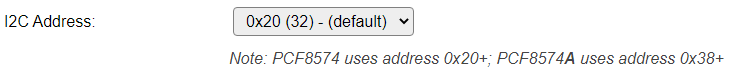

.. include:: ../Plugin/_plugin_substitutions_p06x.repl
.. _P061_page:

|P061_typename|
==================================================

|P061_shortinfo|

Plugin details
--------------

Type: |P061_type|

Name: |P061_name|

Status: |P061_status|

GitHub: |P061_github|_

Maintainer: |P061_maintainer|

Used libraries: |P061_usedlibraries|

Supported hardware
------------------

|P061_usedby|

This plugin is used to get input from buttons/keys or a keypad transformed to a ScanCode, that can be handled in rules. The keys are connected directly or in a matrix to an 8 or 16 port I2C I/O chip. Currently supported chips are PCA8574/PCA8574A (8 I/O ports), MCP23017 and PCA8575 (16 I/O ports). Depending on the configuration, this allows to connect up to 72 keys to a single I/O chip (9*8 matrix). The PCA8575 chip doesn't have internal pull-up resistors, so these must be added externally.

Direct chip mode means that each I/O port is connected to a key, and connects to GND when pressed.

Matrix chip mode means that a matrix is created with half of the I/O ports as row and the other half as columns. At every crossing of the matrix, a key can be connected, connecting the row and column wires when pressed. The extra, 9th, row is formed by GND.

The plugin generates a ScanCode, depending on either the button-order in 'direct' mode, or the row/column position in the 'matrix' mode.

When pressing multiple keys at the same time, the lowest ScanCode value is returned, any other key(s) are ignored.

From the source-code:

.. code-block:: text

  Connecting KeyPad matrix to MCP23017 / PCF8575 chip:
  row 0 = GND   (optional if 9 rows needed)
  row 1 = GPA0 / P00
  row 2 = GPA1 / P01
  ...
  row 8 = GPA7 / P07
 
  column 1 = GPB0 / P10
  column 2 = GPB1 / P11
  ...
  column 8 = GPB7 / P17
 
  Typical Key Pad:
       C1  C2  C3
  R1   [1] [2] [3]
  R2   [4] [5] [6]
  R3   [7] [8] [9]
  R4   [*] [0] [#]
 
  Connecting KeyPad matrix to PCF8574 chip:
  row 0 = GND   (optional if 5 rows needed)
  row 1 = P0
  row 2 = P1
  row 3 = P2
  row 4 = P3
 
  column 1 = P4
  column 2 = P5
  column 3 = P6
  column 4 = P7
 
  Connecting KeyPad direct to PCF8574 / MCP23017 / PCF8575 chip:
  common = GND
  key 1 = P0 / GPA0 / P00
  key 2 = P1 / GPA1 / P01
  ...
  key 8 = P7 / GPA7 / P07
  For 16 bit I/O expanders
  key 9 = -- / GPB0 / P10
  key 10 = -- / GPB1 / P11
  ...
  key 16 = -- / GPB7 / P17
  NB: PCF8575 needs pull-up resistors on all 16 ports to work as intended, as the chip doesn't have internal pull-ups

Often used matrix keypads, in 16 and 12 key configuration:

(Image sourced from Aliexpress)

Configuration
-------------

* **Name** A unique name should be entered here.

* **Enabled** The device can be disabled or enabled. When not enabled the device should not use any resources.

I2C Options 
^^^^^^^^^^^^

The available settings here depend on the build used. At least the **Force Slow I2C speed** option is available, but selections for the I2C Multiplexer can also be shown. For details see the :ref:`Hardware_page`

**I2C Address**: The address the device is using. Usually, for this type of I/O boards, the I2C address can be configured by connecting ``A0``/``A1``/``A2`` to either GND or VCC.

Depending on the chip used, different sets of I2C addresses are available to select from.

For MCP23017 and PCA8575, these are the available addresses:

.. image:: P061_I2CAddressOptions16bitIO.png
  :alt: I2C addresses for MCP23017 and PCF8575

For PCA8574 and PCA8574A, these are the available addresses:

If a **Chip (Mode)** for PCA8574 is selected, an extra message is shown, as the A version of that chip uses a different address-range:

Device Settings
^^^^^^^^^^^^^^^^

* **Chip (Mode)**: Select the configuration needed.

Available options:

Data Acquisition
^^^^^^^^^^^^^^^^

The Data Acquisition, Send to Controller and Interval settings are standard available configuration items. Send to Controller is only visible when one or more Controllers are configured.

* **Interval** By default, Interval will be set to 0 sec.

Values
^^^^^^

The key scan code is available in ``ScanCode``. After releasing the key, the ScanCode is reset to 0.

Change log
----------

.. versionchanged:: 2.0
  ...

  |added|
  2022-01-23 Add support for PCA8575 chip, and multi-instance use of the plugin.

  |added|
  Major overhaul for 2.0 release.

.. versionadded:: 1.0
  ...

  |added|
  Initial release version.

