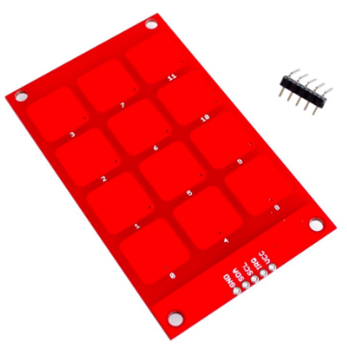
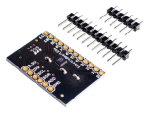
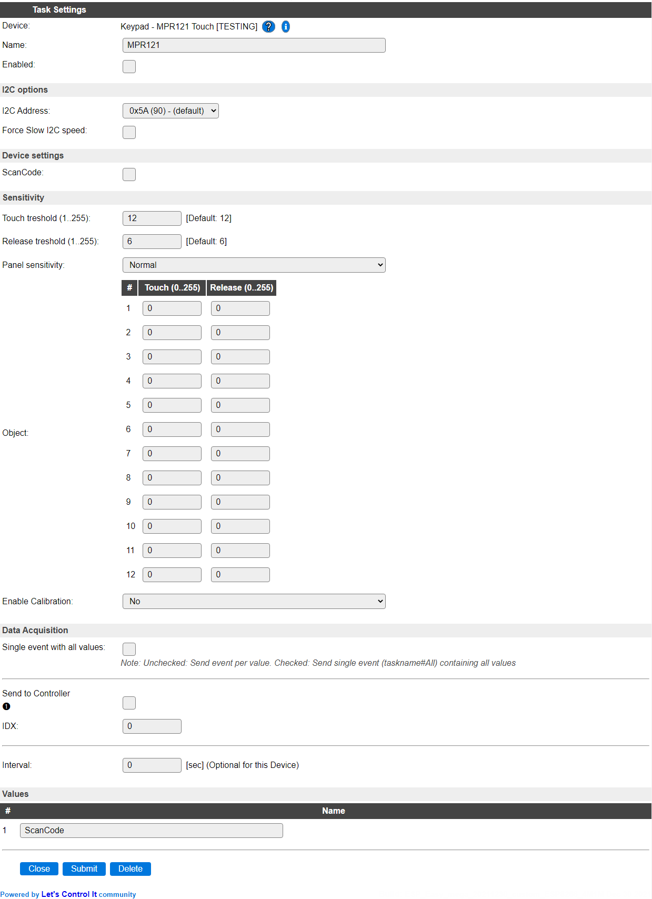
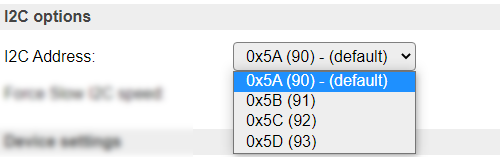
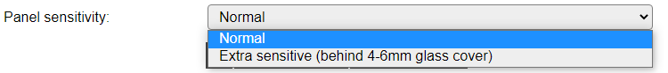
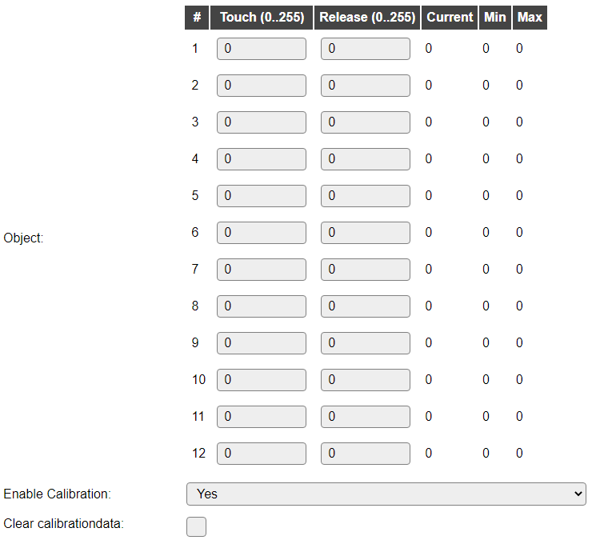

.. include:: ../Plugin/_plugin_substitutions_p06x.repl
.. _P062_page:

|P062_typename|
==================================================

|P062_shortinfo|

Plugin details
--------------

Type: |P062_type|

Name: |P062_name|

Status: |P062_status|

GitHub: |P062_github|_

Maintainer: |P062_maintainer|

Used libraries: |P062_usedlibraries|

Introduction
------------

The NXP MPR121 I2C touch controller is often used as a keypad to allow data entry without mechanical or dome switches. This plugin supports up to 12 inputs, with optional separate configuration and calibration.

When mounting the keypad behind a glass shield, for added electrical safety, the Panel sensitivity can be increased to still be able to detect touch.

Supported hardware
------------------

|P062_usedby|

A keypad based on the MPR121 controller.

A board having the MPR121 controller. Here some external touch-pads should be connected.

(Images taken from Aliexpress website, random seller.)

Configuration
-------------

* **Name** A unique name should be entered here.

* **Enabled** The device can be disabled or enabled. When not enabled the device should not use any resources.

I2C Options 
^^^^^^^^^^^^

* The available settings here depend on the build used. At least the **Force Slow I2C speed** option is available, but selections for the I2C Multiplexer can also be shown. For details see the :ref:`Hardware_page`

* **I2C Address**: The address the device is using. Depending on the board used, when available a SDO or ADD(R) pin, can be used to select the used address. If that address selection is not available, then an I2C multiplexer (in a matching ESPEasy build) can be used to use multiple sensors on a single ESPEasy unit.

.. list-table:: Addresses
  :widths: 15 15 70
  :header-rows: 1

  * - ADDR to
    - Address
    - 
  * - GND
    - 0x5A (90)
    - 
  * - VCC
    - 0x5B (91)
    - 
  * - SDA
    - 0x5C (92)
    - 
  * - SCL
    - 0x5D (93)
    - 

Device Settings
^^^^^^^^^^^^^^^

* **ScanCode** Select this option to get the 'scancode' for the key pressed, in range 1..12. If this is unchecked, the raw bitmap for the key pressed is returned (values: 1, 2, 4, 8, 16, 32, 64, 128, 256, 512, 1024, 2048).

Sensitivity
^^^^^^^^^^^

* **Touch treshold (1..255)** The amount of 'touch' needed to register a touch. This is the global configuration value, see below for per-key configuration.

* **Release treshold (1..255)** The amount of 'touch' until a touch is no longer registered (released). This is the global configuration value, see below for per-key configuration.

* **Panel sensitivity** When having direct access to the keypad, the sensitivity should be set to Normal. When mounting the keypad behind a sheet of glass or another capacitive inert material, the sensitivity can be set to Extra sensitive, to accomodate for a glass sheet of 4-6 mm.

When mounting the keypad behind a glass panel, this should be very tight, without any air gap, to avoid unreliable registration of touches.

Per key configuration
^^^^^^^^^^^^^^^^^^^^^

To have better control per touch key, for each key a separate Touch and Release treshold can be set. When either of the settings per object is 0 it is ignored, and the global setting is applied.

* **Enable Calibration** When the sensor is enabled, the calibration data per key (Current/Min/Max) can viewed, and depending on values the tresholds can be changed (user should experiment with settings to see what changes). By changing this option from No to Yes, the page will reload and show the calibration data, as collected by the sensor (the sensor does auto-calibration). When reverting to No, the page will reload again, without the calibration options visible.

* **Clear calibrationdata** This checkbox can be checked to clear the calibration data from the sensor, so it can restart the calibration process. This will be applied when the Submit button is used *or* the page is reloaded by changing the **Enable Calibration** option!. The initial setting is always unchecked, and is not stored.

Data Acquisition
^^^^^^^^^^^^^^^^

The Data Acquisition, Send to Controller and Interval settings are standard available configuration items. Send to Controller only when one or more Controllers are configured.

* **Interval** By default, Interval will be set to 0 sec (off). If a value > 0 is used, then every <Interval> seconds an event with the last value is generated.

Values
^^^^^^

The last touched key is available in ``ScanCode``.

.. Commands available
.. ^^^^^^^^^^^^^^^^^^

.. .. include:: P062_commands.repl

Events
~~~~~~

When a key is touched, the new data is sent out as an event, using the format ``<TaskName>#<ValueName>``. This can be handled from the rules.

.. .. include:: P062_events.repl

Change log
----------

.. versionchanged:: 2.0
  ...

  |added| 2021-12-29 Panel sensitivity setting added.

  |added| 2020-10 Tresholds per touchkey.

  |added|
  Major overhaul for 2.0 release.

.. versionadded:: 1.0
  ...

  |added|
  Initial release version.

