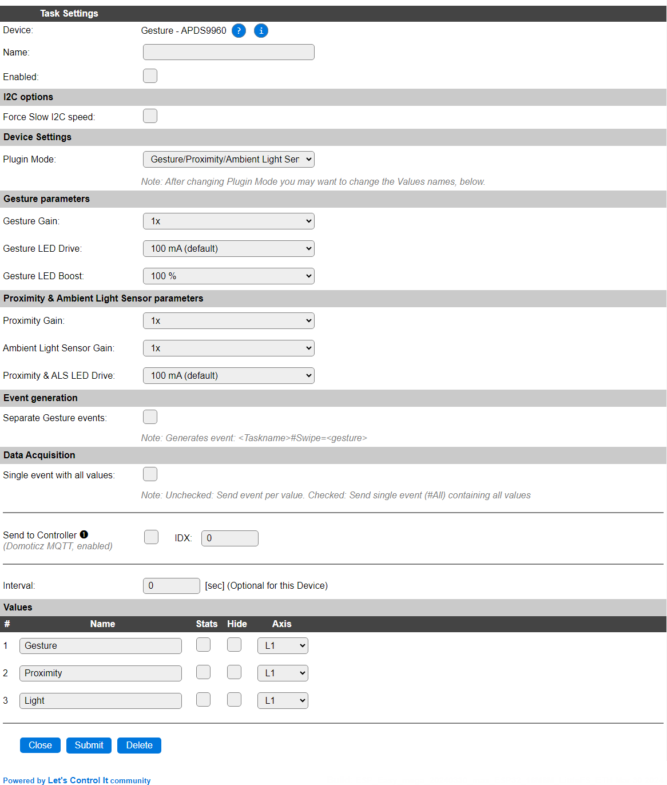
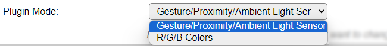

.. include:: ../Plugin/_plugin_substitutions_p06x.repl
.. _P064_page:

|P064_typename|
==================================================

|P064_shortinfo|

Plugin details
--------------

Type: |P064_type|

Name: |P064_name|

Status: |P064_status|

GitHub: |P064_github|_

Maintainer: |P064_maintainer|

Used libraries: |P064_usedlibraries|

Description
-----------

The APDS9960 sensor provides Gesture, Proximity and Ambient Light data or R/G/B color values from the light sensor, depending on the Plugin Mode. After changing the Plugin Mode, the Values arguments may need to be adjusted according to their function (Gesture, Proximity, Light or R, G, B). If the initial Values names are used, they will be replaced when switching the Plugin Mode, and the settings are actually saved.

Device Configuration
--------------------

* **Name**: Required by ESPEasy, must be unique among the list of available devices/tasks.

* **Enabled**: The device can be disabled or enabled. When not enabled the device should not use any resources.

I2C options
^^^^^^^^^^^

The available settings here depend on the build used. At least the **Force Slow I2C speed** option is available, but selections for the I2C Multiplexer can also be shown. For details see the :ref:`Hardware_page`

There is only 1 I2C address available for this sensor, ``0x39`` (not shown).

The Gain, LED Drive and LED Boost parameters may need adjustment from the defaults as some of the low-cost clone sensors aren't as carefully calibrated as the original SparkFun or AdaFruit sensors. The suggested defaults are taken from the original SparkFun driver software settings. When first configuring this plugin it is advised to start with these default settings, and adjust when the sensor isn't responding as required.

Device Settings
^^^^^^^^^^^^^^^

* **Plugin Mode**: Select the desired operation mode.

* *Gesture/Proximity/Ambient Light Sensor*: Will measure the Gesture, Proximity and Ambient light values. If **Separate Gesture events** is disabled, then events will be generated when a Gesture is detected. Also, when **Interval** is set, events are generated.
* *R/G/B Colors*: Will measure the R, G and B components of the current Ambient light condition. Will generate events if **Interval** is set.

For the R/G/B Colors mode, only Light Sensor Gain and Light Sensor LED Drive parameters are available. They correspond with the Ambient Light Sensor Gain and Proximity/ALS LED Drive parameters (and use the same settings storage), but with different labels.

NB: Defaults are *not* automatically set after adding the plugin!

Gesture parameters
^^^^^^^^^^^^^^^^^^

* **Gesture Gain**: Selection of the gain factor, select from 1x, 2x, 4x (default) or 8x.

* **Gesture LED Drive**: Selection of the current to drive the Gesture IR LED, select from 100 mA (default), 50 mA, 25 mA or 12.5 mA.

* **Gesture LED Boost**: Selection of the LED Boost factor, select from 100%, 150%, 200% or 300% (default).

Proximity & Ambient Light Sensor parameters
^^^^^^^^^^^^^^^^^^^^^^^^^^^^^^^^^^^^^^^^^^^

* **Proximity Gain**: Selection of the gain factor, select from 1x, 2x, 4x (default) or 8x.

* **Ambient Light Sensor Gain**: Selection of the gain factor, select from 1x, 2x, 4x (default) or 8x.

* **Proximity/ALS LED Drive**: Selection of the current to drive the Proximity/Ambient Light Sensor IR LED, select from 100 mA (default), 50 mA, 25 mA or 12.5 mA.

R/G/B Colors parameters
^^^^^^^^^^^^^^^^^^^^^^^

* **Light Sensor Gain**: Selection of the gain factor, select from 1x, 2x, 4x (default) or 8x.

* **Light Sensor LED Drive**: Selection of the current to drive the Light Sensor IR LED, select from 100 mA (default), 50 mA, 25 mA or 12.5 mA.

Event generation
^^^^^^^^^^^^^^^^

* **Separate Gesture events**: When enabled will generate a ``<TaskName>#Swipe=<gesture>`` event (see below), independent from **Interval**. This allows gestures to be handled independently from measuring the proximity and ambient light, or R/G/B colors. The ``Gesture`` value will be updated for every gesture detected, but the Values events will only trigger on Interval, if this checkbox is enabled.

Values
^^^^^^

Depending on the **Plugin Mode** setting either the Values are ``Gesture``, ``Proximity`` and ``Light`` or ``R``, ``G`` and ``B``. When not manually changed, they will be switched by the plugin when selecting the other Plugin Mode setting.

.. Supported hardware
.. ^^^^^^^^^^^^^^^^^^

|P064_usedby|

.. Commands available
.. ^^^^^^^^^^^^^^^^^^

.. .. include:: P064_commands.repl

Events
~~~~~~

.. include:: P064_events.repl

Change log
----------

.. versionchanged:: 2.0
  ...

  |added| 2024-03-30: Separate Gesture events option.

  |added|
  Major overhaul for 2.0 release.

.. versionadded:: 1.0
  ...

  |added|
  Initial release version.

