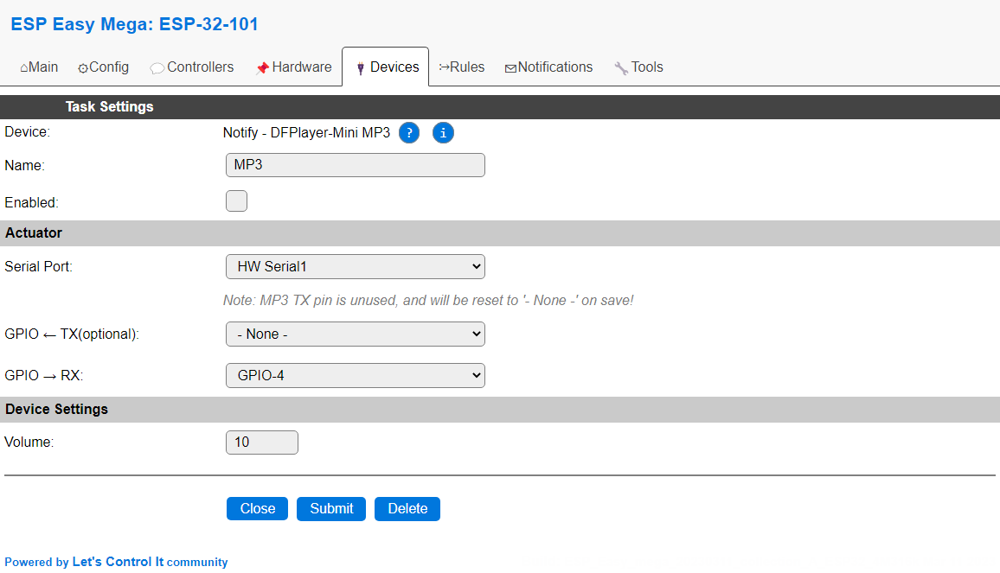

.. include:: ../Plugin/_plugin_substitutions_p06x.repl
.. _P065_page:

|P065_typename|
==================================================

|P065_shortinfo|

Plugin details
--------------

Type: |P065_type|

Name: |P065_name|

Status: |P065_status|

GitHub: |P065_github|_

Maintainer: |P065_maintainer|

Used libraries: |P065_usedlibraries|

Introduction
------------

The ESP module can control the MP3-player module "DRPlayer Mini (DFR0299/YX5200)" and the "YX5300" module with 3.5mm output for speaker(s). Other than MP3 (sampling frequencies up to 48kHz) WAV files are also supported. The file names can be whatever but if you would like to be sure to play the correct file you should use the following name schema:

.. code-block:: none

  0000.mp3, 0001.mp3, 0002.mp3, 0003.mp3 ... 2998.mp3, 2999.mp3

Configuration
-------------

**Name** In the Name field a unique name should be entered.

**Enabled** When unchecked the plugin is not enabled.

**GPIO - RX** The GPIO pin that is wired to the player' RX pin. No information can be retrieved from the unit, so no connection to TX is needed.

**Volume** The default volume setting at startup. When using the ``vol`` command, this value will be updated, but not saved. When opening the configuration, and saving the settings, it *will* be saved though. Also, using the ``save`` command will save the setting once changed by the ``vol`` command.

Supported hardware
------------------

:ref:`P065_DFPlayer_Mini_page`

:ref:`P065_YX5300_page`

|P065_usedby|

Commands available
^^^^^^^^^^^^^^^^^^

.. include:: P065_commands.repl

How to play a track
~~~~~~~~~~~~~~~~~~~~

HTTP
====

.. code-block:: none

   http://<ESP IP address>/control?cmd=play,14

This plays track number 14. The song will be stopped once completed, unless repeat is enabled.

Rules
=====

To start playing a song at startup of the ESP for 30 seconds, these rules can be added:

.. code-block:: none

   On System#Boot do 
     vol,10
     play,255 // file number 255
     timerSet,1,30 //play the song for 30 seconds (this is a generic command!)
   Endon

   On Rules#Timer=1 do
     Stop
   Endon

MQTT
====

Topic:

.. code-block:: none

   <unit name>/cmd

Payload/message:

.. code-block:: none

   play,188

This will play the song number 188.

.. Events
.. ~~~~~~

.. .. include:: P065_events.repl

Change log
----------

.. versionchanged:: 2.0
   ...

  |improved| 2021-05-01 
  Moved (most) documentation to new format from the wiki.

  |added| 2021-05-01 
  Added ``mode`` and ``repeat`` commands

  |added|
  Major overhaul for 2.0 release.

.. versionadded:: 1.0
  ...

  |added|
  Initial release version.

