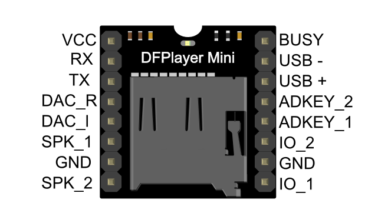

.. .. include:: ../Plugin/_plugin_substitutions_p06x.repl
.. _P065_DFPlayer_Mini_page:

DFPlayer Mini
=============

.. .. |P065_typename|
.. .. |P065_status|

Introduction
------------

Specifications:
 * Play mp3 or wav

Wiring
------

.. code-block:: none

  ESP                   MP3-player
  GPIO (X)       <-->   RX*

  Power
  5.0V or 3.3V   <-->   VCC
  GND            <-->   GND

  Speaker
  Red            <-->   SPK_1
  Black          <-->   SPK_2

  Other
  IO_1           <-->   Button, short press: previous track, long press: decrease volume
  IO_2           <-->   Button, short press: next track, long press: increase volume

  LED
  LED**          <-->   BUSY

\*note that the TX on the mp3-module is not used!

\*\*optional, if you want a LED to indicate playback (low active).

.. Setup
.. -----
.. 
.. 
.. 
.. Rules examples
.. --------------
.. 
.. .. code-block:: none
.. 
..   //Code below...
.. 
.. 
.. Indicators (recommended settings)
.. ---------------------------------
.. 
.. .. csv-table::
..   :header: "Indicator", "Value Name", "Interval", "Decimals", "Extra information"
..   :widths: 8, 5, 5, 5, 40
.. 
..   "XXXXXX", "N/A", "", "", ""

Where to buy
------------

.. csv-table::
  :header: "Store", "Link"
  :widths: 5, 40

  "AliExpress","`Link 1 ($) <http://s.click.aliexpress.com/e/cg1fhDDI>`_"

|affiliate|

.. More pictures
.. -------------
