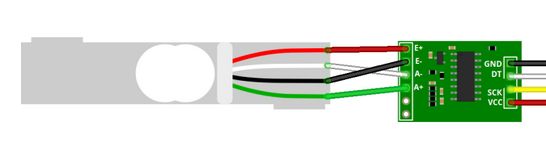
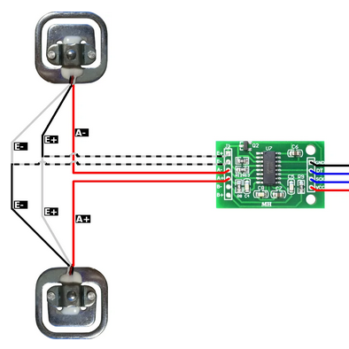
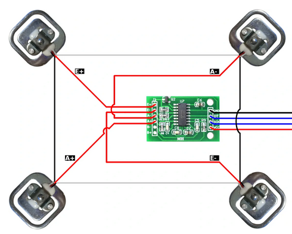
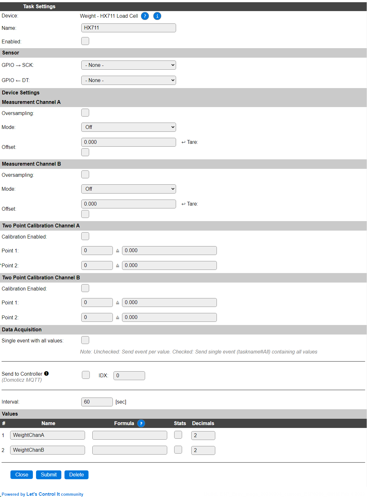

.. include:: ../Plugin/_plugin_substitutions_p06x.repl
.. _P067_page:

|P067_typename|
==================================================

|P067_shortinfo|

Plugin details
--------------

Type: |P067_type|

Name: |P067_name|

Status: |P067_status|

GitHub: |P067_github|_

Maintainer: |P067_maintainer|

Used libraries: |P067_usedlibraries|

Supported hardware
------------------

|P067_usedby|

There are several ways to connect load cells to the HX711 board, depending on the number of load cells used.

1 load cell connected:

2 load cells connected:

4 load cells connected:

Separate A and B channels
^^^^^^^^^^^^^^^^^^^^^^^^^

When connecting 2 (sets of) load cells on both A and B channels, to get independent measurements, start with the 1, 2 or 4 load cell setup, above, then connect the ``E+`` and ``E-`` wires of the second load cell (set) in parallel with the first load cell, the ``A-`` wire of the second load cell to ``B-`` input and the ``A+`` wire to the ``B+`` input of the board.

Description
-----------

The HX711 load-cell signal amplifier can be used for creating a scale, or to detect if the weight of an object changes. There can be 1, 2 or 4 load cells connected to each channel, in specific configurations as shown above.

Configuration
--------------

**Name** A unique name should be entered here.

**Enabled** The device can be disabled or enabled. When not enabled the device should not use any resources.

Sensor
^^^^^^

**GPIO -> SCK**: The GPIO pin that is connected to the clock input of the board.

**GPIO <- DT**: The GPIO pin that is connected to the Data output of the board.

Device Settings
^^^^^^^^^^^^^^^^

Measurement channel A
"""""""""""""""""""""

**Oversampling**: When enabled, the reported values are averaged during the set **Interval** to stabilize the, often somewhat fluctuating, returned values.

**Mode**: Channel A offers 3 modes of operation:

*Off*: The channel is disabled.

*Gain 64*: Enabled, signal enhancement with gain factor 64 is applied.

*Gain 128*: Enabled, signal enhancement with gain factor 128 is applied.

**Offset**: The offset is subtracted from the returned result. As each load cell has its own characteristic, this can be used to get a calibrated result value. The **Tare** checkbox (always off, unless checked by the user) can be used to fetch and set the last measured value as the offset.

Measurement channel B
"""""""""""""""""""""

The HX711 board offers a second input, often labelled B, where another load cell can be connected. To get the values of that channel, this part of the configuration has to be used.

**Oversampling**: When enabled, the reported values are averaged during the set **Interval** to stabilize the, often somewhat fluctuating, returned values. A new measurement sample is taken every 60 msec. (3 alternating measurements for the 3 gain options, 1 every 20 msec.) Max. 250 samples are used for oversampling.

**Mode**: Channel B offers 2 modes of operation:

*Off*: The channel is disabled.

*Gain 32*: Enabled, signal enhancement with gain factor 32 is applied.

**Offset**: The offset is subtracted from the returned result. As each load cell has its own characteristic, this can be used to get a calibrated result value. The **Tare** checkbox (always off, unless checked by the user) can be used to fetch and set the last measured value as the offset.

.. note:: 
  The somewhat irregular Gain settings per channel as shown are a limitation in the HX711 hardware, *not* in the plugin or ESPEasy software.

Two Point Calibration Channel A
"""""""""""""""""""""""""""""""

**Calibration Enabled**: Checked when 2-point calibration should be applied.

**Point 1**: The raw value, mapped to the desired output value.

**Point 2**: The raw value, mapped to the desired output value.

Two Point Calibration Channel B
"""""""""""""""""""""""""""""""

**Calibration Enabled**: Checked when 2-point calibration should be applied.

**Point 1**: The raw value, mapped to the desired output value.

**Point 2**: The raw value, mapped to the desired output value.

Calibration procedure
^^^^^^^^^^^^^^^^^^^^^

To calibrate your measurements to a defined range, f.e. ``kg`` or ``g``, this procedure can be used:

* Make sure no load is on the load cell, the plugin is enabled, and some measurements have been registered (wait for the **Interval** time to have passed at least a few times, and non-zero values are shown in the device overview page).

* Check the **Calibration Enabled** checkbox.

* Reset the **Point 1** and **Point 2** values to 0 and 0.

* Set the offset to the current measurement, by checking the **Tare** checkbox, and Submit the settings.

* Place a reference-load of known value on the load cell that is near the highest range of measurement to be expected, f.e. 25 kg of weight on a 50 kg load cell if the regular measurement should be around 25 kg.

* Take note of the measured value, either from the Devices overview page or the log, available via the serial interface or the Tools/Log page.

* Set the **Point 2** values to that measured value and the actual weight that was used, f.e. 25000 (g) or 25 (kg). When calibrating to ``g`` the value can still be shown in ``kg`` by applying the formula ``%value%/1000``, optionally setting the number of decimals to 3 to show full resolution.

* Submit the page to store the calibration.

.. note:: 
  Disclaimer: As the load versus output signal for a load cell isn't guaranteed to be linear, calibration using the minimum and maximum expected load for calibration will result in a best effort output.

Data Acquisition
----------------

The Data Acquisition, Send to Controller and Interval settings are standard available configuration items. Send to Controller is only visible when one or more Controllers are configured.

* **Interval** By default, Interval will be set to 60 sec. The minimum value allowed is 1 sec.

.. note:: 
  The initial READ of the plugin, immediately after it is initializaed, will not return any data, as no measurement is read from the sensor yet. Only after the next Interval seconds a valid result is returned, as by then some data will have been collected.

Values
^^^^^^

There are 2 values available for this sensor, named ``WeightChanA`` and ``WeightChanB``. A formula can be set to recalculate, f.e. to apply a division, or multiplication, using ``%value%/1000``. The number of decimals is by default set to 2.

Depending on the build-options used, a ``Stats`` checkbox per Value is available, and when checked, statistics for the value are stored in memory, and a graph can be shown in the Device configuration page. These statistics can be queried, similar like documented in the :ref:`p002_page` plugin page.

Commands available
^^^^^^^^^^^^^^^^^^

.. include:: P067_commands.repl

.. Events
.. ~~~~~~

.. .. include:: P067_events.repl

Change log
----------

.. versionchanged:: 2.0
  ...

  |added| 2023-01-01: Allow multiple instances of the plugin to be active, Channel B now returns a reliable result.

  |added|
  Major overhaul for 2.0 release.

.. versionadded:: 1.0
  ...

  |added|
  Initial release version.

