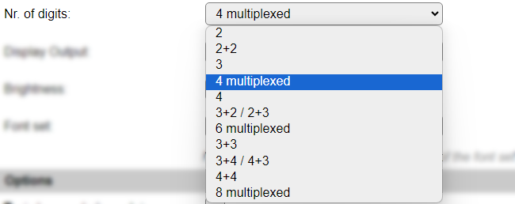
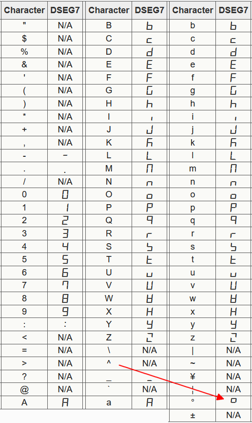

.. include:: ../Plugin/_plugin_substitutions_p07x.repl
.. _P073_page:

|P073_typename|
==================================================

|P073_shortinfo|

Plugin details
--------------

Type: |P073_type|

Name: |P073_name|

Status: |P073_status|

GitHub: |P073_github|_

Maintainer: |P073_maintainer|

Used libraries: |P073_usedlibraries|

Description
-----------

The 7 segment display plugin allows to display date, time, temperatures, numbers, text and self-created shapes on a 7 segment LED display, using a TM1637, MAX7219 or 74HC595 driver.

Depending on the available space in the release, some features may not be available.

Currently 3 fonts are available for presenting text on the display, where the character shapes are somewhat different, and a choice can be made on what font is the most appropriate for the intended purpose. The numbers in the fonts are all equal.

When text to be displayed can't fit on the width of the display (2, 3, 4, 5, 6 or 8 digits), scrolling text can be used so longer messages are shown like a ticker-tape display.

Optionally, periods in text can be shown on the dots of the display, when available (not all 7 segment display have dots).

For temperature display commands, ``7dt,<temp>`` and ``7ddt,<temp1>,<temp2>``, the degree symbol after the temperature can be turned off so there's room for 1 more digit of temperature on the display. The degree symbol is turned off for 2 and 3 digit displays.

Configuration
^^^^^^^^^^^^^^

.. image:: P073_DeviceConfiguration.png

* **Name**: In the Name field a unique name should be entered.

* **Enabled**: When unchecked the plugin is not enabled.

* **1st/2nd/3rd GPIO**: How the display is connected can be configured here. Description per module type is in the Notes below the GPIO fields.

For the MAX7219 and 74HC595 displays, the DIN-Pin and CLK-Pin can be shared when multiple displays are connected, but each display's CS-Pin must be connected to a unique GPIO of the unit.

For TM1637 display possibly the DIN-Pin GPIO's can be shared, but that's untested, so it is more safe to use separate GPIOs for each display.

* **Display Type**: Select the type of display that's connected. 5 models are supported:

* **Nr. of digits**: If the **Display Type** *74HC595* is selected, and the page is submitted, this setting is made visible to select the number of digits available in the display used. These are the available options:

* *2*: 2 digits, the smallest available display

* *2+2*: 2 displays using 2 digits connected sequentially (SDO of first display to SDI of second display), making a total of 4 digits.

* *3*: 3 digits. The 2 and 3 digits displays use 2 or 3 74HC505 chips sequentially, to control a single digit per chip.

* *4*: 4 digits. The 4, 6 and 8 digit display use a multiplexed setup, using 2 74HC595 chips per board, 1 controlling the digit leds, and 1 controlling the digit selected. These multiplexed displays need to be refreshed continuously to properly display the intended data, causing some extra load on the ESP.

* *2+3 / 3+2*: 2 displays with 2 and 3 digits or 3 and 2 digits connected sequentially (SDO to SDI), effectively giving a usable display of 5 digits.

* *6*: 6 digits, multiplexed display.

* *3+3*: 6 digits, 2 boards with 3 digits connected sequentially (SDO to SDI).

* *8*: 8 digits, multiplexed display. This display also supports the ``7ddt`` command for displaying dual temperatures.

* **Display Output**: Here the type of output can be selected:

*Manual*: The content can be set from rules by using the commands available (see below)

*Clock 24h - Blink*: Displays the current time in 24h format, with a blinking colon or dot.

*Clock 24h - No Blink*: Displays the current time in 24h format.

*Clock 12h - Blink*: Displays the current time in 12h format, with a blinking colon or dot.

*Clock 12h - No Blink*: Displays the current time in 12h format.

*Date*: Displays the current date.

*NB: Clock and Date outputs assume the NTP option is enabled in Tools/Advanced.*

The Clock and Date outputs are updated every second, and the blinking selections are 1 second on then 1 second off.

Clock and Date formats are optimized for each Display Type to fill the display efficiently.

* **Brightness**: The brightness level of the display can be set here. 0 is 'Default' brightness, 1..15 from low to high brightness. Displays using 74HC595 ignore this **Brightness** setting!

* **Font set**: Select the font set from this list:

*Default*: The original font as initially included in the plugin. Includes digits 0..9, special characters: space, dash, degree (when using a ``^``), equal sign, slash, underscore and letters A..Z. Uppercase and lowercase characters are shown exactly the same, but as the possible shapes are quite limited, some can be somewhat hard to recognize at first.

*Siekoo*: The character set as documented here `Fakoo.de: Siekoo alphabet <https://fakoo.de/siekoo.html>`_ (See below for the extra special characters supported)

*Siekoo with uppercase 'CHNORUX'*: This font is the same as the normal Siekoo character set, but supports uppercase versions for characters 'CHNORUX', even though they duplicate other characters in the set.

*dSEG7*: the character set as documented here `Keshikan.net: dSEG7 <https://www.keshikan.net/fonts-e.html>`_ special characters: space, dash, degree (when using a ``^``), equal sign, slash, underscore and letters A..Z. (Again single-case, like the default font)

**Siekoo**:

.. image:: P073_SiekooSet.png

The four marked characters, Ä, Ö, Ü and ß, are *not* included, as they can not reliably be sent to the unit because of conversion issues from ASCII/UTF-8/ISO charactersets. And they are possibly not often used, except in German, and some closely related, languages.

**dSEG7**:

The ``^`` character is again used to display the degree symbol, and the degree symbol is not recognized!

Options
^^^^^^^

* **Text show periods as dot**: Enables the use of the display dots when periods are included in ``7dtext,<text>`` command.

* **Hide ° for Temperatures**: Will leave out the degree symbol from the display for temperature commands ``7dt,<temp>`` (and ``7ddt,<temp1>,<temp2>`` when available), allowing 1 more digit for actual temperature display. This option is enabled by default on 2 and 3 digit displays.

* **Suppress leading 0 on day/hour**: When enabled, will show the hours of the time and days of the date without a leading 0 when < 10. (Not available in all builds for size reasons)

* **Scroll text > display width**: Normally the ``7dtext,<text>`` command only show the left n characters the display can hold. This option enables the Scroll Text feature, that will scroll text sent using the ``7dtext`` command (or ``7dbin`` command when available) from right to left when the content is longer than the display can show at once.

* **Scroll text in from right**: Normally the Scroll Text feature starts with the display filled with the left part of the text to scroll, with this option enabled, the display starts empty and the text is scrolled in from the right side of the display to the left, until all text is scrolled off. Then the scrolling restarts.

* **Scroll speed (0.1 sec/step)**: Determines the speed of scrolling the text. Default value is 10, so 1 character per second.

(The Scroll options and feature are not included in the Collection builds for size reasons)

Options for  8 digit displays (MAX7219/74HC595)
^^^^^^^^^^^^^^^^^^^^^^^^^^^^^^^^^^^^^^^^^^^^^^^

* **Right align Temperature (7dt)**: By default the temperature display on the 8 digit displays, is shown 1 position from the right side. This option enabled right-aligns the temperature.

Commands available
^^^^^^^^^^^^^^^^^^

.. include:: P073_commands.repl

Bit to segment mapping for 7dbin command
^^^^^^^^^^^^^^^^^^^^^^^^^^^^^^^^^^^^^^^^

The ``7dbin`` command allows to show any combination of segments on the display according to a (sequence of) bit pattern(s).

.. image:: P073_7Segments.png

The mapping from bits to segments is: ``0Bhabcdefg`` (Based on the segment mapping for MAX7219 driver, for TM1637/74HC595 the pattern is converted into the correct bit-order)

ESPEasy allows decimal, hexadecimal and binary notation for numbers. This makes creating the desired display pattern easy when using the binary notation (starting with ``0B`` or ``0b``).

Switching on all horizontal segments for a digit can be done by the command ``7dbin,0b01001001``. This can also be entered in hexadecimal notation: ``7dbin,0x49``

Change log
----------

.. versionchanged:: 2.0
  ...

  |added|
  Major overhaul for 2.0 release.

  |added|
  Display periods as dot option.

  |added|
  Optional disable degree symbol for temperature display.
  
  |added|
  ``7ddt`` command.
  
  |added|
  Select fonts to use for ``7dtext`` command.
  
  |added|
  Scroll Text option with configurable scroll speed.
  
  |added|
  ``7dbin`` command.

  |added| 2021-10-05:
  ``7output`` command.

  |added| 2023-03-29:
  Optional suppressing of leading 0 for Hour and Day in Time and Date.

  |added| 2024-07-26: Support for 74HC595 displays.

.. versionadded:: 1.0
  ...

  |added|
  Initial release version.

