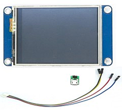
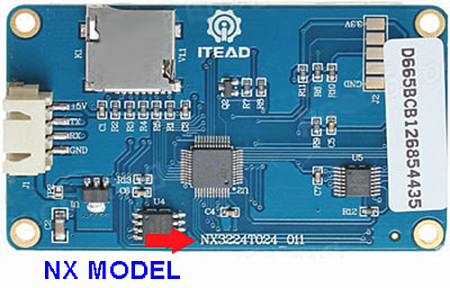
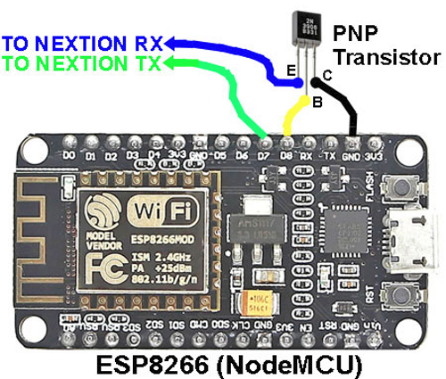
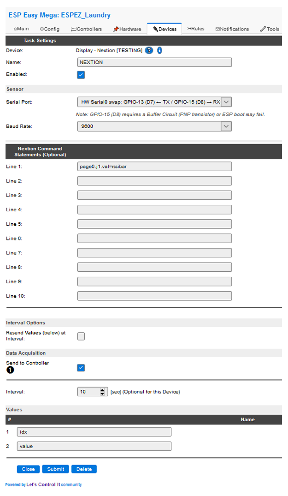

.. include:: ../Plugin/_plugin_substitutions_p07x.repl
.. _P075_page:

.. role:: raw-html(raw)
    :format: html

|P075_typename|
==================================================

|P075_shortinfo|

Plugin details
--------------

Type: |P075_type|

Name: |P075_name|

Status: |P075_status|

GitHub: |P075_github|_

Maintainer: |P075_maintainer|

Used libraries: |P075_usedlibraries|

Introduction
------------

ITead's Nextion HMI (Human Machine Interface) displays are compact Color LCD modules with an integrated touchscreen.
Nextion's Editor software (free download from ITead) is used to develop the application's Graphical User Interface (GUI).
The Editor uses drag-and-drop components such as text, buttons, sliders, and graphic images.

| The display is offered in three different product families, as follows:
|   *Basic* (T-Series)
|   *Enhanced* (K-Series)
|   *Intelligent* (P-Series)

ESPEasy's Nextion plugin has been confirmed to work with the *Basic* and *Enhanced* display modules.
The *Intelligent* display is a new product (released July 2020) and has **NOT** been validated on ESPEasy.

The *Enhanced* display has all the capabilities of the *Basic* module.
But it has more memory, a faster processor, and GPIO control.
Display sizes range from 2.4-inches (6cm) to 7.0-inches (18cm).

The *Intelligent* version offers bigger screen sizes. Plus it has more functions, such as audio, video and animation playback.
But as previously noted, compatibility with ESPEasy is unknown at this time.

The Nextion display connects to the ESPEasy device via TTL Serial (5V, TX, RX ,GND).

Supported Hardware
------------------
In addition to the three product families, there are also region specific models. They are similar, but require different HMI editing tools.

The NX model series is for the general global market. This product is supported by iteadstudio.com. The ITEAD Studio site is English language.

There is a variation for the Chinese market called the TJC series. This product is supported by tjc1688.com. The TJC site is Chinese language.

:raw-html:` `

Unless you have a project that specifically requires the Chinese market TJC display,
our recommendation is to use the global market NX series.
Be aware that some sellers do not specifically mention the exact model number.
If you are unable to confirm the model information then it is advisable to choose a different supplier.

Serial Communication
--------------------

ESPEasy's bi-directional communication with the Nextion HMI display can be performed two ways:
*Soft Serial* (bit-bang) or *Hardware Serial* (Hardware Serial0 Swap).

Soft Serial is fixed at 9600 baud and it supports a variety of ESP8266 I/O pins.
However, reliability of receiving characters sent from the Nextion HMI may suffer due to ESPEasy's background interrupt conflicts.
So using this method may result in unreliable operation of the touchscreen.
Therefore, Soft Serial is a reasonable choice only when the touchscreen feature is not used.

Hardware Serial is extremely reliable and can support a variety of baud rates.
It requires using the ESP's D7 (RX) and D8 (TX) pins.
Furthermore, it requires disabling ESPEasy's serial log feature;
This is automatically done when hardware serial is chosen.

A transistor circuit must be added when hardware serial is used. Despite the extra work, the hardware serial method is strongly recommended.

.. attention::
   Hardware serial transmit (TX) uses ESP8266's D8 "boot" configuration pin.
   A transistor buffer is required to isolate the ESP8266 from the Nextion's RX input circuity.
   Omitting the transistor may prevent the ESP8266 from booting correctly!

Both the Nextion HMI and ESP8266 utilize 3.3V logic.
So RX / TX voltage level conversion is not required.

Software Serial Wiring
**********************

*Soft Serial's* connections are as follows:

.. code-block:: none

   ESP           HMI
  -------------------
   5.0V      ↔   +5V
   GND       ↔   GND
   GPIO (X)  ↔   TX
   GPIO (X)  ↔   RX

Hardware Serial Wiring
**********************

*Hardware Serial* RX wiring requires adding a transistor.
It can be any general purpose PNP small signal type, such as 2N3906 or PN2907.

Below is an example of the transistor's wiring on a NodeMCU board.
When using other ESP boards please consult your specific ESP8266 documentation for its pin-out details.

:raw-html:` `

*Hardware Serial's* connections are as follows:

.. code-block:: none

    ESP              HMI
   --------------------------------------
    5.0V         ↔   +5V
    GND          ↔   GND
    GPIO13 (D7)  ↔   TX
    GPIO15 (D8)  ↔   Transistor Base Pin

ESPEasy Plugin Installation
---------------------------

.. attention:: The Nextion Plugin is only available on Mega |P075_status| builds.

Follow these steps to configure ESPEasy's Nextion plugin.

1. Use your favorite web browser and connect to your ESPEasy device.
2. Go to the *Devices* Tab and pick an empty task.
3. Choose the task *Add* button and select the *Display - Nextion [TESTING]* entry.
4. Configure the Nextion display as needed by your application.
   See the *Configuration Settings Summary* below.
5. Click the submit button.

Configuration Settings Summary
------------------------------

Name
****

Enter a task name. Avoid spaces and special characters. The default name is *NEXTION*.

Enable
******

Select the *Enable* Checkbox to activate the Nextion HMI Display.

Serial Port
***********

Select "**Hardware Serial0 Swap**" when using hardware serial.
When hardware serial is used do NOT alter any of the Tools->Advanced->Serial Settings.

Baud Rate
*********

Select 9600 (Nextion's factory default baud rate is 9600).

Command Statements (Optional)
******************************

Up to ten different *Nextion Command Statements* can be created that automatically execute at each timer interval.
This provides a convenient way to periodically populate your Nextion display with data from the ESPEasy system variables.
System variables are discussed here: https://www.letscontrolit.com/wiki/index.php/ESPEasy_System_Variables

For example, entering statement

.. code-block:: none

   page7.t0.txt="IP: %ip%"

would send the ESPEasy IP address to Nextion's text attribute t0 on page 7.

Or entering

.. code-block:: none

   page7.t1.txt="Signal Level: %rssi%"

would send the RSSI dBm value to text attribute t1 on page 7.

The Nextion plugin provides an optional conversion for the WiFi's RSSI (%rssi%) dBm data.
By using the *rssibar* command keyword the dBm data is converted to a stepped 0-100 integer, which represents 0-100% signal strength.
It's intended for use with Nextion's Progress Bar component.

Here's an *rssibar* keyword example that updates Progress Bar j1 on page 0:

.. code-block:: none

   page0.j1.val=rssibar

And speaking of Nextion's Progress Bar component, please Be mindful that it expects integer data that ranges from 0 to 100.
It does not support float data.
A device's task value can be easily converted to integer precision by setting the Decimal entry to zero (0) in the Values section of a device plugin.

Resend Values at Interval
*************************

When selected, the *idx* and *value* data are resent at each interval time.
Typical applications would leave it unchecked (disabled).
This setting does NOT affect the Command Statement (Lines) interval.

Send to Controller
******************

If selected the *idx* and *value* data will be automatically sent by the active controller using its configured protocol.
The controller must be setup using ESPEasy's Controllers tab.

Interval
********

Enter the repeating interval time (in seconds); Set to zero (0) to disable the timer.
At each interval time period the Nextion Command Statements are executed.
If the Resend Values is enabled then *idx* and *value* data are also resent at the interval.

Values Settings
***************

Data sent from the Nextion display is held in two variables, *idx* and *value*.

#1: *idx* is the main Index (key) variable.
For example, it can be a unique number that is sent by a Nextion touch button that has been is pressed or released.
But it is not limited to that purpose; It may be used for any data that needs to be passed from the Nextion display to ESPEasy.

#2: *value* is a sub-variable related to *idx*.
For example, it could contain "1" when a specific Nextion button is pressed, or a "0" when the button is released.
The *value* variable can be ignored if it is not needed.

Please see the Nextion Command Format Summary (below) for more details.

Example Installation
********************

Below is an example screenshot. It configures the Nextion Plugin for hardware serial.
Every 10 seconds it updates the WiFi signal strength (using a progress bar).
It also sends new touch event values to the controller.

:raw-html:` `

Nextion Data Format Summary
------------------------------

There are three different formats for sending data from the Nextion display to ESPEasy.
They are named *Touch Event*, *Pipe-S*, and *Pipe-U*.
You are free to choose the format for your application.
You can freely mix the different formats in the same application.

What you do with the sent data is up to you.
For example, use button press data from the Nextion to trigger actions in your home automation system that control your lights, appliances, and gadgets.
Or send periodic data that reports the display's state status.
These are just examples, since any Nextion related data can be sent.

Touch Event Format (Send Component ID)
**************************************

Components in your Nextion application can send Touch Press Events and Touch Release Events.
These actions automatically generate idx and value data if their corresponding Send ComponentID checkbox is selected.

During a Touch Press Event (that uses Send Component ID) the Nextion display passes several data bytes to ESPEasy that contains the Page Number, Component ID, and Press State.
The plugin packs these three bytes into the two Nextion variables, *idx* and *value* that can be sent to your home automation system.
Unpacking the two variables to restore the original data can be performed by your home automation system using simple integer math, as follows:

.. code-block:: none

   Page Number = (Nextion idx - 500) / 256

   Component ID = (Nextion idx - 500) - (Page Number * 256)

   Press State = value, where 0 = Press Release, 1 = Pressed

Example: Touch event idx = 1527, value = 0

.. code-block:: none

   (1527 - 500) / 256 = Page 4

   (1527 - 500) - (4 * 256) = Component ID 3

   Result: Component Page 4, Component ID 3, Press Release state

``|s`` (Pipe-S) Format
**********************

The ``|s`` (Pipe-S) format has the same functionality as the Touch Event format.
But it offers more flexibility because your application has the freedom to assign the idx and value data that is sent to ESPEasy.
Data unpacking is not required, so it can be simpler to use.
It's more powerful too, since Nextion code can be created that performs many of the if-then-else statements that would normally be done in your home automation rules files.
For example, create a toggle switch function within Nextion, then use ``|s`` to send unique idx codes for its On and Off states.

The ``|s`` format is constructed as follows:

.. code-block:: none

   |s,i[idx],s[boolen string]

| where [idx] = any valid number, including signed decimal.
| and [boolen string] = ``On`` or ``Off``

For example, to send *idx* = 12 and *value* = 1 the Nextion code would be written using two statements as follows:

.. code-block:: none

   print "|s,i12,sOn" // Send idx 12 and value 1 to ESPEasy
   printh 0a          // Required print termination character

``|u`` (Pipe-U) Format
**********************

The ``|u`` (Pipe-U) format is similar to the ``|s`` format.
Except *idx* and *value* data can be any number, including signed decimal.

The ``|u`` format is constructed as follows:

.. code-block:: none

   |u,i[idx],n,s[value]

| where [idx] = any valid number, including signed decimal.
| and [value] = any valid number, including signed decimal.

For example, to send idx = 50 and value = -3 the Nextion code would be written using two statements as follows:

.. code-block:: none

   print "|u,i50,n,s-3" // Send idx 50 and value -3 to ESPEasy
   printh 0a            // Required print termination character

Display Commands
----------------

.. include:: P075_commands.repl

.. Events
.. ~~~~~~

.. .. include:: P075_events.repl

Nextion IDE Development / User MCU Input
----------------------------------------

The Nextion Plugin's Hardware Serial feature can be configured to enhance the Nextion Integrated Development Environment (IDE).
A special plugin feature makes it possible to develop and test your Nextion application without a physical display panel.
Instead you can utilize the Nextion IDE's User MCU Input feature and enable it to directly interface with the ESP8266's USB port.

In case it's not perfectly clear, you can create your first working application before you spend a penny on a Nextion display!

Configure your development station as follows:

.. code-block:: none

    Disable ESPEasy's Serial Log:
        Go to Tools->Advanced tab.
        Uncheck (disable) the Enable Serial Port checkbox.
        Submit changes.
    Configure ESPEasy's Nextion Plugin to use USB serial:
        Go to the Nextion plugin.
        Set Serial Port to: HW Serial0: GPIO-3 (D9)<-TX / GPIO-1 (D10)->RX
        Submit changes.
    Launch the Windows compatible Nextion IDE app.
        Load (or create) your Nextion application.
        Choose Debug to compile and run your Nextion application.
        At the bottom of the Debug screen enable User MCU input and select your ESP8266's USB port.
        If the Nextion display board is connected it will be ignored. It does NOT need to be removed.

You can now use the Nextion IDE instead of an actual HMI display board to test out your EPSEasy application.

Change log
----------
.. versionchanged:: mega
  ...

  |improved|
  2020/09/25
  Updated text with additional information.

.. versionchanged:: 2.0
  ...

  |added|
  Major overhaul for 2.0 release.

.. versionadded:: 1.0
  ...

  |added|
  Initial release version.

