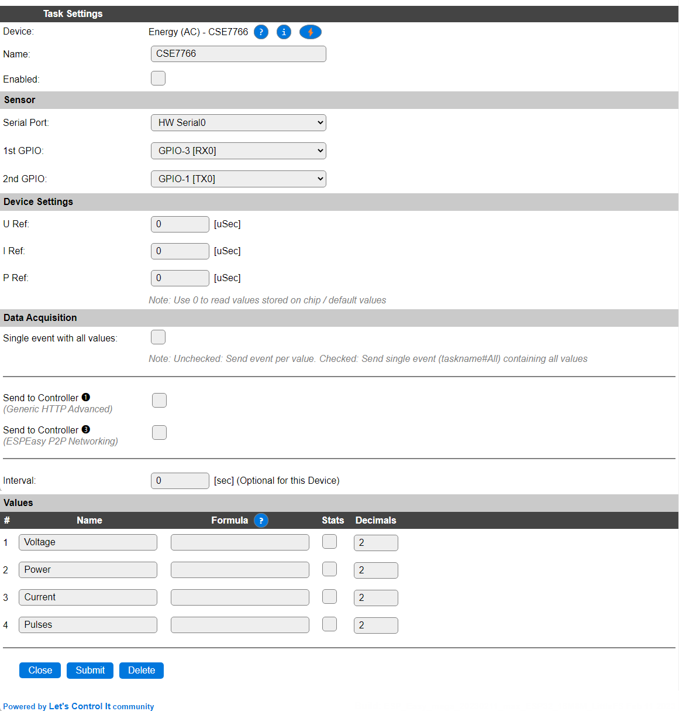

.. include:: ../Plugin/_plugin_substitutions_p07x.repl
.. _P077_page:

|P077_typename|
==================================================

|P077_shortinfo|

Plugin details
--------------

Type: |P077_type|

Name: |P077_name|

Status: |P077_status|

GitHub: |P077_github|_

Maintainer: |P077_maintainer|

Used libraries: |P077_usedlibraries|

Supported hardware
------------------

|P077_usedby|

:ref:`P077thr3xx_page`

Introduction
------------

To measure the power used by an electric device, the Sonoff POW units, running either on an ESP8266 or ESP32, can be used. The installed power-sensor is the CSE7766, that makes the measured data available via a serial output at 4800 baud.

This plugin can read the measured data, and apply a correction value to show calibrated values for Voltage, Power and Current, and it will also make available a pulse count.

Configuration
-------------

* **Name** A unique name should be entered here.

* **Enabled** The device can be disabled or enabled. When not enabled the device should not use any resources.

Sensor
^^^^^^

See: :ref:`SerialHelper_page`

Device Settings
^^^^^^^^^^^^^^^

* **U Ref**: The calibration value for the Voltage measurement. When set to 0, a default value of ``1950`` will be used, see Calibration, below.

* **I Ref**: The calibration value for the Current measurement. When set to 0, a default value of ``3500`` will be used, see Calibration, below.

* **P Ref**: The calibration value for the Power measurement. When set to 0, a default value of ``12530`` will be used, see Calibration, below.

Data Acquisition
^^^^^^^^^^^^^^^^

Single event with all values, Send to Controller and Interval settings are standard available configuration items. Send to Controller only when one or more Controllers are configured.

* **Interval** By default, Interval will be set to 0 sec. as this is optional for this plugin.

Values
^^^^^^

The measured values are available in ``Voltage``, ``Power``, ``Current`` and ``Pulses``. A formula can be set to recalculate. The number of decimals is by default set to 2, and can be set to 0 for ``Pulses``, as no decimals are provided from the measurement. When enabling the Stats checkbox for a value, statistics will be gathered and a graph of the last 16 (ESP8266) or 64 (ESP32) measurements will be shown.

Calibration
-----------

Easiest way to calibrate the plugin is to connect a known (resistive) load to the unit, measure the actual voltage, calculate the current from the power and voltage (``current = power/voltage``) and use the ``csecalibrate,<voltage>,<current>,<power>`` command (the Command input on the Tools page in the web UI will doen fine for that) to set the calibration values.

Commands available
------------------

.. include:: P077_commands.repl

.. Events
.. ~~~~~~

.. .. include:: P077_events.repl

Change log
----------

.. versionchanged:: 2.0
  ...

  |changed| 2023-02-11 Use ESPEasySerial to allow more flexible Serial/GPIO configuration and support new Sonoff POW models (ESP32)

  |added|
  Major overhaul for 2.0 release.

.. versionadded:: 1.0
  ...

  |added|
  Initial release version.

