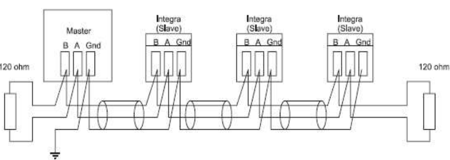

.. include:: ../Plugin/_plugin_substitutions_p07x.repl
.. _P078_page:

|P078_typename|
==================================================

|P078_shortinfo|

Plugin details
--------------

Type: |P078_type|

Port Type: |P078_porttype|

Name: |P078_name|

Status: |P078_status|

GitHub: |P078_github|_

Maintainer: |P078_maintainer|

Used libraries: |P078_usedlibraries|

Supported hardware
------------------

|P078_usedby|

Introduction
------------

Eastron is the manufacturer of many energy meters.
These can be had in various form factors, from DIN rail modules to panel meters.
There are many variations in number of phases, direct metering or using current transformer clamps (``CT`` in the name).

Apart from all these differences in features, there are also variations in interfacing to read the meter.
The ESPEasy plugin for these meters only can interact with them using Modbus RTU.

This Modbus RTU protocol uses the half-duplex RS485 serial interface.

RS485 Modbus Interface
----------------------

RS485 allows to 'daisy chain' various meters on to the same bus over long distances. (upto 1200 m).

Interfacing RS485 devices with an ESP module requires some chip to convert typical serial signals to the differential signal required for RS485 devices.
Commonly used chips are the MAX485 or ADM483, but there are lots of other variants which can also be used.

Typically such a chip has a data input (``DI`` or ``D``) and data output (``RO`` or ``R``).
To toggle between sending and listening, the ``DE`` pin must be pulled 'high' when sending data.

The ``/RE`` pin is logically inverted and thus can be connected to the ``DE`` pin.
This allows for a single GPIO pin to be used to toggle between sending and receiving data.

.. note:: 
  Most RS485 transceiver chips, like the MAX485, allow for a supply voltage (for the chip) higher than the 3.3V used for the ESP. Some even will not work reliable at 3.3 Volt.
  Keep in mind that on most RS485 transceiver boards, all microcontroller connected pins have a pull-up resistor to the supplied VCC.
  Meaning when you connect this chip to 5V, the signal connected to the ESP pins should be converted down to the lower 3.3V levels the ESP board uses.

Manual switching of transmitter/receiver without collision detection
^^^^^^^^^^^^^^^^^^^^^^^^^^^^^^^^^^^^^^^^^^^^^^^^^^^^^^^^^^^^^^^^^^^^

The most commonly used schematic for connecting a RS485 transceiver chip to a microcontroller, like the ESP boards:

.. code-block::

          VCC ---------------+
                             |
                     +-------x-------+
          RXD <------| RO            |
                     |              B|-----------<> B
          TXD ------>| DI   ADM483   |
  ESP                |               |     RS485 bus side
          RTS --+--->| DE            |
                |    |              A|-----------<> A
                +----| /RE           |
                     +-------x-------+
                             |
                            GND

Collision detection circuit
^^^^^^^^^^^^^^^^^^^^^^^^^^^

By connecting the ``/RE`` pin to GND, the transceiver chip has "receiving" enabled even when sending.
This allows to detect "collision", when other devices are sending data when the ESP attempts to send data.

If there is only a single 'master' on the RS485 bus, there is no need for using this kind of setup.

.. note:: Only ESP32 (and variants) can handle collision detection on RS485.

.. code-block::

          VCC ---------------+
                             |
                     +-------x-------+
          RXD <------| R             |
                     |              B|----------<> B
          TXD ------>| D    ADM483   |
  ESP32              |               |     RS485 bus side
          RTS ------>| DE            |
                     |              A|----------<> A
                +----| /RE           |
                |    +-------x-------+
                |            |
               GND          GND

Wiring RS485 bus
^^^^^^^^^^^^^^^^

The RS485 bus transports a differential signal to all connected modules.

There is some debate about whether the GND should also be connected, since the ``A`` and ``B`` line carry all what is needed.
When there is no common GND among modules and the ESP board, the voltage on both A and B might be too high compared to the module's GND, which may cause damage to the module.
Most cheap MAX485 boards have a 20k pull-up resistor on the ``A`` line and a 20k pull-down resistor on the ``B`` line, to prevent high voltage differences on the MAX485 chip.
But this does not protect the modules when no GND line is present.
So when possible, also wire the GND between modules and the GND of the RS485 transceiver chip.

Eastron modules do not appear to have a direct connection between GND and mains voltage. But this is not guaranteed for all RS485 modules being sold.
So the best approach is to use proper isolation when using mains connected devices.
For example, the ``ADM2483`` is a galvanic isolated RS485 transceiver chip.

It is best to twist the A/B lines when using longer wires to reduce effects of noise.

All modules on the same bus must be daisy chained from one to the other. 
A star topology is not allowed.

Most MAX485 modules already have a 120 Ohm resistor over the A/B pins.
It is adviced to add another 120 Ohm resistor over the A/B connector of the last module on the bus to act as a 'terminator', to reduce signal reflections.
For short links, a second 120 Ohm resistor is almost never needed, especially given the rather low baud rate used by these modules.

Configuration
-------------

See: :ref:`SerialHelper_page`

.. note:: All Eastron modules on the same ESPEasy node must use the same serial settings, like baud rate and serial port config.

Device Settings
^^^^^^^^^^^^^^^

The Model Type selector only limits which values can be selected in the Output Configuration section.
This way, only supported register reads will be offered to select.

It also is used to simplify the generated strings and suggested task value names.
For example on 1 phase modules, there is no need to specify the phase.

All Eastron module versions use the same internal register numbering schema.
For example, register ``0x0000`` is always about measuring the voltage between L1 and neutral.
But register ``0x0002`` (voltage between L2 and neutral) is only supported on 3-phase modules.

So selecting the wrong Model Type may still work fine, only it is possible not all supported options can be selected or unsupported options may be selected.

Output Configuration
^^^^^^^^^^^^^^^^^^^^

ESPEasy only allows upto 4 task values per task.
However the modules made by Eastron allow for much more values to be collected.
For example, the SDM630 has almost 100 values that can be read.

To allow collecting more values from a module, multiple tasks may be added which all have the same serial port settings and modbus address configured.

All task running the Eastron plugin will add their configured registers to be read, including the modbus address, are put in a queue in ESPEasy.
This queue is being read continuously and the read values will be immediately set on the output task values of the matching Eastron task.

ESPEasy tries to read the next register 10x per second.

The set baud rate determines the number of registers that can be read per second:

* @2400 baud: 3 - 5 registers per second.
* @9600 baud: 10 registers per second.

When a task is being read (e.g. per set "Interval" or when calling ``TaskRun`` from the rules), the last read values will be sent to any connected controller and events will be generated with these values.
Thus on a setup which in total reads more than 10 registers (either on a single or multiple modules) can not provide new values on each task run when set to an interval of 1 second.

With "Stats" enabled, the recorded min/max peak values will be updated on each read of that register.
So when the "Interval" is set to a long interval, the peaks may be taken from the frequent reads inbetween.

Units of Measure
^^^^^^^^^^^^^^^^

Depending on the model, these Eastron modules can provide various units of measure:

* Line voltage and THD% (total harmonic distortion) of all phases
* Line Frequency
* Currents, Current demands and current THD% of all phases
* Power, maximum power demand and power factor
* Active energy imported and exported
* Reactive energy imported and exported

The options with "Demand" in their name, are measurements within a time window.
The default "Demand Time Interval" is a preset period of 60 minutes.

ESPEasy currently does not support setting the time on these modules, or triggering a new start of a demand period.
Thus the start of such interval may not be on the start of each hour.

Set Baudrate/ID
^^^^^^^^^^^^^^^

The default baud rate of 2400 of most of these sensors may be too low for using Software Serial.
On ESP8266, the module may rather frequently crash due to watch dog resets when running Software Serial at such low baud rates.

It is adviced to set the module to 9600 baud.

Using a higher baud rate will also take less resources of the ESPEasy node.
For example, writing the 8 byte command to the module takes roughly 35 msec @2400 baud and only 13 msec @9600 baud.

When running at 9600 baud, ESPEasy can typically read upto 10 registers per second for all connected Eastron modules.

On some modules, like the SDM120, the module settings can only be set via the Modbus interface.

When an Eastron task is enabled in ESPEasy, it will continously read the set registers on all connected Eastron modules.
This will affect the commands used to change settings and thus this continous reading must be paused.

The commands in ESPEasy to change settings have a last optional parameter ``node_id``, which is the current set address of the module.
If none is given, the factory default address ``1`` is assumed.
Valid node IDs are ``1 ... 247``.

Steps to change settings:

* Pause continously reading registers on the module by calling ``Eastron,Pause`` in ESPEasy.
* Enable ``-set-`` mode on the module by pressing the button on the module for 3 seconds.
* To change the baud rate, call ``Eastron,SetBaud,<new_baudrate>[,<node_id>]`` in ESPEasy, where the new baud rate parameter can be given either as a value ``0`` ... ``5``, or the exact (supported) baud rate. (see description below).
* To change the node ID (address), call ``Eastron,SetID,<new_id>[,<node_id>]``.
* Press the button on the module again for 3 seconds to save the new values.
* Reading the set registers can be resumed with the command ``Eastron,Resume``

Since changing the node ID is effective immediately, it makes sense to change the baud rate first and then the ID if both need to be changed.

.. note:: The new baud rate will only be used after a power cycle of the module.

Sensor
------

Commands available
------------------

.. include:: P078_commands.repl

.. Events
.. ~~~~~~

.. .. include:: P078_events.repl

Change log
----------

.. versionchanged:: 2.0
  ...

  |added| 2023-08-06: 
  * Add support for many more modules
  * Add commands to set ID and baud rate
  * Massively reduce use of resources when reading sensor

.. versionadded:: 1.0
  ...

  |added|
  Initial release version.

