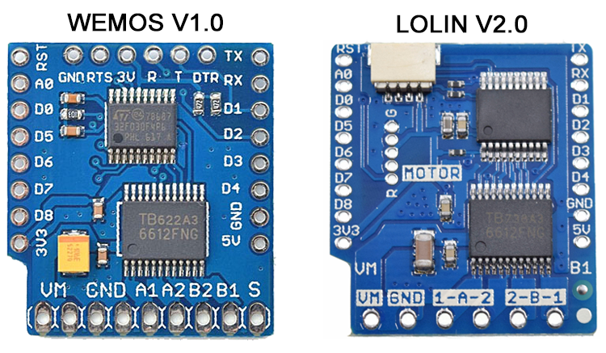

.. include:: ../Plugin/_plugin_substitutions_p07x.repl
.. _P079_page:

|P079_typename|
==================================================

|P079_shortinfo|

Plugin details
--------------

Type: |P079_type|

Port Type: |P079_porttype|

Name: |P079_name|

Status: |P079_status|

GitHub: |P079_github|_

Maintainer: |P079_maintainer|

Used libraries: |P079_usedlibraries|

Introduction
------------

ESPEasy's *Wemos / Lolin Motorshield* plugin is used to control small DC brushed motors.
It can also be used with other resistive or inductive loads. Such as low voltage light bulbs, LED strip lights, solenoids, etc.
The attached load must be able to tolerate polarity reversal.

The Motor Shield connects to the i2c bus (default address is 0x30).
The Shield is designed to plug directly onto a Wemos D1 mini (ESP8266).
D1 mini details are found `HERE <https://docs.wemos.cc/en/latest/d1/d1_mini.html>`_

However, it can be installed on other ESP8266 variant devices using hard wire connections.
It requires 3.3V, Ground, RST, D1 (GPIO5/SCL), and D2 (GPIO4/SDA).

The Shield has a TB6612FNG driver chip that can control two DC motors that draw 1.2A or less.
Motor supply voltage can range from 2.5VDC to 15.0VDC.
There is also a STM32F030 microcontroller onboard that handles the i2c communication for command processing.

Supported Hardware
------------------

There are two variations of the Motor Shield. Originally only the Wemos V1.0 Motor Shield was supported.
This board requires modification (custom STM32F030 firmware and solder jumpers).
But on mega-20200929 and later releases the plugin has been updated to support the Lolin 2.0 Motor Shield.
The Lolin Shield requires no modifications which greatly simplifies a new installation.

Hardware Installation
---------------------

For installation details, please click the link below that matches the Shield you are using.

| |P079_usedby_wemos|
| |P079_usedby_lolin|

Motor Shield Actions
--------------------

Motor control actions can be executed locally using ESPEasy rules.
They can also be sent remotely using HTTP and MQTT.

Please be aware that Motor Shield communication is one-way.
So it’s not possible to directly read motor status from the ESPEasy plugin.

Commands Available
^^^^^^^^^^^^^^^^^^

.. include:: P079_commands.repl

.. Events
.. ~~~~~~

.. .. include:: P079_events.repl

Change log
----------
.. versionchanged:: mega
  ...

  |improved|
  2020/09/25
  Added support for Lolin V2.0 Motor Shield.
  Added Brake and Standby actions.
  Added Lolin V2.0 i2c communication test.
  Incorrect syntax usage now logs error.

.. versionchanged:: 2.0
  ...

  |added|
  Major overhaul for 2.0 release.

  |improved|
  2019/03/14 Moved from Testing to Normal and added links to firmware update.

.. versionadded:: 1.0
  ...

  |added|
  Initial release version.
