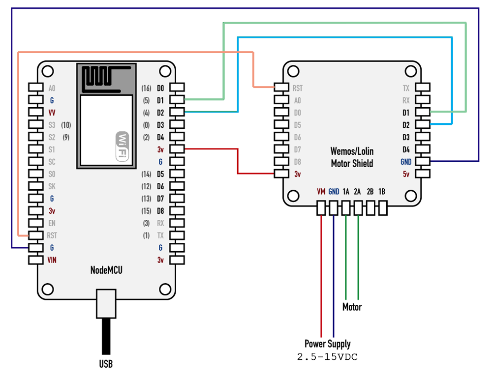
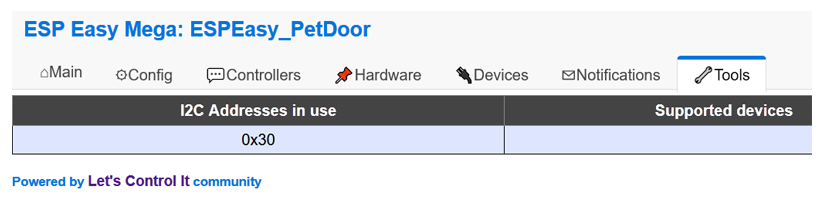

.. include:: ../Plugin/_plugin_substitutions_p07x.repl
.. _P079_LolinMotorshield_page:
.. role:: raw-html(raw)
    :format: html

Lolin V2.0 Motor Shield
=======================

|P079_typename|
|P079_status|

.. attention:: If you are using the Wemos V1.0 Motor Shield board then please go to: |P079_usedby_Wemos|

Introduction
------------

The Lolin V2.0 Motor Shield is used to control small DC brushed motors.
It can also be used with other resistive or inductive loads.
Such as low voltage light bulbs, LED strip lights, solenoids, etc.
The attached load must be able to tolerate polarity reversal.

The Motor Shield connects to the i2c bus (default address is 0x30).
It has a TB6612FNG driver chip that can control two DC motors that draw 1.2A or less.
Motor supply voltage can range from 2.5VDC to 15.0VDC.
There is also a STM32F030 microcontroller onboard that handles the i2c communication for command processing.

Hardware Installation
---------------------
The Shield is designed to plug directly onto a Wemos D1 mini (ESP8266).
D1 mini details are found `HERE <https://docs.wemos.cc/en/latest/d1/d1_mini.html>`_

However, it can be installed on other ESP8266 variant devices using hard wire connections.
The image below provides typical wiring details (NodeMCU board shown for reference).

ESPEasy Plugin Installation
---------------------------

Follow these steps to configure a new Motor Shield.

1. Use your favorite web browser and connect to your ESPEasy device.
2. Go to the *Devices* Tab and pick an empty task.
3. Choose the task *Add* button and select the *Motor - Wemos/Lolin Motorshield* entry.
4. Configure the Motor Shield (use i2c address 0x30), as shown in the image below:
5. Click the submit button.

Motor Shield Testing
--------------------

The I2C scan function (found on ESPEasy's *Tools* page) can be used to confirm the board is seen by the bus.
If the scan does not find address 0x30 then check your wiring.
The image below shows a successful Motor Shield I2C Scan:

:raw-html:` `

Practical testing can be performed by controlling the Motor Shield from ESPEasy's Command function.
For example, to control Motor-A, go to the 'Tools' page and submit each of these commands using the *Command* box:

.. code-block:: none

  LolinMotorShieldCMD,0,Forward,99
  LolinMotorShieldCMD,0,Stop
  LolinMotorShieldCMD,0,Backward,50
  LolinMotorShieldCMD,0,Standby
  LolinMotorShieldCMD,0,Forward,45
  LolinMotorShieldCMD,0,Brake

.. hint:: Commands are case insensitive.

Communication Test:
*******************

The Lolin Motor Shield includes a special test command that verifies I2C communication is working correctly.
To run the test go to the 'Tools' page and enter *LolinMotorShieldCMD* into the *Command* box, then press submit:

.. code-block:: none

   LolinMotorShieldCMD

Success will display a "Pass" message and version information. See image below:

Motor Shield Actions
--------------------

Motor control actions can be executed using ESPEasy rules.
They can also be sent remotely using HTTP and MQTT.

Please be aware that Motor Shield communication is one-way.
So it's not possible to directly read motor status from the ESPEasy plugin.

Rules Examples
**************

The Event rule examples shown below provide basic control to DoorOpen, DoorClose, and DoorStop.
A pair of switches (requires two *Switch input - Switch* plugins) are used to limit up/down motor travel.

.. code-block:: none

  // Events
  on DoorOpen do
    LolinMotorShieldCMD,0,Backward,30
  endon

  on DoorClose do
    LolinMotorShieldCMD,0,Forward,30
  endon

  on DoorStop do
    LolinMotorShieldCMD,0,Stop
  endon

  // Timer for all day open door at time if not open
  on Clock#Time=All,07:00 do
    if [Limit1#Switch]!=1
      event,DoorOpen
    else
      event,DoorStop
    endif
  endon

  // Timer for all day close door at time if not closed
  on Clock#Time=All,22:00 do
    if [Limit2#Switch]!=1
      event,DoorClose
    else
     event,DoorStop
    endif
  endon

HTTP Examples
*************

| Turn on DC Motor-A, Direction: Forward, Speed: 99
| ``http://<ESP IP address>/control?cmd=LolinMotorShieldCMD,0,Forward,99``

| Stopping DC Motor-A:
| ``http://<ESP IP address>/control?cmd=LolinMotorShieldCMD,0,Stop``

Motor Shield Command Summary
----------------------------

.. include:: P079_commands.repl
