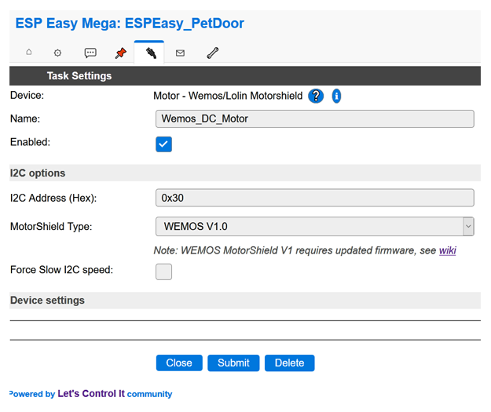

.. include:: ../Plugin/_plugin_substitutions_p07x.repl
.. _P079_WemosMotorshield_page:
.. role:: raw-html(raw)
    :format: html

Wemos V1.0 Motor Shield
=======================

|P079_typename|
|P079_status|

.. attention:: If you are using the Lolin V2.0 Motor Shield board then please go to: |P079_usedby_lolin|

Introduction
------------

The Wemos V1.0 Motor Shield is used to control small DC brushed motors.
It can also be used with other resistive or inductive loads. Such as low voltage light bulbs, LED strip lights, solenoids, etc.
The attached load must be able to tolerate polarity reversal.

The Motor Shield connects to the i2c bus (default address is 0x30).
It has a TB6612FNG driver chip that can control two DC motors that draw 1.2A or less.
Motor supply voltage can range from 2.5VDC to 15.0VDC.
There is also a STM32F030 microcontroller onboard that handles the i2c communication for command processing.

Firmware Upgrade
----------------
Piotr Bugalski has re-written the firmware for the Wemos V1.0 Motor Shield. It is published at https://github.com/pbugalski/wemos_motor_shield.
Details to Piotr's firmware redesign can be found `Here <https://hackaday.io/project/18439-motor-shield-reprogramming>`_

The factory installed firmware has reliability issues, such as hard lockup (hang) of the I2C bus.
When this occurs all I2c communication is lost.
A power cycle is required to restore operation!

The new firmware is backwards compatible.
Despite the extra work to reflash the Shield's firmware, the improvements make it an essential upgrade.
But If you prefer less work then use the Lolin V2.0 Motor Shield instead.
Details are found here: |P079_usedby_lolin|

In order to flash the firmware the module must be connected to a 3.3V compatible USB2TTL adapter.
The reflashing must be done *before* connecting the Shield to your ESPEasy device.

Preparations to flash:
**********************

Four USB2TTL connections must be made to the Shield.
A temporary jumper is installed too.
As follows:

* Jumper the RTS (not the RST!) to the 3V pin on the Shield, `like this <https://cdn.hackaday.io/images/3123331492797505129.jpg>`_
* Connect the main pins of the Shield to your USB2TTL as follows:

  * GND ↔ GND
  * 3V3 ↔ 3V3 (or VCC or whatever it is called on your USB2TTL)
  * D2 ↔ TX
  * D1 ↔ RX

Download and Flash:
*******************

The firmware (bin file) and STMF32 flashing tool are available online. Just follow these steps:

* Download the `motor_shield.bin <https://github.com/letscontrolit/ESPEasy/tree/mega/misc/Wemos_motor_shield/motor_shield.bin>`_
  This binary is built from `github.com/pbugalski/wemos_motor_shield <https://github.com/pbugalski/wemos_motor_shield>`_
* Download `STM32Flash <https://sourceforge.net/projects/stm32flash/files/>`_
* Extract and put the above files into a working directory
* Plug in your USB serial device and make a note of the COM port it uses

Those of you who want to do this using Windows 8/10:

Using the Windows Command Prompt, cd to the stm32flash working directory.
Flash the bin file using the following commands:

1. ``stm32flash.exe COM9`` replace COM9 with your COM port number
2. ``stm32flash.exe -k COM9`` This will unlock your Shield
3. ``stm32flash.exe -f -v -w motor_shield.bin COM9`` This will flash the bin and re-lock the Shield.
4. Remove the jumper wire across the RTS and 3V pins that was installed earlier.

Solder Jumpers
--------------
The Wemos V1.0 Motor Shield has PCB jumper pads that must be bridged with solder.
Please consult the photo below.

Hardware Installation
---------------------
The Shield is designed to plug directly onto a Wemos D1 mini (ESP8266).
D1 mini details are found `HERE <https://docs.wemos.cc/en/latest/d1/d1_mini.html>`_

However, it can be installed on other ESP8266 variant devices using hard wire connections.
The image below provides typical wiring details (NodeMCU board shown for reference).

.. image:: P079_Shield_Wiring.png
    :width: 1000px
    :height: 769px
    :scale: 60 %
    :alt: Motor Shield Wiring Diagram
    :align: left

ESPEasy Plugin Installation
---------------------------

Follow these steps to configure a new Motor Shield.

1. Use your favorite web browser and connect to your ESPEasy device.
2. Go to the *Devices* Tab and pick an empty task.
3. Choose the task *Add* button and select the *Motor - Wemos/Lolin Motorshield* entry.
4. Configure the Motor Shield (use i2c address 0x30), as shown in the image below:
5. Click the submit button.

R

Motor Shield Testing
--------------------

The I2C scan function (found on ESPEasy's *Tools* page) can be used to confirm the board is seen by the bus.
If the scan does not find address 0x30 then recheck your wiring.
The image below shows a successful Motor Shield I2C Scan:

.. image:: P079_i2c_scan1.png
    :width: 825px
    :height: 205px
    :scale: 60 %
    :alt: I2C Scan
    :align: left

:raw-html:` `

Practical testing can be performed by controlling the Motor Shield from ESPEasy's Command function.
For example, to control Motor-A, go to the 'Tools' page and submit each of these commands using the *Command* box:

.. code-block:: none

  WemosMotorShieldCMD,0,Forward,99
  WemosMotorShieldCMD,0,Stop
  WemosMotorShieldCMD,0,Backward,50
  WemosMotorShieldCMD,0,Standby
  WemosMotorShieldCMD,0,Forward,45
  WemosMotorShieldCMD,0,Brake

.. hint:: Commands are case insensitive.

Motor Shield Actions
-------------------

Motor control actions can be executed using ESPEasy rules.
They can also be sent remotely using HTTP and MQTT.

Please be aware that Motor Shield communication is one-way.
So it's not possible to directly read motor status from the ESPEasy plugin.

Rules Examples
**************

The Event rule examples shown below provide basic control to DoorOpen, DoorClose, and DoorStop.
A pair of switches (requires two *Switch input - Switch* plugins) are used to limit up/down motor travel.

.. code-block:: none

  // Events
  on DoorOpen do
    WemosMotorShieldCMD,0,Backward,30
  endon

  on DoorClose do
    WemosMotorShieldCMD,0,Forward,30
  endon

  on DoorStop do
    WemosMotorShieldCMD,0,Stop
  endon

  // Timer for all day open door at time if not open
  on Clock#Time=All,07:00 do
    if [Limit1#Switch]!=1
      event,DoorOpen
    else
      event,DoorStop
    endif
  endon

  // Timer for all day close door at time if not closed
  on Clock#Time=All,22:00 do
    if [Limit2#Switch]!=1
      event,DoorClose
    else
     event,DoorStop
    endif
  endon

HTTP Examples
*************

| Turn on DC Motor-A, Direction: Forward, Speed: 99
| ``http://<ESP IP address>/control?cmd=WemosMotorShieldCMD,0,Forward,99``

| Stopping DC Motor-A:
| ``http://<ESP IP address>/control?cmd=WemosMotorShieldCMD,0,Stop``

Motor Shield Command Summary
----------------------------

.. include:: P079_commands.repl
