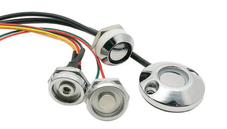
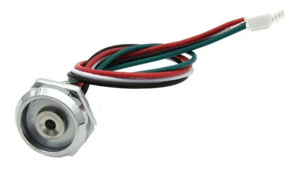
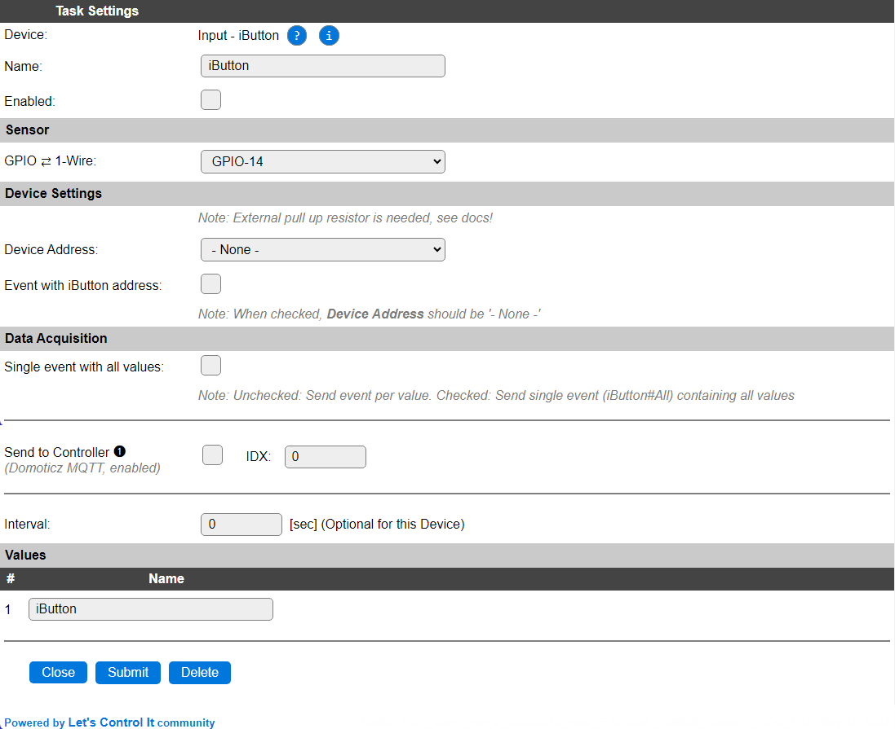

.. include:: ../Plugin/_plugin_substitutions_p08x.repl
.. _P080_page:

|P080_typename|
==================================================

|P080_shortinfo|

Plugin details
--------------

Type: |P080_type|

Name: |P080_name|

Status: |P080_status|

GitHub: |P080_github|_

Maintainer: |P080_maintainer|

Used libraries: |P080_usedlibraries|

Supported hardware
------------------

.. .. |P080_usedby|

This type of reader is available at sites like Aliexpress and eBay. The wiring for these units can be somewhat confusing:

.. code-block:: none

  ESP           iButton (4 wires)
  GPIO   <-->   1-wire/D (green) with 1k..10k Pull-up to VCC
  GND    <-->   GND (red)

  ESP           Resistor        LED
  VCC    <-->                   Anode (black)
  GPIO   <-->   470 ohm   <-->  Cathode (white)

The value for the pull-up resistor on the 1-wire GPIO pin depends somewhat, sometimes, 10k doesn't work reliable, especially when using longer wires (> 2m), then lowering to 4k7 or 2k2 usually fixes that. For really problematic installations with high (electrical) noise levels, a 1k resistor may be needed to make it work reliable.

Description
-----------

The iButton, developed by Dallas, now Maxim, is a coded key or button, that can be used for access control or similar identity checks. They use RFID technology to transfer their ID to the receiver, once in close proximity of the receiver.

The iButtons often come in the shape shown in the image below, and can be attached to a keyring for easy access and use.

These buttons are available as read-only iButtons, and as rewritable iButtons, where the user can change the ID of the button. Both types can be read by ESPEasy, but ESPEasy does not provide tools or features to write an ID to the rewritable buttons, separate tools for that can be obtained elsewhere.

Configuration
-------------

* **Name**: Required by ESPEasy, must be unique among the list of available devices/tasks.

* **Enabled**: The device can be disabled or enabled. When not enabled the device should not use any resources.

Sensor
^^^^^^

* **GPIO 1-Wire**: The reader only needs a single GPIO pin (and GND) to be connected. The 1-Wire hardware configured in ESPEasy requires a ca. 4k7 ohm (range 1k..10k depending on wire-length) pull-up resistor between VCC (3.3V) and the GPIO pin. Internal pull-up of the ESP is not sufficient!

Any additional wires on the receiver unit mostly are used for indicator leds, that can optionally be controlled using standard GPIO commands from rules. (Don't forget a resistor to limit the current...)

Device Settings
^^^^^^^^^^^^^^^

* **Device Address**: Select the desired device ID that the plugin should respond to. This requires the device to be enabled, and an iButton in contact with the receiver when opening the device settings page! When set, the task will only respond to this iButton ID, when read.

* **Event with iButton address**: With this option enabled, and the **Device Address** selection left to ``- None -``, instead of responding to a single iButton, an event is generated for any iButton that is recognized by the receiver. And once removed, the same event is generated without the iButton address. This can be processed in rules. See below in the **Events** chapter for a more detailed description.

Data Acquisition
^^^^^^^^^^^^^^^^

This group of settings, **Single event with all values** and **Send to Controller** settings are standard available configuration items. Send to Controller is only visible when one or more Controllers are configured.

* **Interval** By default, Interval will be set to 0 sec. as it is optional. It is the frequency used to send the value to any Controllers configured for this device.

Values
^^^^^^

The plugin provides the ``iButton`` value, that shows either 0 (no iButton on the receiver) or 1 (iButton recognized).

.. Commands available
.. ^^^^^^^^^^^^^^^^^^

.. .. include:: P080_commands.repl

Events
~~~~~~

.. include:: P080_events.repl

Change log
----------

.. versionchanged:: 2.0
  ...

  |added| 2024-05-10 Support for Event with iButton address.

  |added|
  Major overhaul for 2.0 release.

.. versionadded:: 1.0
  ...

  |added|
  Initial release version.

