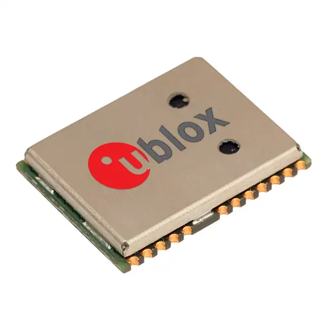
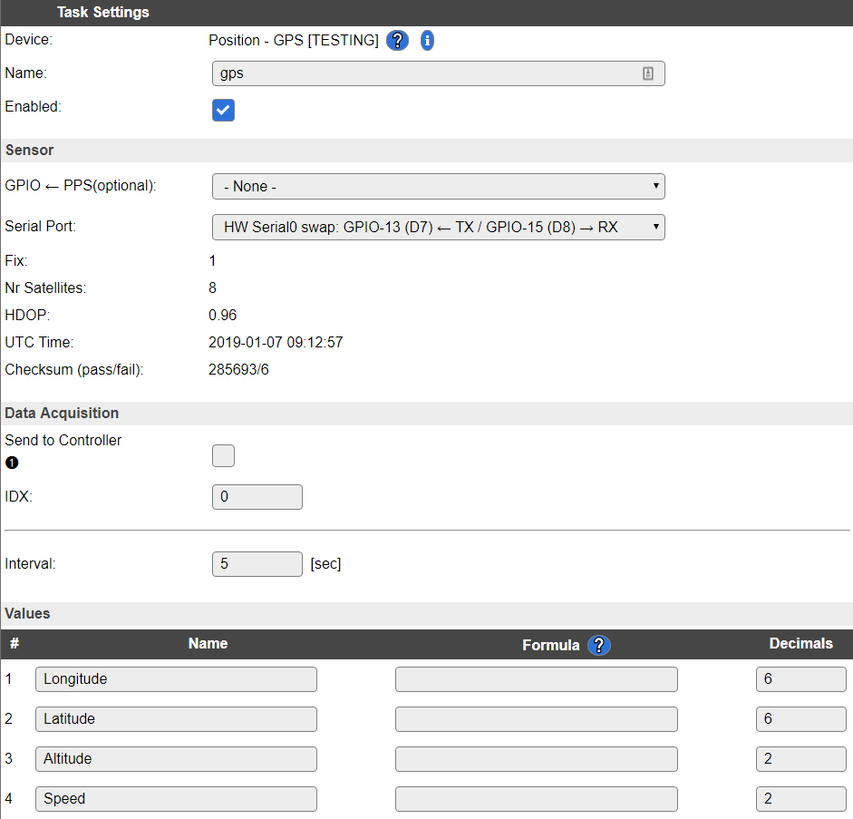
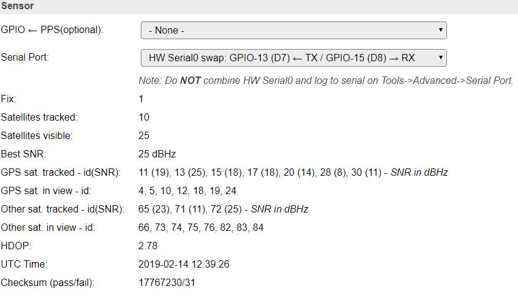

.. include:: ../Plugin/_plugin_substitutions_p08x.repl
.. _P082_Neo-M8n_page:

Neo M8n
=======

|P082_typename|
|P082_status|

Introduction
------------

GPS module that uses GPS, Galileo, GLONASS, BeiDou satellites.

Specifications:
 * GPS
 * Galileo
 * GLONASS
 * BeiDou

Wiring
------

A GPS receiver is rather 'chatty', so it is strongly advised to use hardware serial ports.

The ESP8266 only has 2 HW serial ports, but only Serial0 uses a HW RX pin.
The TX channel from the ESP to the GPS is not needed for this plugin.

The used baudrate is 9600 bps.

.. code-block:: none

  ESP                         Neo-M8n (HW Serial0)
  GPIO (3/RX/RX0/D9)   <-->   TXD
  GPIO (1/TX/TX0/D10)  <-->   RXD

  ESP                         Neo-M8n (HW Serial0 swapped)
  GPIO (13/D7)         <-->   TXD
  GPIO (15/D8)         <-->   RXD

  ESP                         Neo-M8n (HW Serial1)
  not used             <-->   TXD
  GPIO (2/D4)          <-->   RXD

  Power
  5.0V                 <-->   VCC
  GND                  <-->   GND

.. danger:: If you use ``HW Serial0`` or ``HW Serial0 swapped`` you must disable serial port in the advanced settings! If you
            fail to do so the unit will not work properly.

Setup
-----

A screenshot of a later relase of the plugin. The use of hardware serial communication
makes the transfer between the GPS and ESP a LOT more stable:

Task settings
~~~~~~~~~~~~~

* **Device**: Name of plugin
* **Name**: Name of the task (example name **GeoPos**)
* **Enable**: Should the task be enabled or not

Sensor
^^^^^^

* **GPIO <-- TX**: Used to communicate with the GPS unit.
* **GPIO --> RX**: Not used (optional), to push commands back into the GPS unit.
* **GPIO --> PPS**: Experimental (optional), used to let the GPS unit update the time of the ESP.
* **Dropdown**: ``SoftwareSerial`` lets you select any GPIO pin, ``HW Serial0`` is the preferred (most stable),
                ``HW Serial0 swapped`` is similar to Serial0, ``HW Serial1`` is only able to receive data from the GPS unit.

.. warning:: It's highly recommended you use either the ``HW Serial1`` or ``HW Serial0`` for stable reading of the GPS unit. But also remember to disable the serial in the
             advanced settings page, if not the ESP will interfere with the GPS unit.

.. include:: P082_pps_pin.repl

Data acquisition
^^^^^^^^^^^^^^^^

* **Send to controller** 1..3: Check which controller (if any) you want to publish to. All or no controller can be used.
* **Interval**: How often should the task publish its value (5..15 seconds is normal).

Indicators (recommended settings)
^^^^^^^^^^^^^^^^^^^^^^^^^^^^^^^^^

.. csv-table::
   :header: "Indicator", "Value Name", "Interval", "Decimals", "Extra information"
   :widths: 8, 5, 5, 5, 40

   "Longitude", "Long", "1", "6", "5 decimals = 100cm resolution, 6 decimals = 10cm resolution, 7 decimals = 1cm resolution"
   "Latitude", "Lat", "1", "6", "5 decimals = 100cm resolution, 6 decimals = 10cm resolution, 7 decimals = 1cm resolution"
   "Altitude", "Alt", "1", "0", "Normally only full meters are needed. Use more decimals if you need higher resolution."
   "Speed", "mps", "1", "1", "Meters per second."

.. note:: These resolutions are given at the equator. Less accuracy is received the further north/south you go.

Rules examples
--------------

.. code-block:: none

   on GeoPos#Speed do
    if [GeoPos#Speed]>50
      //Whooohooo, fast as lightning!
    endif
   endon

.. Commands available
.. ~~~~~~~~~~~~~~~~~~

.. .. include:: P082_commands.repl

Events
~~~~~~

.. include:: P082_events.repl

Where to buy
------------

.. csv-table::
  :header: "Store", "Link"
  :widths: 5, 40

  "AliExpress","`Link 1 ($) <http://s.click.aliexpress.com/e/cmauSCgs>`_"
  "Banggood","`Link 2 ($) <https://www.banggood.com/custlink/G3vvYRCdgh>`_ `Link 3 ($) <https://www.banggood.com/custlink/mmvmdYpEBr>`_"
  "eBay","`Link 4 ($) <https://rover.ebay.com/rover/1/711-53200-19255-0/1?icep_id=114&ipn=icep&toolid=20004&campid=5338336929&mpre=https%3A%2F%2Fwww.ebay.com%2Fsch%2Fi.html%3F_nkw%3Dneo%2520m8n>`_"

|affiliate|

.. More pictures
.. -------------

.. .. image:: P082_Neo-M8n_2.jpg
