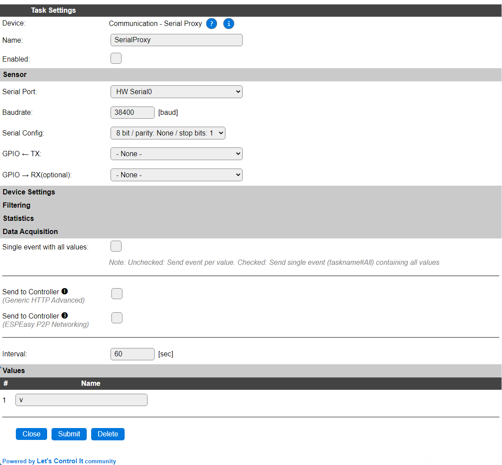
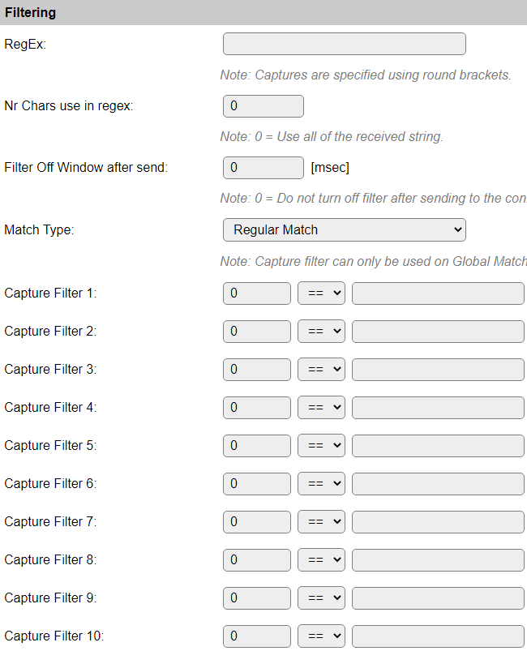
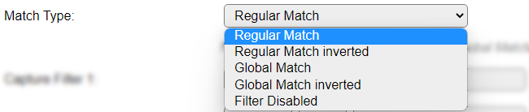
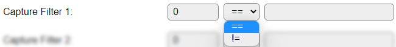
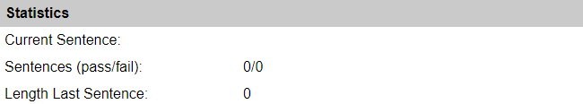

.. include:: ../Plugin/_plugin_substitutions_p08x.repl
.. _P087_page:

|P087_typename|
==================================================

|P087_shortinfo|

Plugin details
--------------

Type: |P087_type|

Port Type: |P087_porttype|

Name: |P087_name|

Status: |P087_status|

GitHub: |P087_github|_

Maintainer: |P087_maintainer|

Used libraries: |P087_usedlibraries|

.. Supported hardware
.. ------------------

Configuration
-------------

* **Name** A unique name should be entered here.

* **Enabled** The device can be disabled or enabled. When not enabled the device should not use any resources.

Sensor
^^^^^^

See: :ref:`SerialHelper_page`

Filtering
^^^^^^^^^

This section only shows settings when the plugin is configured and enabled.

* **RegEx**: Specify a regular expression to apply to the received data before it is accepted as acceptable data.

* **Nr Chars use in RegEx**: Limit the length of the data to be checked using the **RegEx** regular expression filter. When set to 0 all data is checked.

* **Filter Off Window after send**: The time in milliseconds to turn *off* filtering after receiving data that is accepted by the filter. Setting this to 0 will not turn off the filter after sending to the connected device.

* **Match Type**: Select the type of matching that is to be applied:

* **Regular Match**: Use the Regular Expression matching, configured above.

* **Regular Match inverted**: Use the Regular Expression matching but with inverting the result, as configured above.

* **Global Match**: Use the group values defined the Regular Expression above, to compare to the Capture Filter 1..10 definitions explained below.

* **Global Match inverted**: Like **Global Match**, inverting the outcome.

* **Filter Disabled**: No filtering is applied.

Capture Filter 1..10
~~~~~~~~~~~~~~~~~~~~

Each Capture Filter has 3 fields:

* **Group**: Refer to the group index as returned from the **Regular Expression**, range 1..32.

* **Comparison**: The comparison can be Equals or Not Equals:

* **Compared value**: The literal value that should match the value from the RegEx **Group** chosen, and compared using the **Comparison**.

Statistics
^^^^^^^^^^

Statistic data is only visible if the plugin is configured and enabled.

This shows the latest data received and some statistics.

Data Acquisition
^^^^^^^^^^^^^^^^

This group of settings, **Single event with all values** and **Send to Controller** settings are standard available configuration items. Send to Controller is only visible when one or more Controllers are configured.

* **Interval** By default, Interval will be set to 60 sec.

Values
^^^^^^

The Values are not changed during processing, and can be ignored.

Commands available
^^^^^^^^^^^^^^^^^^

.. include:: P087_commands.repl

Change log
----------

.. versionchanged:: 2.0
  ...

  |added| 2023-03-22 Add support for writing any binary data out via the serial port.

  |added| 2020-02-22 
