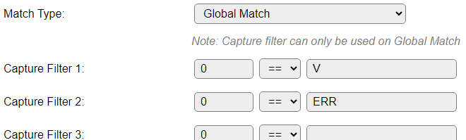

.. include:: ../Plugin/_plugin_substitutions_p08x.repl
.. _P087_page:

|P087_typename|
==================================================

|P087_shortinfo|

Plugin details
--------------

Type: |P087_type|

Port Type: |P087_porttype|

Name: |P087_name|

Status: |P087_status|

GitHub: |P087_github|_

Maintainer: |P087_maintainer|

Used libraries: |P087_usedlibraries|

.. Supported hardware
.. ------------------

Configuration
-------------

.. image:: P087_DeviceConfiguration.png

* **Name** A unique name should be entered here.

* **Enabled** The device can be disabled or enabled. When not enabled the device should not use any resources.

Sensor
^^^^^^

See: :ref:`SerialHelper_page`

Filtering
^^^^^^^^^

This section only shows settings when the plugin is configured and enabled.

.. image:: P087_FilteringConfiguration.png

* **RegEx**: Specify a regular expression to apply to the received data before it is accepted as acceptable data. This regular expression is based on the Lua script language, and is documented here: http://www.lua.org/manual/5.2/manual.html#6.4.1

* **Nr Chars use in RegEx**: Limit the length of the data to be checked using the **RegEx** regular expression filter. When set to 0 all data is checked.

* **Filter Off Window after send**: The time in milliseconds to turn *off* filtering after receiving data that is accepted by the filter. Setting this to 0 will not turn off the filter after sending to the connected device.

* **Match Type**: Select the type of matching that is to be applied:

.. image:: P087_MatchTypeOptions.png

* **Regular Match**: Use the Regular Expression matching, configured above.

* **Regular Match inverted**: Use the Regular Expression matching but with inverting the result, as configured above.

* **Global Match**: Use the group values defined the Regular Expression above, to compare to the Capture Filter 1..10 definitions explained below.

* **Global Match inverted**: Like **Global Match**, inverting the outcome.

* **Filter Disabled**: No filtering is applied.

Capture Filter 1..10
~~~~~~~~~~~~~~~~~~~~

Each Capture Filter has 3 fields:

* **Group**: Refer to the group index as returned from the **Regular Expression**, range 0..31.

* **Comparison**: The comparison can be Equals or Not Equals:

.. image:: P087_ComparisonOptions.png

* **Compared value**: The literal value that should match the value from the RegEx **Group** chosen, and compared using the **Comparison**. Case sensitive.

Statistics
^^^^^^^^^^

Statistic data is only visible if the plugin is configured and enabled.

.. image:: P087_StatisticsConfiguration.png

This shows the latest data received and some statistics.

Data Acquisition
^^^^^^^^^^^^^^^^

This group of settings, **Single event with all values** and **Send to Controller** settings are standard available configuration items. Send to Controller is only visible when one or more Controllers are configured.

* **Interval** By default, Interval will be set to 60 sec.

Values
^^^^^^

The Values are not changed during processing, and can be ignored.

Commands available
^^^^^^^^^^^^^^^^^^

.. include:: P087_commands.repl

Get Config Values
^^^^^^^^^^^^^^^^^

Get Config Values retrieves values or settings from the sensor or plugin, and can be used in Rules, Display plugins, Formula's etc. The square brackets **are** part of the variable. Replace ``<taskname>`` by the **Name** of the task.

.. include:: P087_config_values.repl

Example configuration
^^^^^^^^^^^^^^^^^^^^^

A practical example:

Received data via serial:

.. code:: none

  PID	0xA060
  FW	159
  SER#	HQ12345E6M7
  V	26280
  I	750
  VPV	31920
  PPV	20
  CS	3
  MPPT	2
  OR	0x00000000
  ERR	0
  LOAD	OFF

(Tokens are tab-separated)

Suppose we want to handle the lines starting with the token ``V`` and ``ERR``, and send the values to a MQTT broker.

We start by devising a regular expression (Lua syntax, using ``%`` instead of the more common ``\`` escape character) that can handle each line, collecting the tokens into groups:

``(%w+#?)%s+(%w+)``

* A group ``(`` that captures a set of 1 or more alphanumeric characters ``%w+`` and accepts an optional hash-sign ``#?``, end of group ``)``.
* 1 or more white-space characters ``%s+`` (space, tab).
* Another group ``(`` that captures a set of 1 or more alphanumeric characters ``%w+``, end of group ``)``.

The regular expression can be entered into the **RegEx** field.

If we keep the **Match Type** setting on **Regular Match**, received data has to match the regex before it is passed on for processing. This is the correct setting if we want to process all lines received in Rules.

When we want to reduce the CPU load by limiting the processing to only some of the lines of received data, we can use filters. The filters are checked if we change **Match Type** to *Global Match*. There are 10 available filter entries, where we can select what values should pass, or *not pass* by using the **Match Type** *Global Match inverted*.

For this example we only want the ``V`` and ``ERR`` lines to pass, and the first token is captured in group 0, so we set the filters like this:

To process the received data, Rules have to be enabled in the Tools/Advanced page.

The event when receiving the data ``V 26280`` is logged like this:

.. code:: none

  01:27:15.147 : (308048) Info   : EVENT: SerialProxy#v=`V 26280`

For this example, the Taskname is ``SerialProxy``, so we'll define a rule to process the Value, default name is ``v``:

.. code:: none

  On *serialproxy#v Do
    LogEntry,'Match P1: [serialproxy#group.0], P2: [serialproxy#group.1] V: [serialproxy#next.V] ERR: [serialproxy#next.err]'
    If {equals:V:'[serialproxy#group.0]'}=1
      publish,receiver/V,[serialproxy#next.V]
    Endif
    If {equals:ERR:'[serialproxy#group.0]'}=1
      publish,receiver/ERR,[serialproxy#next.ERR]
    Endif
  Endon

We'll discuss the lines one by one:

``On *serialproxy#v Do`` : To have the rules engine handle the non-numeric parameter received in the event, the wildcard character ``*`` has to be prefixed to the event name. The taskname and valuename are handled non-case-sensitive.

``LogEntry...`` : For testing purposes it is helpful to log the data, so it can be viewed via the serial console or the Tools/Log page. Here it is used to demonstrate 2 ways of retrieving the processed data from the Regular expression:

* Via the ``[<taskname>#group.<nr>]`` config value like ``[serialproxy#group.0]``, that will return the current value from that group.

* Via the ``[<taskname>#next.<value>]`` config value, like ``[serialproxy#next.V]``, that will return the current value from the group next from a group that contains ``V``.

The second method is especially useful for handling multiple name/value pairs in a single data package (and a different regular expression to capture that).

``If {equals:V:'[serialproxy#group.0]'}=1`` : Do a case-sensitive string comparison on the value from the first group (0) to equal ``V``.

``publish,receiver/V,[serialproxy#next.V]`` : Publish the received data value from the next group after the ``V`` value to a MQTT topic, using the first enabled MQTT Controller.

``Endif`` : End of first ``If`` statement.

``If {equals:ERR:'[serialproxy#group.0]'}=1`` : Do a case-sensitive string comparison on the value from the first group (0) to equal ``ERR``.

``publish,receiver/ERR,[serialproxy#group.1]`` : Publish the received data value from the second group (1) to a MQTT topic, using the first enabled MQTT Controller.

``Endif`` : End of second ``If`` statement.

``Endon`` : End of this rule/event handler

For this example I used a rather elaborate way of writing the rule, and this should be used if quite different MQTT topics are to be used, but it can probably be simplified to:

.. code:: none

  On *serialproxy#v Do
    LogEntry,'Match P1: [serialproxy#group.0], P2: [serialproxy#group.1]'
    publish,receiver/[serialproxy#group.0],[serialproxy#group.1]
  Endon

.. note:: For testing your regular expression and the handling of the rule, have a look at the ``serialproxy_test`` command, above.

|

Change log
----------

.. versionchanged:: 2.0
  ...

  |added| 2024-02-25 Add support for ``serialproxy_test`` command and retrieving the separate groups from parsed regex.

  |added| 2023-03-22 Add support for writing any binary data out via the serial port.

  |added| 2020-02-22 
