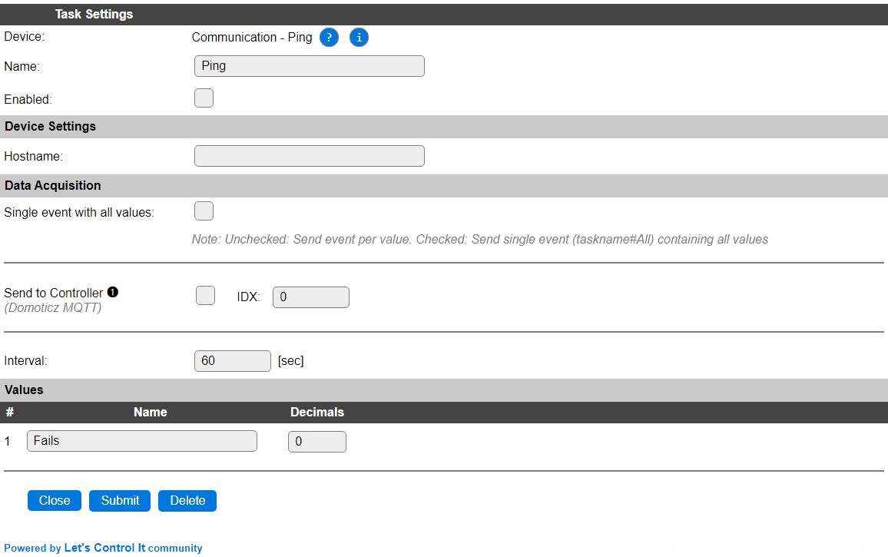

.. include:: ../Plugin/_plugin_substitutions_p08x.repl
.. _P089_page:

|P089_typename|
==================================================

|P089_shortinfo|

Plugin details
--------------

Type: |P089_type|

Name: |P089_name|

Status: |P089_status|

GitHub: |P089_github|_

Maintainer: |P089_maintainer|

Used libraries: |P089_usedlibraries|

Description
-----------

The Ping plugin is designed to check the availability of a local or remote device or host that can be reached via TCP/IP, and responds to ICMP requests (ping). If no response is received, the Fails counter is incremented, if the connection is restored after temporarily being disturbed, the Fails counter is auto-reset to 0.

Configuration
-------------

* **Name** A unique name should be entered here.

* **Enabled** The device can be disabled or enabled. When not enabled the device should not use any resources.

Device Settings
^^^^^^^^^^^^^^^

* **Hostname**: The hostname or IP-address for the device or host to monitor.

Data Acquisition
^^^^^^^^^^^^^^^^

This group of settings, **Single event with all values** and **Send to Controller** settings are standard available configuration items. Send to Controller is only visible when one or more Controllers are configured.

* **Interval** By default, Interval will be set to 60 sec. Every Interval setting, the host will be pinged and the state will be updated in Fails. If the ping responds as intended, then Fails is reset to 0.

Values
^^^^^^

The failure count value is available in ``Fails``. No other options are available for Values.

Commands available
^^^^^^^^^^^^^^^^^^

.. include:: P089_commands.repl

Change log
----------

.. versionchanged:: 2.0
  ...

  |changed| 2023-03-14 Extended command handling to not require the taskname argument.

  |added| 2020-02-22 
