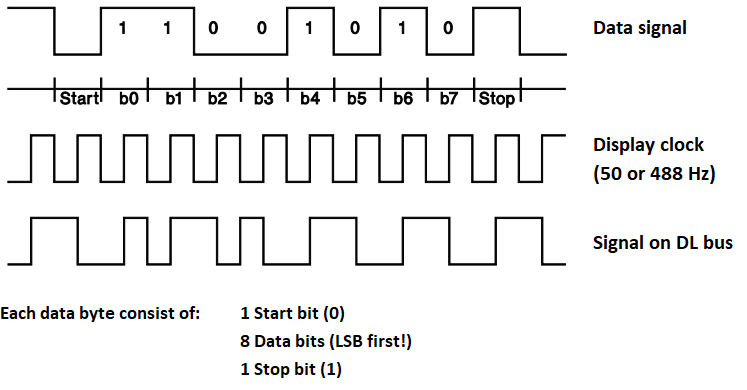
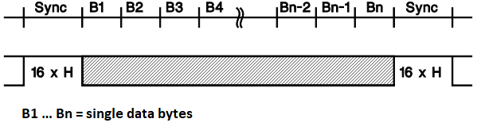
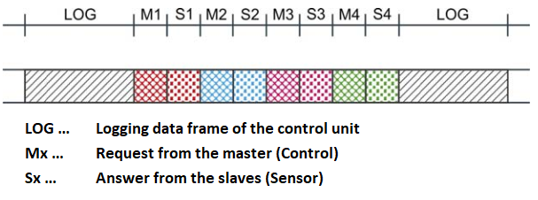
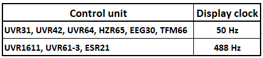

Introduction
------------

The DL-Bus is used in control units e.g. sold by `Technische Alternative <http://www.ta.co.at/>`_.

The DL-Bus serves as a bus line for various external sensors and modules.

The DL-Bus is a bidirectional data line and only compatible with products of Technische Alternative.

The data transmission looks as follows:

* In an infinite loop, a logging data frame is created by the control one after the others on the data line.
* So that the beginning of a data frame can be detected, a SYNC of 16 high bits is sent before the first data byte.
* The data transmission is carried out as Manchester code (EXOR linked) with a display clock of 50 or 488Hz (depending on control type).

This is necessary to ensure the supply voltage of the logger and DL sensors from the data signal.
If the receiver is synchronized to the display clock, the correct bit value appears always during the second half period of the data bit (inverted in the first half period).

.. note:: A new device task must be created for each value to be read from the DL bus!

Wiring
------

The DL-Bus consists of 2 wires: 

* DL
* GND (sensor ground).

The power supply for the DL-Bus sensors is supplied via the DL-Bus itself.

Some DL-Bus devices can/must be powered via a 12V source, e.g. that of the CAN bus (this is explicitly noted in the operating manual of that sensor).

The cable routing can be star-shaped or serial (from one device to the next).

Any cable with a cross-section of 0.75 mm2 up to a maximum length of 30 m can be used as a data cable.

Over 30 m, the use of shielded cables is recommended, which increases the permissible length of the cable to 100 m.

Protocol
--------

Transmission of a data byte

Transmission of a data frame

Data frame on the DL bus

Display clock

