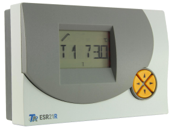

.. include:: ../Plugin/_plugin_substitutions_p09x.repl
.. _P092_ESR21_page:

ESR21
=====

|P092_typename|
|P092_status|

Introduction
------------

The ESR21 unit is a simple solar control.

The ESR21 unit is a differential control that can be used in many ways

* The DL bus runs at 12 volts.
* The data frame consist of 30 bytes (excluding sync and CRC).
* The data are transmitted @ 488Hz, therefore the transmission of one data set takes about 0.67 seconds.

Wiring
------

.. image:: P092_12V_Wiring.png

Protocol
--------

.. image:: P092_ESR21_Protocol.png

Setup
-----

.. note:: A new device task must be created for each value to be read from the DL bus!

.. image:: P092_Setup.png

Task settings
~~~~~~~~~~~~~

* **Device**: Heating - DL-Bus (Technische Alternative)
* **Name**: Name of the task (example name **ValueN**, where N is a number).
* **Enable**: Should the task be enabled or not

Sensor
^^^^^^

* **1st GPIO**: DL bus input e.g. **GPIO 14 (D5)**
* **DL-Bus Type**: **ESR21**

.. note:: The settings for **1st GPIO** and **DL-Bus Type** must be the same for all used DL bus tasks!

Inputs
^^^^^^

.. note:: The description of the **Frame data** and the related **Frame bytes** can be found in the section **Protocol**!

.. csv-table::
  :header: "Frame data", "Frame bytes", "Value", "Index", "Decimals"
  :widths: 16, 8, 8, 5, 5

  "Sensor1 ... Sensor3", "3 ... 8", "Sensor", "1 - 3", "1"
  "Ext1 ... Ext6", "9 ... 20", "Ext. Sensor", "1 - 6", "1"
  "Output byte", "21", "Digital Output", "", "0"
  "Speed step", "22", "Speed step", "", "0"
  "Analog output", "23", "Analog output", "", "1"
  "Current power", "25,26", "Heat power [kW]", "", "1"
  "Heat quantity", "27 ... 30", "Heat meter [MWh]", "", "4"

Data acquisition
^^^^^^^^^^^^^^^^

* **Send to controller** 1..3: Check which controller (if any) you want to publish to. All or no controller can be used.
* **Interval**: How often should the task publish its value (10..60 seconds is normal).

.. note:: Intervall not less than **10 seconds**! The reading of the DL bus happens twice per intervall.
