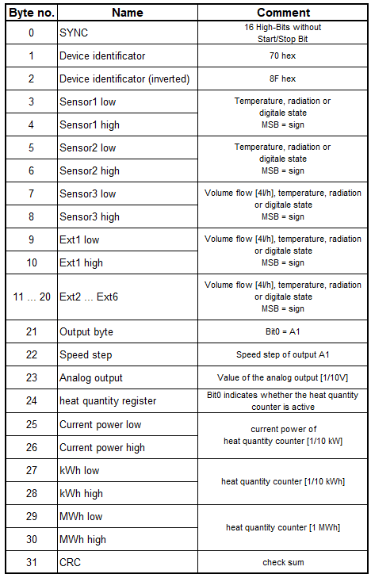

.. include:: ../Plugin/_plugin_substitutions_p09x.repl
.. _P092_DLbus_page:

ESR21
=====

|P092_typename|
|P092_status|

Introduction
------------

The ESR21 unit is a simple solar control.
The ESR21 unit is a differential control that can be used in many ways
The DL bus runs at 12 volts.
The data frame consist of 30 bytes (excluding sync and CRC).
The data are transmitted @ 488Hz, therefore the transmission of one data set takes about 0.67 seconds.

Wiring
------

.. image:: P092_ESR21_Wiring.png

Protocol
--------

Setup
-----

Note: Intervall not less than 10 seconds!

.. image:: P092_ESR21_Sensor.PNG
.. image:: P092_ESR21_Inputs.PNG
