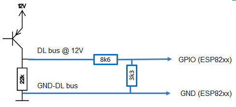

.. include:: ../Plugin/_plugin_substitutions_p09x.repl
.. _P092_UVR1611_page:

UVR1611
=======

|P092_typename|
|P092_status|

Introduction
------------

The UVR1611 unit is a freely programmable universal control system.

The UVR1611 universal controller can be freely programmed using function modules to match any system configuration for heating room management.

* The DL bus runs at 12 volts.
* The data frame consist of 63 bytes (excluding sync and CRC).
* The data are transmitted @ 488Hz, therefore the transmission of one data set takes about 1.4 seconds.

Wiring
------

Protocol
--------

Setup
-----

.. note:: A new device task must be created for each value to be read from the DL bus!

.. image:: P092_Setup.png

Task settings
~~~~~~~~~~~~~

* **Device**: Heating - DL-Bus (Technische Alternative)
* **Name**: Name of the task (example name **ValueN**, where N is a number).
* **Enable**: Should the task be enabled or not

Sensor
^^^^^^

* **1st GPIO**: DL bus input e.g. **GPIO 14 (D5)**
* **DL-Bus Type**: **UVR1611**

.. note:: The settings for **1st GPIO** and **DL-Bus Type** must be the same for all used DL bus tasks!

Inputs
^^^^^^

.. note:: The description of the **Frame data** and the related **Frame bytes** can be found in the section **Protocol**!

.. csv-table::
  :header: "Frame data", "Frame bytes", "Value", "Index", "Decimals"
  :widths: 16, 8, 8, 5, 5

  "Sensor1 ... Sensor16", "9 ... 40", "Sensor", "1 - 16", "1"
  "Output A1 ... A7", "41", "Digital Output", "1 - 7", "0"
  "Output A9 ... A13", "42", "Digital Output", "9 - 13", "0"
  "Speed step A1", "43", "Speed step", "1", "0"
  "Speed step A2", "44", "Speed step", "2", "0"
  "Speed step A6", "45", "Speed step", "3", "0"
  "Speed step A7", "46", "Speed step", "4", "0"
  "Current power 1", "48 ... 51", "Heat power [kW]", "1", "2"
  "Current power 2", "56 ... 59", "Heat power [kW]", "2", "2"
  "Heat quantity 1", "52 ... 55", "Heat meter [MWh]", "1", "4"
  "Heat quantity 2", "60 ... 64", "Heat meter [MWh]", "2", "4"

Data acquisition
^^^^^^^^^^^^^^^^

* **Send to controller** 1..3: Check which controller (if any) you want to publish to. All or no controller can be used.
* **Interval**: How often should the task publish its value (10..60 seconds is normal).

.. note:: Intervall not less than **10 seconds**! The reading of the DL bus happens twice per intervall.
