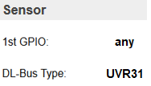
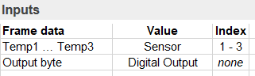

.. include:: ../Plugin/_plugin_substitutions_p09x.repl
.. _P092_DLbus_page:

UVR31
=====

|P092_typename|
|P092_status|

Introduction
------------

The UVR31 unit is a single-circuit universal control system.
The UVR31 unit is designed for simple solar installations and heating systems (storage charging, domestic hot water preparation)
The DL bus runs at 24 volts.
The data frame consist of 8 bytes (excluding sync).
The data are transmitted @ 50Hz, therefore the transmission of one data set takes about 1.92 seconds.
.. image:: P092_UVR31.png

Wiring
------

.. image:: P092_UVR31_Wiring.png

Protocol
--------

.. image:: P092_UVR31_Protocol.png

Setup
-----

Note: Intervall not less than 20 seconds!

