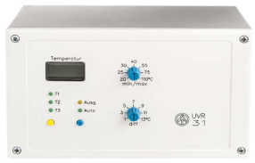
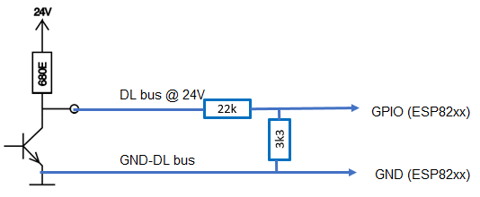
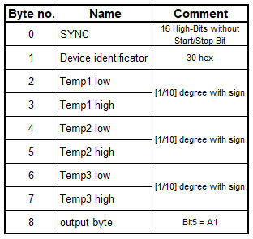
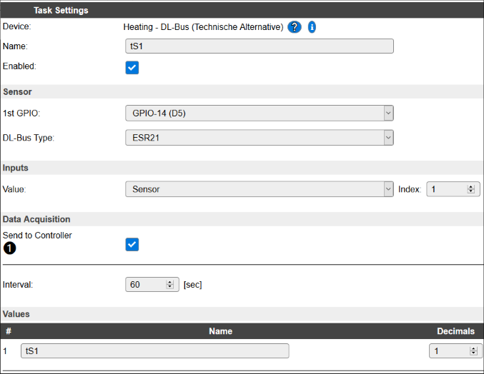

.. include:: ../Plugin/_plugin_substitutions_p09x.repl
.. _P092_UVR31_page:

UVR31
=====

|P092_typename|
|P092_status|

Introduction
------------

The UVR31 unit is a single-circuit universal control system.
The UVR31 unit is designed for simple solar installations and heating systems (storage charging, domestic hot water preparation)

* The DL bus runs at 24 volts.
* The data frame consist of 8 bytes (excluding sync).
* The data are transmitted @ 50Hz, therefore the transmission of one data set takes about 1.92 seconds.

Wiring
------

Protocol
--------

Setup
-----

.. note:: A new device task must be created for each value to be read from the DL bus!

Task settings
~~~~~~~~~~~~~

* **Device**: Heating - DL-Bus (Technische Alternative)
* **Name**: Name of the task (example name **ValueN**, where N is a number).
* **Enable**: Should the task be enabled or not

Sensor
^^^^^^

* **1st GPIO**: DL bus input e.g. **GPIO 14 (D5)**
* **DL-Bus Type**: **UVR31**

.. note:: The settings for **1st GPIO** and **DL-Bus Type** must be the same for all used DL bus tasks!

Inputs
^^^^^^

.. note:: The description of the **Frame data** and the related **Frame bytes** can be found in the section **Protocol**!

.. csv-table::
  :header: "Frame data", "Frame bytes", "Value", "Index", "Decimals"
  :widths: 16, 8, 8, 5, 5

  "Temp1 ... Temp3", "2 ... 7", "Sensor", "1 - 3", "1"
  "Output byte", "8", "Digital Output", "", "0"

Data acquisition
^^^^^^^^^^^^^^^^

* **Send to controller** 1..3: Check which controller (if any) you want to publish to. All or no controller can be used.
* **Interval**: How often should the task publish its value (20..60 seconds is normal).

.. note:: Intervall not less than **20 seconds**! The reading of the DL bus happens twice per intervall.
