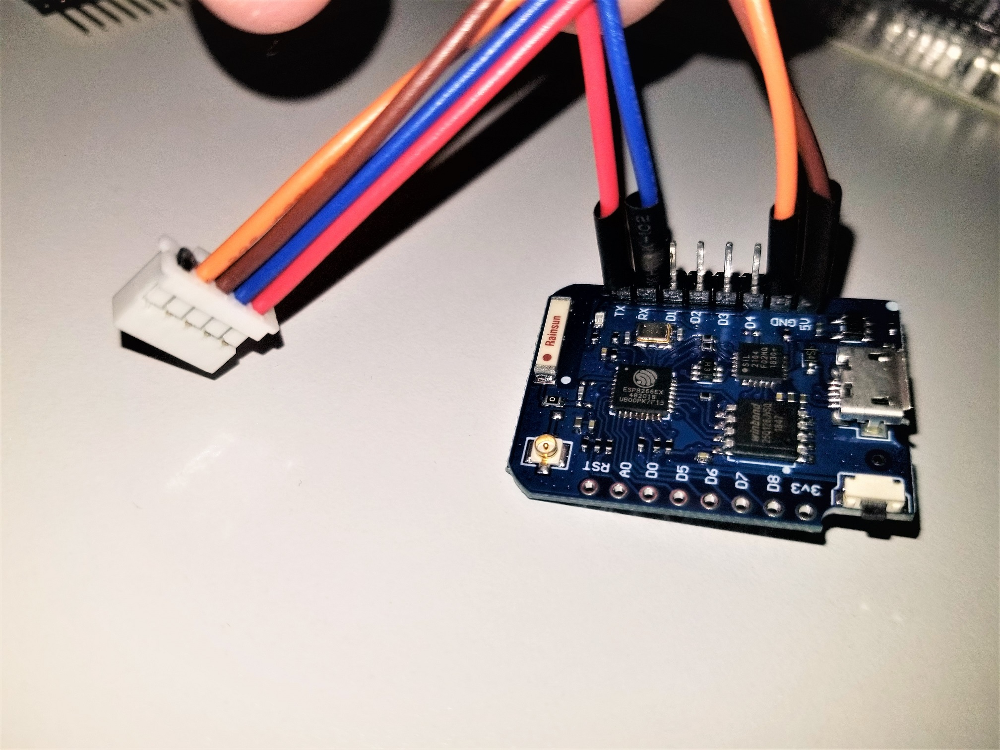
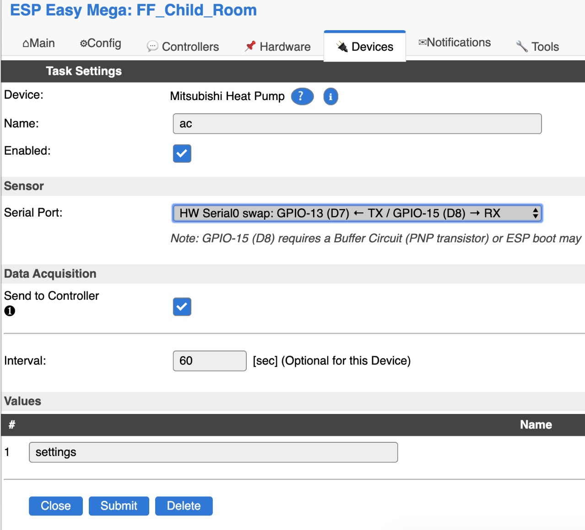

.. include:: ../Plugin/_plugin_substitutions_p09x.repl
.. _P093_page:

|P093_typename|
==================================================

|P093_shortinfo|

Plugin details
--------------

Type: |P093_type|

Name: |P093_name|

Status: |P093_status|

GitHub: |P093_github|_

Maintainer: |P093_maintainer|

Used libraries: |P093_usedlibraries|

Plugin is based on `Arduino library to control Mitsubishi Heat Pumps <https://github.com/SwiCago/HeatPump>`_.

Supported hardware
------------------

Plugin should support all Mitsubishi heat pump units with a CN105 connector:

* `P-Series <https://www.mitsubishicomfort.com/sites/default/themes/mitsubishicomfort/pdf/2018-01_P-Series_Controls-Compatibility-Chart.pdf>`_,
* `M-Series <https://www.mitsubishicomfort.com/sites/default/themes/mitsubishicomfort/pdf/2018-01_M-Series_Controls-Compatibility-Chart.pdf>`_,
* `CITY MULTI <https://www.mitsubishicomfort.com/sites/default/themes/mitsubishicomfort/pdf/Controller_Compatibility_Chart_2017-12_CITY_MULTI.pdf>`_.

Open issue, where users can report models they are using - `list <https://github.com/SwiCago/HeatPump/issues/13>`_.

How to connect
~~~~~~~~~~~~~~

**Note**: If your unit has cn105 port, it is most likely supported. If your unit has cn100 port, it may work as well.

.. csv-table::
  :header: "CN105", "CN100", "Notes"
  :widths: 10, 10, 60

  "1","NA","12V, can be sourced from pin 3 of cn51 or pin 1 of cn52 (not needed for ESP)"
  "2","8","GND"
  "3","1","5V"
  "4","5","TX"
  "5","4","RX"

.. danger::
  Please make sure to verify voltages!

Parts required to make a CN105 female connector
~~~~~~~~~~~~~~~~~~~~~~~~~~~~~~~~~~~~~~~~~~~~~~~

* `PAP-05V-S <https://www.digikey.com/product-detail/en/jst-sales-america-inc/PAP-05V-S/455-1489-ND/759977>`_,
* `SPHD-002T-P0.5 <https://www.digikey.com/product-detail/en/jst-sales-america-inc/SPHD-002T-P0.5/455-1313-1-ND/608809>`_,

One can also get `premade pigtails <http://www.usastore.revolectrix.com/Products_2/Cellpro-4s-Charge-Adapters_2/Cellpro-JST-PA-Battery-Pigtail-10-5-Position>`_.

Example using D1 mini PRO
~~~~~~~~~~~~~~~~~~~~~~~~~

There is a good tutorial on how to do `soldering <https://chrdavis.github.io/hacking-a-mitsubishi-heat-pump-Part-1/#soldering>`_ and
`installing <https://chrdavis.github.io/hacking-a-mitsubishi-heat-pump-Part-1/#installing>`_.

Setup
-----

The Mitsubishi Heatpump plugin can be added as simple as selecting it from the list, selecting the serial port used for connection - and we are ready:

Once we hit submit, the plugin will start sending messages through controller, i.e. MQTT with payload:

``{"roomTemperature":23.0,"wideVane":"|","power":"OFF","mode":"AUTO","fan":"QUIET","vane":"AUTO","iSee":false,"temperature":24.0}``

Message is send every time a change is detected (i.e. one changes settings using IR remote control) and every X seconds, as set in the settings (60 seconds in above screenshot).

Commands
--------

.. include:: P093_commands.repl

.. Events
.. ~~~~~~

.. This file is missing. (remove up to 'include' when fixed) include:: P093_events.repl

Example
-------

A full working example using openHAB can be found `here <https://community.openhab.org/t/mitsubishi-heat-pump/91765>`_.

Special thanks
--------------

* to SwiCago and other maintainers and contributors of the *Arduino library to control Mitsubishi Heat Pumps* from https://github.com/SwiCago/HeatPump/,
* to Chris Davis for his great `blog <https://chrdavis.github.io/hacking-a-mitsubishi-heat-pump-Part-1/>`_,
* to Hadley from New Zealand for his *hacking* https://nicegear.co.nz/blog/hacking-a-mitsubishi-heat-pump-air-conditioner/,
* and all others that contributed on this subject.

Change log
----------

.. versionadded:: 2020/03/07
  ...

  |added|
  Initial release version.
