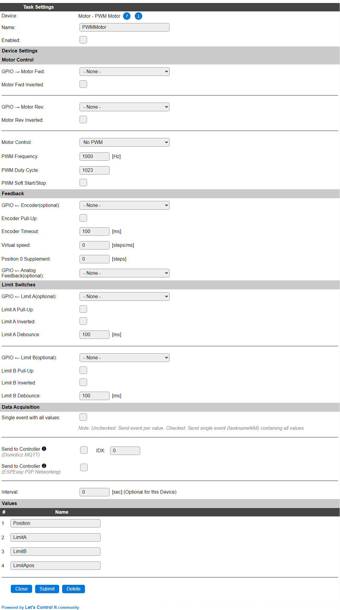
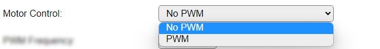

.. include:: ../Plugin/_plugin_substitutions_p09x.repl
.. _P098_page:

|P098_typename|
==================================================

|P098_shortinfo|

Plugin details
--------------

Type: |P098_type|

Name: |P098_name|

Status: |P098_status|

GitHub: |P098_github|_

Maintainer: |P098_maintainer|

Used libraries: |P098_usedlibraries|

Supported hardware
------------------

|P098_usedby|

Configuration
-------------

* **Name**: Required by ESPEasy, must be unique among the list of available devices/tasks.

* **Enabled**: The device can be disabled or enabled. When not enabled the device should not use any resources.

Motor Control
^^^^^^^^^^^^^

* **GPIO -> Motor Fwd**: Select the GPIO that is connected to the Motor Forward connection.

* **Motor Fwd Inverted**: Some motors need the signal to be inverted. This checkbox provides that option.

* **GPIO -> Motor Rev**: Select the GPIO that is connected to the Motor Reverse connection.

* **Motor Fwd Inverted**: Some motors need the signal to be inverted. This checkbox provides that option.

* **Motor Control**: Select the type of motor control:

Available options:

* *No PWM*: The motor is controlled by applying a High level (or Low when the matching Inverted option is checked) to the Forward or Reverse GPIO pin.

* *PWM*: The motor is controlled by applying a PWM signal with the set frequency and duty-cycle (next options). **Attention** Check the documentation if the motor can be controlled via PWM, as in some cases this can cause damage to the motor or electronics involved!

.. ..spacer

* **PWM Frequency**: The frequency of the PWM signal. Some motors run best at a specific frequency, usually noted in their documentation.

* **PWM Duty Cycle**: The duty cycle of the PWM signal. Usually also specified in the motor documentation.

* **PWM Soft Start/Stop**: This option will use a speed-fade-in at the start of moving, and fade-out near the end of moving. This makes the movement smoother.

Feedback
^^^^^^^^

* **GPIO <- Encoder(optional)**: If the motor is equiped with a rotary encoder, the encoder signal can be connected to this GPIO pin. This is optional.

* **Encoder Pull-Up**: When checked will activate the internal pull-up resistor for the Encoder GPIO. Depending on the encoder electronics a stronger (lower value like 4k7 or 10k) pull-up may be required, that should then be installed separately. This option can then be unchecked.

* **Encoder Timeout**: The maximum time that is allowed for the encoder to start providing pulses after the motor movement is started.

* **Virtual speed**: The number of steps/ms that the motor will move.

* **Position 0 Supplement**: The number of steps that compensates for the overshoot or undershoot when moving to the Home position.

* **GPIO <- Analog Feedback(optional)**: Not implemented yet. Only available on ESP32.

Limit Switches
^^^^^^^^^^^^^^

* **GPIO <- Limit A(optional)**: Select the GPIO that is connected to the Home-detection switch. This is optional.

* **Limit A Pull-Up**: Enables the internal pull-up for the GPIO. When using longer wiring, a stronger (lower value like 4k7 or 10k) pull-up resistor may be required for a stable signal.

* **Limit A Inverted**: Will invert the state of the limit switch.

* **Limit A Debounce**: The limit-switch debounce time, range 0 to 1000 msec.

* **GPIO <- Limit B(optional)**: Select the GPIO that is connected to the End-detection switch. This is optional.

* **Limit B Pull-Up**: Enables the internal pull-up for the GPIO. When using longer wiring, a stronger (lower value like 4k7 or 10k) pull-up resistor may be required for a stable signal.

* **Limit B Inverted**: Will invert the state of the limit switch.

* **Limit B Debounce**: The limit-switch debounce time, range 0 to 1000 msec.

Data Acquisition
^^^^^^^^^^^^^^^^

This group of settings, **Single event with all values** and **Send to Controller** settings are standard available configuration items. Send to Controller is only visible when one or more Controllers are configured.

* **Interval**: Interval is optional, and will be set to 0 sec. The data will be collected and optionally sent to any configured controllers using this interval.

Values
^^^^^^

The plugin provides the ``Position``, ``LimitA``, ``LimitB`` and ``LimitApos`` values. ``LimitA`` or ``LimitB`` will be set to 1 when the motor is at that position, and the matching settings are configured, above.

Commands available
^^^^^^^^^^^^^^^^^^

.. include:: P098_commands.repl

Events
~~~~~~

.. include:: P098_events.repl

Change log
----------

.. versionadded:: 2.0
  ...

  |added|
  Initial release version.

