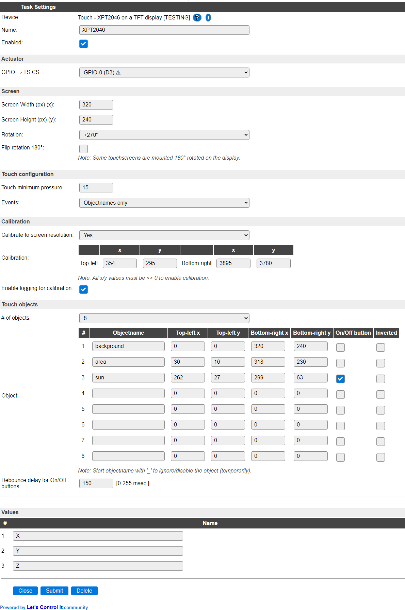
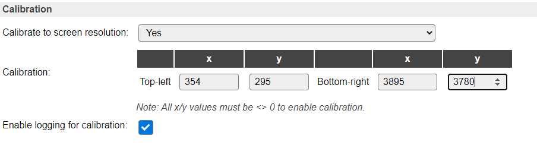
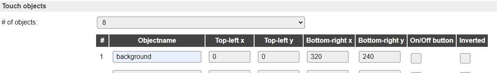
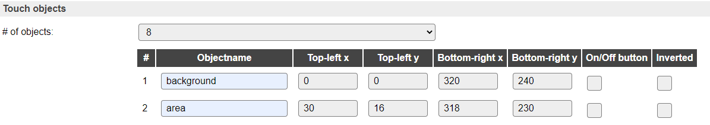
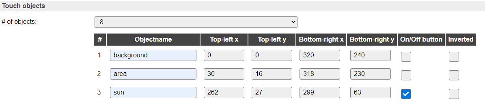

.. include:: ../Plugin/_plugin_substitutions_p09x.repl
.. _P099_page:

|P099_typename|
==================================================

|P099_shortinfo|

Plugin details
--------------

Type: |P099_type|

Name: |P099_name|

Status: |P099_status|

GitHub: |P099_github|_

Maintainer: |P099_maintainer|

Used libraries: |P099_usedlibraries|

Description
-----------

Touchscreen support for XPT2046.

Some type of TFT screens, particularly the :ref:`P095_page` 65000 color screens, come with a resistive touchscreen using a XPT2046 controller. Usually, a screen pen is included with the purchase.

Configuration options
^^^^^^^^^^^^^^^^^^^^^^

Actuator
~~~~~~~~

The only connection, besides the standard SPI signals ``MISO``, ``MOSI`` and ``CLK``, is the ``CS`` pin (usually labeled ``TS_CS`` at the connector) that is configured in the device.

Screen
~~~~~~

To allow scaling the touch coordinates to screen coordinates, the screen resolution and (touchscreen) rotation need to be configured, as the 0,0 coordinates of the screen and touchscreen should match, for mapping a touch coordinate to a screen coordinate. An option to flip the rotation by 180 degrees is available to be able to set the rotation to the same value as the ILI9341 TFT screen plugin.

Touch configuration
~~~~~~~~~~~~~~~~~~~~

To avoid spurious ghost-touches, a treshold, Touch minimum pressure, can be set. The default value is 15 (and max = 255, but then no touch will be detected).

NB: For events to be sent, the `Rules` option must be enabled in Tools / Advanced settings!

The events fired by the touchscreen can be configured to send 2 events for X and Y coordinates, 3 events for Y, Y and Z coordinates, 1 event for a defined touchobject name (see below), or a series of 3 or 4 events for X, Y and touchobject name or X, Y, Z and touchobject name.

By default the X and Y events are fired.

For TouchObject name events to be sent, some touchobject name(s) must be defined (see below).

Calibration
~~~~~~~~~~~~

Optionally, the touchscreen can be calibrated to the display resolution the touchscreen is mounted on. This will make the coordinate-mapping with the display more human understandable. By default this option is turned off. When changing this setting, the page will be reloaded, and reveal or hide the calibration coordinates to be entered.

By enabling the 'Enable logging for calibration' setting, extra logging is produced (Info level) so calibration and touchobject coordinates can be determined.

See: How to calibrate, below.

Touch objects
~~~~~~~~~~~~~~

To make the use of the touchscreen easier, specific screen areas, called touchobjects, can be defined. The default # of objects made available is 8, but this can be set from None to 40 in increments of 8.

After changing this setting the page is reloaded to adjust the list of objects. When set to None, no touch objects will be shown (though the objectnames and coordinates won't be cleared), only the number of touchobjects configured here will be checked when the touchscreen is touched.

A touchobject has a name, that will be used as the second part of the event-name if the Events setting includes the option Objectnames, where the first part is the device Name. So if the objectname is ``button`` and the device name is ``XPT2046``, the event ``XPT2046#button`` will be fired, with the actual X, Y and Z values of the touch that triggered it as ``%eventvalue1%``, ``%eventvalue2%`` and ``%eventvalue3%``.

When the name of the touchobject starts with '_' (underscore), that objectname is ignored, to make it easy to temporary disable an object, without the need of removing it from the list. The commands ``touch,disable,<objectname>`` and ``touch,enable,<objectname>`` can be used to disable/enable touch objects from rules or externally.

Per touchobject, checkboxes are available to configure that object as an On/Off button, and optionally invert the state. When the On/Off button option is checked, the event fired by the object has its On/Off state as an argument, just like a switch does. So in that case it fires ``XPT2046#button`` with the state (0 or 1) as the ``%eventvalue%``. Any X, Y or Z values can be used by reading ``[XPT2046#X]`` etc.

Object names do not have to be unique, though they should not be the same as the Values defined in the Device settings. When defining multiple touchobjects with the same name and options (On/Off button and Inverted), but different touch coordinates, they will fire the same event for different touch coordinates. Also, when using the ``touch,enable,<objectname>`` and ``touch,disable,<objectname>`` commands, all objects with that name will be enabled/disabled.

When configuring touchobjects as On/Off button, the debounce delay can be configured, to avoid generating multiple On/Off events when touching the screen. Default 150 msec. proved to be working fine during testing, but for a somewhat quicker response the value can be decreased.

How to calibrate
~~~~~~~~~~~~~~~~

Calibration of the touchscreen, to the display it is mounted on, is not required, but can make working with touchobjects easier.

There are some settings that can make calibration, or touchobject configuration, easier:

1. Set ESPEasy's logging level to Info (Tools / Advanced / Log Settings / Web Log Level: Info)

2. Turn off as many other devices as possible, as many tend to generate logging at the Info level, cluttering the output there. The display the touchscreen is mounted on should be enabled though.

3. Select for the touchscreen device the option 'Events' either 'Off' or 'Objectnames only' (so touching a touchobject defined area will show the eventname in the log).

4. Open 2 tabs in a webbrowser (easiest is to use a laptop or computer, not a tablet or mobile phone for this calibration configuration), 1 tab showing the Device configuration, and another showing the Tools page. Instead of a second browser tab the Serial log can be used if the ESP is connected to the computer via USB. Then the serial log level should also be set to Info.

5. Draw a non-filled rectangle on the underlying display from coordinate 0,0 to the maximum screen resolution (in this documentation the display used is set to 320 x 240 px, 270 degrees rotated). These commands can be sent from the Tools page of ESPEasy.

   For example on 'Display - TFT 2.4 inches ILI9341' screen: 
   
   a. Set background color to black:  ``tftcmd,clear,black``
 
   b. Set display rotation to 270 degrees:  ``tft,rot,3``
 
   c. Draw a white, non-filled, rectangle:  ``tft,r,0,0,320,240,white``

6. On the Device configuration set the Touch calibration to Yes, and tick the checkbox at 'Enable logging for calibration'.

7. Now open the Log from the Tools page, or view the serial log output.

8. Using the screen pen, supplied with the display, or another non-scharp but pointy object/device (a non-writing ballpoint or small phillips screw-driver could do):

   a. Touch the screen at the top left (0.0) corner of the rectangle on the display. Use the **rx** and **ry** values for Top-left ``x`` and ``y`` values::

        106025 : Info  : Touch calibration rx= 352, ry= 293; z= 146, x= 352, y= 293
        106125 : Info  : Touch calibration rx= 356, ry= 296; z= 151, x= 356, y= 296
        106225 : Info  : Touch calibration rx= 354, ry= 294; z= 164, x= 354, y= 294

      You might want to take an average of a few values, for ``x`` we'll use 354 and for ``y`` we'll use 295.

   b. Touch the screen at the lower right corner of the rectangle on the display. Use the **rx** and **ry** values for Bottom-right ``x`` and ``y`` values::

        371625 : Info  : Touch calibration rx= 3903, ry= 3787; z= 66, x= 3903, y= 3787
        371725 : Info  : Touch calibration rx= 3887, ry= 3779; z= 78, x= 3887, y= 3779
        371825 : Info  : Touch calibration rx= 3895, ry= 3767; z= 87, x= 3895, y= 3767

      A rough average of these would be 3895 for ``x`` and 3780 for ``y``.

9. Save the settings using the Submit button at the bottom of the page.

After calibration is set, the output of the log lines shown changes, for example, when now touching the top left corner of the rectangle, this output wil show::

  1857810 : Info  : Touch calibration rx= 355, ry= 297; z= 157, x= 0, y= 0
  1857910 : Info  : Touch calibration rx= 357, ry= 305; z= 135, x= 0, y= 0
  1859110 : Info  : Touch calibration rx= 361, ry= 360; z= 144, x= 0, y= 4

Now that calibration is set up, the ``x`` and ``y`` values of the logging have the calibrated values of the raw x and y (``rx``/``ry``) values.
There are several log lines with nearly the same values. The count of lines depends on the duration of pressing the pen on the screen, as the touchscreen is read 10 times per second.
Also there can be a little variation on the ``x`` and ``y`` values, but anything below the calibrated top-left or above the bottom-right values is cut off to that value.

How to configure touch objects
~~~~~~~~~~~~~~~~~~~~~~~~~~~~~~

Touch objects are used to define areas of the screen that can react to a touch. This way it is possible to define on-screen 'buttons', so certain actions can be started or stopped when that area is touched, either using a touch-pen or, when the area is defined large enough, using a finger(nail).
The many posibilities are only limited by the imagination of the user and the size of the rules files.

Setting up touch objects:

First configure your device according to steps 1..4 and step 7 of the 'How to calibrate' instructions, above.

Then, draw the desired user interface on the display, or design it, using the constraints of the display resolution the touchscreen is mounted on.

Now define the touchobjects, I'll first define an object named background, that will cover the entire display area.

Next is the area that displays a graph of the production of the solar panels mounted on the roof, top-left::

  2661905 : Info  : Touch calibration rx= 688, ry= 528; z= 236, x= 30, y= 16
  2662006 : Info  : Touch calibration rx= 683, ry= 535; z= 233, x= 29, y= 17
  2662105 : Info  : Touch calibration rx= 695, ry= 539; z= 233, x= 31, y= 17
  2662206 : Info  : Touch calibration rx= 691, ry= 543; z= 221, x= 30, y= 17

and bottom-right::

  2731406 : Info  : Touch calibration rx= 3845, ry= 3493; z= 61, x= 317, y= 228
  2731506 : Info  : Touch calibration rx= 3847, ry= 3509; z= 89, x= 317, y= 229
  2731606 : Info  : Touch calibration rx= 3871, ry= 3516; z= 52, x= 319, y= 230
  2731706 : Info  : Touch calibration rx= 3854, ry= 3514; z= 68, x= 318, y= 229

Then as there is a sun drawn on the screen, I want to trigger an action when that is touched, top-left::

  3012832 : Info  : Touch calibration rx= 3257, ry= 678; z= 18, x= 263, y= 27
  3012932 : Info  : Touch calibration rx= 3244, ry= 678; z= 58, x= 262, y= 27
  3013031 : Info  : Touch calibration rx= 3252, ry= 676; z= 212, x= 263, y= 27

and bottom-right::

  3071032 : Info  : Touch calibration rx= 3633, ry= 1170; z= 241, x= 298, y= 62
  3071131 : Info  : Touch calibration rx= 3647, ry= 1177; z= 250, x= 299, y= 63
  3071431 : Info  : Touch calibration rx= 3638, ry= 1184; z= 251, x= 298, y= 63

Up to 40 touchobjects can be defined in this way. When changing the # of objects, the configuration will also be saved.

Now Submit the page to save the configuration.

After the configuration is saved, the objects can be touched to see the events sent, assuming we configured to only send events for Touchobjects (Enable logging for calibration is still enabled here, though it could be turned off now), we'll only see those::

  3500336 : Info  : Touch calibration rx= 3461, ry= 1005; z= 24, x= 282, y= 50
  3500337 : Info  : EVENT: XPT2046#sun=282,50,24
  3500436 : Info  : Touch calibration rx= 3503, ry= 1030; z= 59, x= 286, y= 52
  3500437 : Info  : EVENT: XPT2046#sun=286,52,59
  3500536 : Info  : Touch calibration rx= 3501, ry= 1012; z= 41, x= 286, y= 51
  3500537 : Info  : EVENT: XPT2046#sun=286,51,41

Or, when the On/Off button option is checked (as in the screenshot)::

  1784226 : Info  : Touch calibration rx= 3421, ry= 954; z= 32, x= 278, y= 47
  1784326 : Info  : Touch calibration rx= 3414, ry= 990; z= 148, x= 278, y= 49
  1784426 : Info  : Touch calibration rx= 3423, ry= 944; z= 239, x= 279, y= 46
  1784427 : Info  : EVENT: XPT2046#sun=1
  1792926 : Info  : Touch calibration rx= 3364, ry= 894; z= 79, x= 273, y= 42
  1793026 : Info  : Touch calibration rx= 3350, ry= 930; z= 165, x= 272, y= 45
  1793126 : Info  : Touch calibration rx= 3376, ry= 907; z= 134, x= 274, y= 43
  1793127 : Info  : EVENT: XPT2046#sun=0

As you see, multiple events are sent when holding the pen on the touch area, that may require some careful planning while handling the event actions, as they can be fired up to 10 times per second!

When configuring a touchobject as an On/Off button, less events will be sent, as some 'debouncing' is built in (currently fixed at 150 msec), so a 'toggle' of the button requirs a good press before it is registered.
And in that configuration, only an On  or Off event is sent (or inverted when that checkbox is on). The X, Y and Z values can be read from the values as usual.

The screen, with its content, is defined like this (the content shown is drawn on the display from a Raspberry Pi using a Python script, collecting data from Zevercloud and some Domoticz data)

Commands
~~~~~~~~

.. include:: P099_commands.repl

Events
~~~~~~

.. include:: P099_events.repl

Change log
----------

.. versionchanged:: 2.0
  ...

  |added| 2020-09-06
