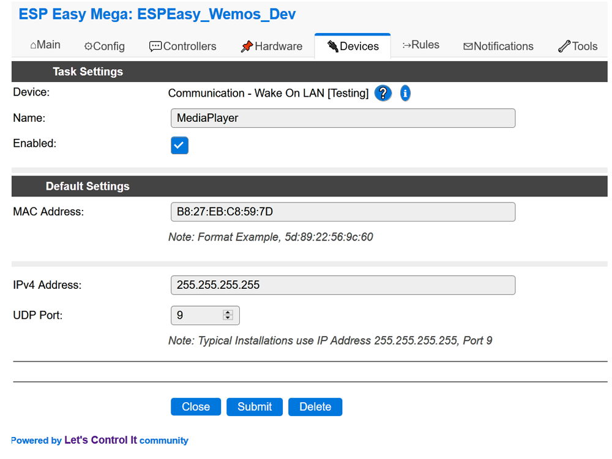
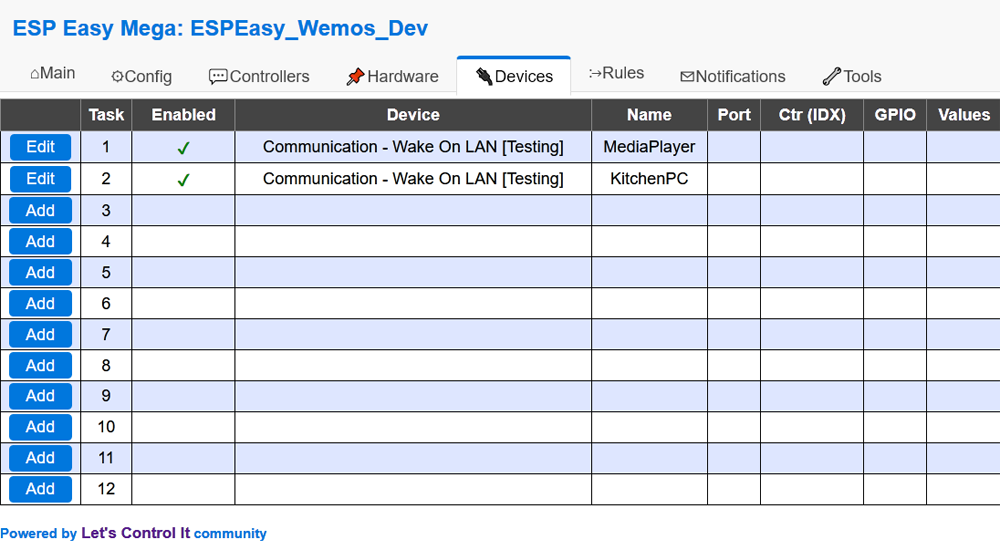

.. include:: ../Plugin/_plugin_substitutions_p10x.repl
.. _P101_page:
.. role:: raw-html(raw)
    :format: html

|P101_typename|
==========================================

|P101_shortinfo|

Plugin Details
--------------

Name: |P101_name|

Type: |P101_type|

Status: |P101_status|

GitHub: |P101_github|_

Maintainer: |P101_maintainer|

Used libraries: |P101_usedlibraries|

Introduction
------------

The Wake-On-LAN (WOL) plugin is a basic "Magic Packet" Sender.
It provides the ability to wake a slept/suspended/hibernating computer.
The support for this is dependent upon the computer's hardware, BIOS/UEFI settings, and operating system.

Many modern computers with integrated networking hardware will support the WOL feature.
Enabling the function typically requires configuring some BIOS and operating system settings.
Some basic tips are discussed here:
https://www.howtogeek.com/70374/how-to-geek-explains-what-is-wake-on-lan-and-how-do-i-enable-it/

Reasons to use ESPEasy's WOL Plugin
***********************************

WOL is the ideal solution when you don't want a computer turned on all the time.
For example, let's say you have a media server that auto-sleeps and you want to remotely wake it so you can listen to your music.

Keep in mind that some home automation systems (e.g. OpenHab, Home Assistant, etc.) have built-in support for WOL.
However, this WOL plugin is for those that prefer to use a simpler home control solution based on ESPEasy.

ESPEasy Plugin Installation
---------------------------

Follow these steps to configure WOL.

1. Use your favorite web browser and connect to your ESPEasy device.
2. Go to the *Devices* Tab and pick an empty task.
3. Choose the task *Add* button and select the *Communication - Wake On LAN* entry.
4. Configure the WOL task using the settings for your device. See below for more details.
5. Click the submit button.

Task Configuration Settings
***************************

**Name:**
 Enter the *Task Name*. The name must be unique. Avoid special characters and reserved command names.

**Enabled:**
 Check the box to enable the WOL task.

**MAC Address:**
 Enter the default MAC Address of the device to wakeup. This entry can be set to *00:00:00:00:00* if the MAC is provided in the command sentence.

**IPv4 Address:**
 The typical default IP address is *255.255.255.255*, which is a global subnet for WOL's Magic Packets.
 Some routers may require using the local subnet IP address with 255 at the end. For example, *192.168.1.255*.

 Some WOL devices will accept magic packets sent to the computer's specific IP too. For example, *192.168.1.25*.

 PC's with integrated WiFi and Ethernet ports will likely have two MAC addresses, with specific WOL settings for each one.

**UDP Port:**
 The typical default Port value is *9*. Common UDP Port values are 0, 7, and 9.
 In typical networks all MAC addresses can share the same WOL port value.
 The allowed range is 0-65535.

Multiple Task Instances
***********************
Multiple WOL device tasks can be installed. Each task MUST have a unique name for use as the command keyword.
Assigning a WOL task to each MAC address will simplify the WOL command sentences.

However, creating separate WOL task for each MAC address can quickly consume ESPEasy's available tasks.
A more efficient solution is to create a single WOL task and provide the MAC address with the command sentences.

Multiple versus single WOL tasks, which is better? There's no perfect answer, it's up to you to decided.

Configuration Examples
**********************

WOL Actions
--------------------

WOL actions can be executed using ESPEasy rules.
They can also be sent remotely using HTTP and MQTT.

A keyword is used when commanding a WOL action. Typically the *Task Name* (assigned by the user) is the keyword.
As an alternative, *WAKEONLAN* can be used too.

When only one WOL task is assigned the *WAKEONLAN* and *Task Name* command keywords are interchangeable.

If multiple WOL tasks are assigned the user provided *Task Name* should be used as the command keyword.
Whenever the *WAKEONLAN* keyword is used any default values will come from the firstly assigned WOL task.
The keywords and optional parameters are case insensitive.

Rules Examples
**************

The ESPEasy rules example shown below will wake up the media server and kitchen PC each morning.
It also shows how to wake up a device that requires multiple WOL packets.
And a PIR motion sensor is used to wake up the media server too.
Of course more complex rules can be created, but these should help get you started.

.. code-block:: none

  // Events

  on Clock#Time=All,08:30 do // every day at 8:30 hours do ...
    MediaPlayer              // Wake up Media Center using default values.
    KitchenPC                // Wake up Kitchen PC using default values.
    event,wakePC             // Wake up the gaming PC using multiple WOL packets.
  endon

  // The basement gaming PC requires multiple WOL packets to wake it up.
  on wakePC do               // Special wake up, will repeat 5 times.
    LoopTimerSet_ms,1,100,5  // Timer #1, use 100mS repeat interval.
  endon

  on Rules#Timer=1 do        // Timer started by wakePC event.
    WAKEONLAN,74:27:EA:60:40:E5 // Wake up specific MAC (Gaming PC).
  endon

  // PIR Motion Detector (requires Switch plugin and PIR module).
  on PIR#Detect=1 do         // Motion Sensed in media room.
    MediaPlayer              // Wake up Media Center.
  endon

HTTP Examples
*************

| Wake up using the MediaPlayer task's default settings.
| ``http://<ESP IP address>/control?cmd=MediaPlayer``

| Wake up using specific MAC address; IP and Port use first WOL task's default settings.
| ``http://<ESP IP address>/control?cmd=WAKEONLAN,74:27:EA:60:40:E5``

| Wake up using specific MAC, IP, and port.
| ``http://<ESP IP address>/control?cmd=WAKEONLAN,74:27:EA:60:40:E5,192.168.1.255,7``

WOL Command Summary
----------------------------

.. include:: P101_commands.repl

WOL Troubleshooting
-------------------

ESPEasy's serial log can be used to troubleshoot basic WOL command syntax problems.
Use Tools->Advanced->Log Settings and set Serial Log Level to "Info".
Any log messages from WOL actions will be labeled as "Wake On LAN:".

Change log
----------

.. versionchanged:: 2.0 (Mega)
  ...

  |added| 2020-10-20
