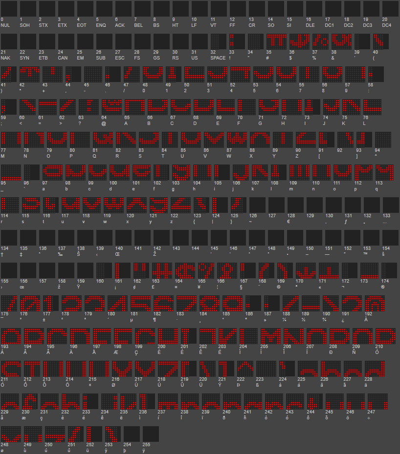

.. include:: ../Plugin/_plugin_substitutions_p10x.repl
.. _P104-Font-DoubleHeight_page:

|P104-Font-DoubleHeight_typename|
======================================================

Double height characters, lower part in the normal ASCII index, upper part in the high ASCII index (+128).

